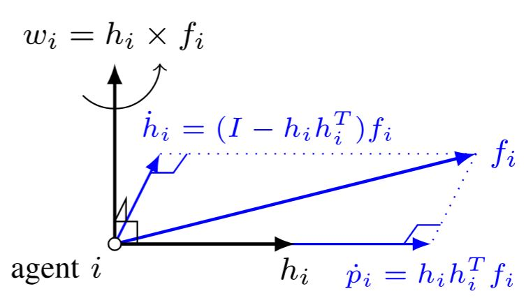
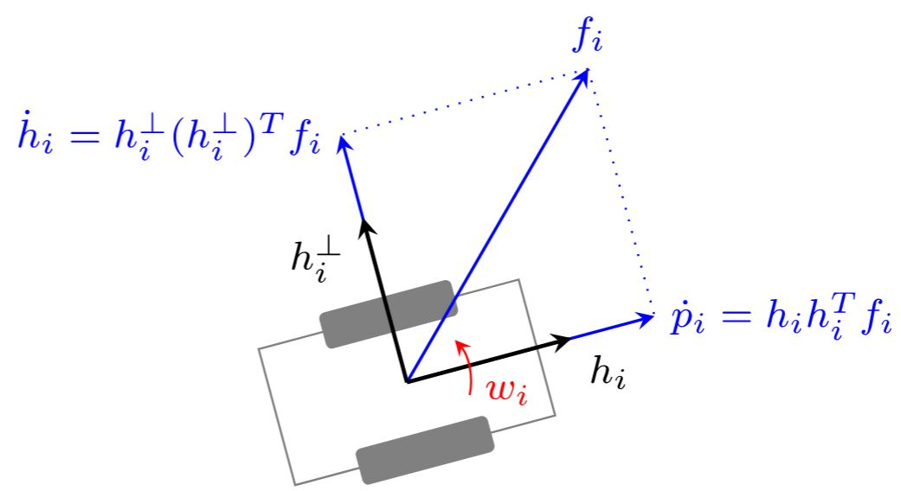

# Formation Control of Mobile Agents With Motion Constraints [1]
## 1 Problem Setup
For a given motion coordination task, let $e(\boldsymbol{p})$ be the coordination error vector of appropriate dimensions so that $\boldsymbol{e}(\boldsymbol{p})=\mathbf{0}$ when the coordination task is achieved. Let $V(\boldsymbol{e})$ be a **continuously differentiable Lyapunov function** satisfying $V(\boldsymbol{e}) \geqslant 0$ for all $\boldsymbol{e}$ and $V(\boldsymbol{e})=\mathbf{0} \Leftrightarrow \boldsymbol{e}=\mathbf{0}$. The corresponding gradient control law is

$$
\dot{\boldsymbol{p}}_{i}=-\nabla_{\boldsymbol{p}_{i}} V:=\boldsymbol{f}_{i}(\boldsymbol{e}, \boldsymbol{p}), \quad i \in \mathcal{V} . \tag{1.1}
$$

Note that $\dot{V}(\boldsymbol{e})=\sum\limits_{i \in \mathcal{V}}-\boldsymbol{f}_{i}^{\top} \boldsymbol{f}_{i} \leqslant 0$ under the action of the gradient control law. The gradient control is **distributed** if $\boldsymbol{f}_{i}(\boldsymbol{e}, \boldsymbol{p})$ merely depends on the positions of agent $i$ and its neighbors. The error dynamics of [$(1.1)$](#eq-1.1) is

$$
\dot{\boldsymbol{e}}=\frac{\partial \boldsymbol{e}}{\partial \boldsymbol{p}} \boldsymbol{f}(\boldsymbol{e}, \boldsymbol{p}) \tag{1.2}
$$

where $\boldsymbol{f}=\left[\boldsymbol{f}_{1}^{\top}, \ldots, \boldsymbol{f}_{n}^{\top}\right]^{\top} \in \mathbb{R}^{d n}$. Let $\Omega(r)=\{\boldsymbol{e}: V(\boldsymbol{e}) \leqslant r\}$ where $r \geqslant 0$ be the **level set**. The gradient control [$(1.1)$](#eq-1.1) is **convergent** if there exists $r_{0}>0$ such that the trajectory of [$(1.2)$](#eq-1.2) converges to $\boldsymbol{e}=\mathbf{0}$ for any initial error $\boldsymbol{e}_{0} \in \Omega\left(r_{0}\right)$. In this case, $\Omega\left(r_{0}\right)$ is called the **attraction region**.

The design of the gradient control law in [$(1.1)$](#eq-1.1) **does not consider any motion constraints**. When applied in practice, real agents may not be able to follow the gradient flow $\boldsymbol{f}_{i}$ exactly due to certain motion constraints such as **nonholonomic dynamics** and velocity saturation. As a result, the convergence of the entire coordination system may not be guaranteed.

Here we consider general coordination control tasks that satisfy the following mild assumption. Let $\|\cdot\|$ denote the Euclidian norm of a vector or the spectral norm of a matrix.

> [!info] Assumption 1
> For a given coordination task, functions $V(\boldsymbol{e})$ and $\boldsymbol{e}(\boldsymbol{p})$ satisfy the following conditions.
> 1. $\Omega(r)$ is compact for any $r \geqslant 0$.
> 2. There exists $r_{0}>0$ such that $\boldsymbol{e}=\mathbf{0} \Leftrightarrow \boldsymbol{f}=\mathbf{0}$ in $\Omega\left(r_{0}\right)$.
> 3. $\|\partial \boldsymbol{e}(\boldsymbol{p}) / \partial \boldsymbol{p}\|$ and $\|\boldsymbol{f}(\boldsymbol{e}, \boldsymbol{p})\|$ are bounded for bounded $\|\boldsymbol{e}\|$.
> 4. $\boldsymbol{f}(\boldsymbol{e}, \boldsymbol{p})$ is continuous in $\boldsymbol{e}$ and uniformly continuous[^4.1] in $\boldsymbol{p}$.

[Assumption 3](#assumption-1) implies that $\boldsymbol{e}=\mathbf{0}$ is **asymptotically stable** and $\Omega\left(r_{0}\right)$ is the **attraction region** according to the **invariance principle**. The attraction region may be the **entire space or a sufficiently small neighborhood of $\boldsymbol{e}=\mathbf{0}$**. If the attraction region is the entire space, then the coordination system is globally stable; otherwise, the system is locally stable.

[Assumption 3](#assumption-1) is satisfied by a wide range of coordination control laws such as the distance-based formation control law and bearing-based formation control as shown below. In these examples, the underlying graphs are assumed to be **bidirectional and connected**. If the graph is not bidirectional, the control laws may still work, but they may not be gradient control laws. For the sake of simplicity, suppose the **weight** for each edge to be $1$ and let $m=|\mathcal{E}| / 2$ denote the number of undirected edges.

### Example 1: Distance-Based Formation Control
The objective of distance-based formation control is to steer a group of agents from some initial positions to a desired geometric pattern defined by constant interneighbor distances $\left\{d_{i j}\right\}_{(i, j) \in \mathcal{E}}$. Consider the Lyapunov function

$$
V=\frac{1}{8} \sum_{i \in \mathcal{V}} \sum_{j \in \mathcal{N}_{i}}\left(\left\|\boldsymbol{p}_{i}-\boldsymbol{p}_{j}\right\|^{2}-d_{i j}^{2}\right)^{2} .
$$

Then, $V=\mathbf{0}$ if and only if the interneighbor distances satisfy the constraints. The gradient control law

$$
\begin{equation*}
\dot{\boldsymbol{p}_{i}}=\boldsymbol{f}_{i}=\sum_{j \in \mathcal{N}_{i}}\left(\left\|\boldsymbol{p}_{i}-\boldsymbol{p}_{j}\right\|^{2}-d_{i j}^{2}\right)\left(\boldsymbol{p}_{j}-\boldsymbol{p}_{i}\right) \tag{1.3}
\end{equation*}
$$

is the distance-based formation control law. We next show that all the conditions in [Assumption 3](#assumption-1) are satisfied. Consider any oriented graph and define the error state as $\boldsymbol{e}_{k}= \left\|\boldsymbol{q}_{k}\right\|^{2}-d_{k}^{2}$ where $\boldsymbol{q}_{k}=\boldsymbol{p}_{i}-\boldsymbol{p}_{j}$ and $d_{k}=d_{i j}$ with $k=1, \ldots, m$. Let $\boldsymbol{e}=\left[\boldsymbol{e}_{1}, \ldots, \boldsymbol{e}_{m}\right]^{\top} \in \mathbb{R}^{m}$ and $\boldsymbol{q}=\left[\boldsymbol{q}_{1}^{\top}, \ldots, \boldsymbol{q}_{m}^{\top}\right]^{\top} \in \mathbb{R}^{d m}$. We have $\boldsymbol{q}=(H \otimes I) \boldsymbol{p}$ where $H \in \mathbb{R}^{m \times n}$ is the incidence matrix of the oriented graph, $\otimes$ denotes the Kronecker product, and $I$ is the identity matrix with appropriate dimensions. Then, $V(\boldsymbol{e})=\frac14 \sum\limits_{k=1}^{m}\left\|\boldsymbol{e}_{k}\right\|^{2}$, $\partial \boldsymbol{e} / \partial \boldsymbol{p}=2 \operatorname{diag}\left(\boldsymbol{q}_{1}^{\top}, \ldots, \boldsymbol{q}_{m}^{\top}\right)(H \otimes I)$ is bounded when $\boldsymbol{e}$ is bounded, $\boldsymbol{f}$ is uniformly continuous in both $\boldsymbol{e}$ and $\boldsymbol{p}$, and $\left\|\boldsymbol{f}_{i}\right\|$ is bounded when $\|\boldsymbol{e}\|$ is bounded. Let $R \in \mathbb{R}^{m \times d n}$ be the rigidity matrix of the network. Then, $R=\operatorname{diag}\left(\boldsymbol{q}_{1}^{\top}, \ldots, \boldsymbol{q}_{m}^{\top}\right)(H \otimes I)$ and $\dot{\boldsymbol{p}}=\boldsymbol{f}=-R^{\top} \boldsymbol{e}$. A sufficient (but not necessary) condition for $R$ to have full row rank is that the network is **minimally infinitesimally rigid**. Under this condition, $\boldsymbol{f}=\mathbf{0} \Leftrightarrow \boldsymbol{e}=\mathbf{0}$ holds in a sufficiently small neighborhood of $\boldsymbol{e}=\mathbf{0}$ TODO [20], [21].

## 2 Nonholonomic Constraints

In this section, we modify the gradient control law in [$(1.1)$](#eq-1.1) to handle the nonholonomic constraint such that the velocity direction of each agent **must align with its heading vector**.

##### A. Modified Gradient Control Law

Let $\boldsymbol{h}_{i}(t) \in \mathbb{R}^{d}$ be the unit-length heading vector of agent $i$. The proposed modified gradient control law is

$$
\begin{align*}
& \dot{\boldsymbol{p}}_{i}=\boldsymbol{h}_{i} \boldsymbol{h}_{i}^{\top} \boldsymbol{f}_{i} \\
& \dot{\boldsymbol{h}}_{i}=\boldsymbol{w}_{i} \times \boldsymbol{h}_{i}, \quad i \in \mathcal{V} \tag{2.1}
\end{align*}
$$

where $\times$ denotes the cross product and $\boldsymbol{w}_{i} \in \mathbb{R}^{3}$ is the angular velocity to be designed. In this control law, since $\boldsymbol{h}_{i} \boldsymbol{h}_{i}^{\top}$ is an orthogonal projection matrix, the velocity $\dot{\boldsymbol{p}}_{i}$ is the orthogonal projection of $\boldsymbol{f}_{i}$ onto $\boldsymbol{h}_{i}$. As a result, the velocity is aligned with the heading vector $\boldsymbol{h}_{i}$ and the nonholonomic constraint is satisfied. The magnitude of $\boldsymbol{h}_{i}$ is invariant since $\boldsymbol{w}_{i} \times \boldsymbol{h}_{i}$ is always orthogonal to $\boldsymbol{h}_{i}$.

Our objective is to design $\boldsymbol{w}_{i}$ so that the entire multiagent system remains convergent in the sense that $V \rightarrow 0$. To this end, design

$$
\boldsymbol{w}_{i}=\boldsymbol{h}_{i} \times \boldsymbol{f}_{i} \tag{2.2}
$$

The geometric interpretation of [$(2.2)$](#eq-2.2) is that $\boldsymbol{w}_{i}$ attempts to rotate $\boldsymbol{h}_{i}$ to align with $\boldsymbol{f}_{i}$ (see [Figure 2.1](#fig-2.1) for an illustration). Denote $[\cdot]_{\times}$as the skew-symmetric matrix of a vector. For any $\boldsymbol{x}=\left[x_{1}, x_{2}, x_{3}\right]^{\top} \in \mathbb{R}^{3}$

$$
[\boldsymbol{x}]_{\times}:=\left[\begin{array}{lll}
0 & -x_{3} & x_{2} \\
x_{3} & 0 & -x_{1} \\
-x_{2} & x_{1} & 0
\end{array}\right]
$$

Then, we have $\boldsymbol{x} \times \boldsymbol{y}=[\boldsymbol{x}]_{\times} \boldsymbol{y}$ for any $\boldsymbol{x}, \boldsymbol{y} \in \mathbb{R}^{3}$. Substituting [$(2.2)$](#eq-2.2) into [$(2.1)$](#eq-2.1) gives

$$
\dot{\boldsymbol{h}}_{i}=-\left[\boldsymbol{h}_{i}\right]_{\times} \boldsymbol{w}_{i}=-\left[\boldsymbol{h}_{i}\right]_{\times}^{2} \boldsymbol{f}_{i}=\left(\mathbf{I}-\boldsymbol{h}_{i} \boldsymbol{h}_{i}^{\top}\right) \boldsymbol{f}_{i}
$$

where the last equability follows from the fact that $-[\boldsymbol{x}]_{\times}^{2}=\mathbf{I}-\boldsymbol{x x}^{\top}$ for any unit vector $\boldsymbol{x} \in \mathbb{R}^{3}$. Then, the modified gradient control law [$(2.1)$](#eq-2.1) becomes

$$
\begin{align*}
& \dot{\boldsymbol{p}}_{i}=\boldsymbol{h}_{i} \boldsymbol{h}_{i}^{\top} \boldsymbol{f}_{i} \\
& \dot{\boldsymbol{h}}_{i}=\left(\mathbf{I}-\boldsymbol{h}_{i} \boldsymbol{h}_{i}^{\top}\right) \boldsymbol{f}_{i}, \quad i \in \mathcal{V}
\end{align*} \tag{2.3}
$$

Note that $\mathbf{I}-\boldsymbol{h}_{i} \boldsymbol{h}_{i}^{\top}$ is an orthogonal projection matrix that projects any vector onto the orthogonal complement of $\boldsymbol{h}_{i}$. Although derived in $\mathbb{R}^{3}$, control law [$(2.3)$](#eq-2.3) is also valid in $\mathbb{R}^{2}$ because the case of $\mathbb{R}^{2}$ can be viewed as a special case of $\mathbb{R}^{3}$ by treating the plane spanned by $\boldsymbol{h}_{i}$ and $\boldsymbol{f}_{i}$ as the $X-Y$ plane in $\mathbb{R}^{3}$.

<figure>
   
   
<figcaption> Figure 2.1: Illustration of the modified gradient control law in (2.3)[1].</figcaption>

</figure>

The **convergence** of [$(2.3)$](#eq-2.3) is analyzed as follows.

> [!caution] Theorem 1 (Modified Gradient Control Law)
> Under [Assumption 1](#assumption-1), the modified gradient coordination control law [$(2.3)$](#eq-2.3) is **convergent** with the same **attraction region** as [$(1.1)$](#eq-1.1).

**Proof**:

  
Details of Proof

  The error dynamics corresponding to [$(2.3)$](#eq-2.3) is $\dot{\boldsymbol{e}}= (\partial \boldsymbol{e} / \partial \boldsymbol{p}) \mathbf{M} \boldsymbol{f}$ where $\mathbf{M}=\operatorname{diag}\left(\boldsymbol{h}_{1} \boldsymbol{h}_{1}^{\top}, \ldots, \boldsymbol{h}_{n} \boldsymbol{h}_{n}^{\top}\right) \in \mathbb{R}^{(d n) \times(d n)}$. The time derivative of $V$ is

$$
\dot{V}=-\sum_{i \in \mathcal{V}} \boldsymbol{f}_{i}^{\top} \dot{p}_{i}=-\sum_{i \in \mathcal{V}} \boldsymbol{f}_{i}^{\top} \boldsymbol{h}_{i} \boldsymbol{h}_{i}^{\top} \boldsymbol{f}_{i} \leq 0 .
$$

It follows that $\Omega\left(V\left(\boldsymbol{e}_{0}\right)\right) \subseteq \Omega\left(r_{0}\right)$ is positively invariant for any $\boldsymbol{e}_{0} \in \Omega\left(r_{0}\right)$. Let $\mathcal{M}=\{\boldsymbol{e}: \dot{V}(e)=0\}$. Then, the system trajectory starting from any point in $\Omega\left(V\left(\boldsymbol{e}_{0}\right)\right)$ converges to the largest invariant set in $\mathcal{M} \cap \Omega\left(V\left(\boldsymbol{e}_{0}\right)\right)$ by the invariance principle. For any point in $\mathcal{M}$, we have $\boldsymbol{h}_{i}^{\top} \boldsymbol{f}_{i}=0$ for all $i$, which indicates either $\boldsymbol{f}_{i}=0$ for all $i$ or $\boldsymbol{h}_{i} \perp \boldsymbol{f}_{i}$ but $\boldsymbol{f}_{i} \neq 0$ for certain $i$. In the first case, it follows that $e=0$ by condition 2) in Assumption 1. As a result, the error converges to zero and the theorem is proved. The second case is impossible. To see that assume $\boldsymbol{h}_{i} \perp \boldsymbol{f}_{i}$ but $\boldsymbol{f}_{i} \neq 0$. Then, $\dot{p}_{i}=\boldsymbol{h}_{i} \boldsymbol{h}_{i}^{\top} \boldsymbol{f}_{i}=0$ for all $i$, which indicates that all the agents are stationary. As a result, $\boldsymbol{f}_{i}$ is time invariant for all $i$. However, it follows from $\boldsymbol{h}_{i} \perp \boldsymbol{f}_{i}$ that $\dot{h}_{i}= \left(\mathbf{I}-\boldsymbol{h}_{i} \boldsymbol{h}_{i}^{\top}\right) \boldsymbol{f}_{i}=\boldsymbol{f}_{i} \neq 0$. As a result, $\boldsymbol{h}_{i}$ is rotating. It is impossible to maintain $\boldsymbol{h}_{i} \perp \boldsymbol{f}_{i}$ if $\boldsymbol{f}_{i}$ is time invariant while $\boldsymbol{h}_{i}$ is rotating. Hence, the system trajectory will escape from $\mathcal{M}$.

[Theorem 1](#thm-1) indicates that if $\Omega\left(r_{0}\right)$ is the attraction region of the gradient system [$(1.1)$](#eq-1.1), then it remains an attraction region for the modified gradient system [$(2.3)$](#eq-2.3). As a result, if the original gradient control is globally (respectively, locally) stable, then the modified one is **also globally (respectively, locally) stable**. The initial values of the heading vectors $\left\{\boldsymbol{h}_{i}(0)\right\}_{i \in \mathcal{V}}$ do not affect the convergence. The final values $\left\{\boldsymbol{h}_{i}(\infty)\right\}_{i \in \mathcal{V}}$ are not specified.

### B. Application to Unicycle Models

Considering that unicycle models have been widely considered in multiagent coordination control, we apply [$(2.3)$](#eq-2.3) to derive the specific control law for unicycle agents moving in the plane. It is, however, worth noting that [$(2.3)$](#eq-2.3) is applicable to agents moving in both two and three dimensions.

Let $\boldsymbol{p}_{i}=\left[x_{i}, y_{i}\right]^{\top} \in \mathbb{R}^{2}$ and $\theta_{i} \in \mathbb{R}$ be the position coordinate and heading angle of agent $i$, respectively. The motion of agent $i$ is governed by the unicycle model

$$
\begin{align*}
& \dot{x}_{i}=v_{i} \cos \theta_{i} \\
& \dot{y}_{i}=v_{i} \sin \theta_{i} \\
& \dot{\theta}_{i}=w_{i}
\end{align*} \tag{2.4}
$$

where $v_{i} \in \mathbb{R}$ and $w_{i} \in \mathbb{R}$ are the linear and angular velocities. We propose the following control law for the unicycle model

$$
\begin{align*}
v_{i} & =\left[\cos \theta_{i}, \sin \theta_{i}\right] \boldsymbol{f}_{i} \\
w_{i} & =\left[-\sin \theta_{i}, \cos \theta_{i}\right] \boldsymbol{f}_{i}
\end{align*} \tag{2.5}
$$

The **convergence** of the control law is proved below.
> [!caution] Theorem 2 (Control Law for Unicycle Agents)
> Under [Assumption 1](#assumption-1), control law [$(2.5)$](#eq-2.5) designed for the unicycle model in [$(2.4)$](#eq-2.4) is **convergent** with the same attraction region as [$(1.1)$](#eq-1.1).

**Proof**:

  
Details of Proof

Let $\boldsymbol{h}_{i}=\left[\cos \theta_{i}, \sin \theta_{i}\right]^{\top}$ and $\boldsymbol{h}_{i}^{\perp}=\left[-\sin \theta_{i}, \cos \theta_{i}\right]^{\top}$. Note that $\boldsymbol{h}_{i} \perp \boldsymbol{h}_{i}^{\perp}$. Substituting control law [$(2.5)$](#eq-2.5) into the unicycle model yields $\dot{p}_{i}=\boldsymbol{h}_{i} \boldsymbol{h}_{i}^{\top} \boldsymbol{f}_{i}$ and $\dot{h}_{i}=\boldsymbol{h}_{i}^{\perp}\left(\boldsymbol{h}_{i}^{\perp}\right)^{\top} \boldsymbol{f}_{i}$. Since $\boldsymbol{h}_{i}^{\perp}\left(\boldsymbol{h}_{i}^{\perp}\right)^{\top}=I-\boldsymbol{h}_{i} \boldsymbol{h}_{i}^{\top}$, the closed-loop system has the same expression as [$(2.3)$](#eq-2.3). The convergence property then follows from [Theorem 1](#thm-1).

The geometric interpretation of the control law in [$(2.5)$](#eq-2.5) is illustrated in [Figure 2.2](#fig-2.2). The initial values of the heading angles $\left\{\theta_{i}(0)\right\}_{i \in \mathcal{V}}$ do not affect the convergence. The final values $\left\{\theta_{i}(\infty)\right\}_{i \in \mathcal{V}}$ are not specified. We next apply [$(2.5)$](#eq-2.5) to derive a displacement-based formation control law for unicycles.

<figure>
   
   
<figcaption> Figure 2.2: Geometric interpretation of the control law in (2.5). Note that p _i is the orthogonal projection of f_i onto h_i and  \dot{h}_i is the orthogonal projection of f_i onto h_i^⊥. The angular velocity aims to turn h_i to align with f_i[1].</figcaption>

</figure>

#### Example 2 (Displacement-Based Formation Control of Unicycles)
Consider the displacement-based formation control law $\dot{p}_{i}= \boldsymbol{f}_{i}=\sum\limits_{j \in \mathcal{N}_{i}}\left(\boldsymbol{p}_{j}-\boldsymbol{p}_{i}-\boldsymbol{p}_{j}^{*}+\boldsymbol{p}_{i}^{*}\right)$. Substituting $\boldsymbol{f}_{i}$ into [$(2.5)$](#eq-2.5) yields

$$
\begin{align*}
v_{i} & =\left[\cos \theta_{i}, \sin \theta_{i}\right] \sum_{j \in \mathcal{N}_{i}}\left(\boldsymbol{p}_{j}-\boldsymbol{p}_{i}-\boldsymbol{p}_{j}^{*}+\boldsymbol{p}_{i}^{*}\right) \\
w_{i} & =\left[-\sin \theta_{i}, \cos \theta_{i}\right] \sum_{j \in \mathcal{N}_{i}}\left(\boldsymbol{p}_{j}-\boldsymbol{p}_{i}-\boldsymbol{p}_{j}^{*}+\boldsymbol{p}_{i}^{*}\right)
\end{align*} \tag{2.6}
$$

Another well-known formation control law for unicycles proposed in [1, eq. [$(1.1)$](#eq-1.1)] is

$$
\begin{align*}
& v_{i}=\left[\cos \theta_{i}, \sin \theta_{i}\right] \sum_{j \in \mathcal{N}_{i}}\left(\boldsymbol{p}_{j}-\boldsymbol{p}_{i}-\boldsymbol{p}_{j}^{*}+\boldsymbol{p}_{i}^{*}\right) \\
& w_{i}=\cos t
\end{align*} \tag{2.7}
$$

The two control laws in [$(2.6)$](#eq-2.6) and [$(2.7)$](#eq-2.7) have the same linear velocity. They, however, have different angular velocities. The angular velocity in [$(2.7)$](#eq-2.7) $w_{i}=\cos t$ will cause periodical rotation of the unicycle. When compared, the control law in [$(2.6)$](#eq-2.6) is more reasonable in the sense that it avoids unnecessary periodical rotations by turning the heading vector to align with the gradient flow.

#### Example 3: Displacement-Based Formation Control
The objective of displacement-based formation control is to steer the agents from some initial positions to converge to a desired geometric pattern defined by constant relative positions $\left\{\boldsymbol{p}_{i}^{*}-\boldsymbol{p}_{j}^{*}\right\}_{(i, j) \in \mathcal{E}}$. This formation control problem degenerates to the rendezvous problem when $\boldsymbol{p}_{i}^{*}=\boldsymbol{p}_{j}^{*}$ for all $i, j \in \mathcal{V}$. Consider the Lyapunov function

$$
V=\frac{1}{4} \sum_{i \in \mathcal{V}} \sum_{j \in \mathcal{N}_{i}}\left\|\left(\boldsymbol{p}_{i}-\boldsymbol{p}_{j}\right)-\left(\boldsymbol{p}_{i}^{*}-\boldsymbol{p}_{j}^{*}\right)\right\|^{2} .
$$

The target formation is achieved if and only if $V=0$ since the graph is bidirectional and connected. The gradient control law

$$
\dot{\boldsymbol{p}_{i}}=\boldsymbol{f}_{i}=\sum_{j \in \mathcal{N}_{i}}\left[\left(\boldsymbol{p}_{j}-\boldsymbol{p}_{i}\right)-\left(\boldsymbol{p}_{j}^{*}-\boldsymbol{p}_{i}^{*}\right)\right]
$$

is the displacement-based formation control law. Consider any oriented graph and define the error state as $\boldsymbol{e}_{k}=\boldsymbol{p}_{i}- \boldsymbol{p}_{j}-\left(\boldsymbol{p}_{i}^{*}-\boldsymbol{p}_{j}^{*}\right)$ with $k=1, \ldots, m$ and $\boldsymbol{e}=(\mathbf{H} \otimes \mathbf{I})\left(\boldsymbol{p}-\boldsymbol{p}^{*}\right)$. Then, $V(\boldsymbol{e})=1 / 2 \sum\limits_{i=1}^{m}\left\|\boldsymbol{e}_{k}\right\|^{2}, \partial \boldsymbol{e} / \partial \boldsymbol{p}=\mathbf{H} \otimes \mathbf{I}$ is constant, $\boldsymbol{f}$ is continuous in $\boldsymbol{e}$, and $\|\boldsymbol{f}\|$ is bounded when $\|\boldsymbol{e}\|$ is bounded. Since $V= 1 / 2\left(\boldsymbol{p}-\boldsymbol{p}^{*}\right)^{\top}(L \otimes \mathbf{I})\left(\boldsymbol{p}-\boldsymbol{p}^{*}\right)$ and $\dot{p}=\boldsymbol{f}=-(L \otimes \mathbf{I})\left(\boldsymbol{p}-\boldsymbol{p}^{*}\right)$, we have $\boldsymbol{f}=\mathbf{0} \Leftrightarrow V=0 \Leftrightarrow \boldsymbol{e}=\mathbf{0}$ and the attraction region $\Omega\left(r_{0}\right)$ is the entire space $\mathbb{R}^{d m}$. Therefore, all the conditions in [Assumption 1](#assumption-1) are satisfied.

#### Example 4: Bearing-Based Formation Control
The objective of bearing-based formation control is to steer the agents from some initial positions to converge to a desired geometric pattern defined by constant interneighbor bearings $\left\{\boldsymbol{g}_{i j}^{*}\right\}_{(i, j) \in \mathcal{E}}$. Consider the Lyapunov function

$$
V=\frac{1}{4} \sum_{i \in \mathcal{V}} \sum_{j \in \mathcal{N}_{i}}\left\|\boldsymbol{p}_{\boldsymbol{g}_{i j}^{*}}\left(\boldsymbol{p}_{i}-\boldsymbol{p}_{j}\right)\right\|^{2}
$$

where $\boldsymbol{p}_{\boldsymbol{g}_{i j}^{*}}=\mathbf{I}-\boldsymbol{g}_{i j}^{*}\left(\boldsymbol{g}_{i j}^{*}\right)^{\top}$. The gradient control law

$$
\dot{\boldsymbol{p}_{i}}=\boldsymbol{f}_{i}=\sum_{j \in \mathcal{N}_{i}} \boldsymbol{p}_{\boldsymbol{g}_{i j}^{*}}\left(\boldsymbol{p}_{j}-\boldsymbol{p}_{i}\right)
$$

is the bearing-based formation control law. For any oriented graph, define the error state as $\boldsymbol{e}_{k}=\boldsymbol{p}_{\boldsymbol{g}_{i j}^{*}}\left(\boldsymbol{p}_{i}-\right. \boldsymbol{p}_{j})$  with $k=1, \ldots, m$. Then, $V(\boldsymbol{e})=1 / 2 \sum\limits_{k=1}^{m}\left\|\boldsymbol{e}_{k}\right\|^{2}, \partial \boldsymbol{e} / \partial \boldsymbol{p}= \operatorname{diag}\left(\boldsymbol{p}_{\boldsymbol{g}_{1}^{*}}, \ldots, \boldsymbol{p}_{\boldsymbol{g}_{m}^{*}}\right)(\mathbf{H} \otimes \mathbf{I})$ is constant, $\boldsymbol{f}$ is uniformly continuous in $\boldsymbol{e}$, and $\|\boldsymbol{f}\|$ is bounded when $\|\boldsymbol{e}\|$ is bounded. Let $L_\mathcal{B} \in \mathbb{R}^{d n \times d n}$ be the bearing Laplacian. Then, $V= 1 / 2 \boldsymbol{p}^{\top} L_\mathcal{B} \boldsymbol{p}$ and $\dot{\boldsymbol{p}}=\boldsymbol{f}=-L_\mathcal{B} \boldsymbol{p}$. As a result, $\boldsymbol{f}=\mathbf{0} \Leftrightarrow V=\mathbf{0} \Leftrightarrow \boldsymbol{e}=\mathbf{0}$ and the attraction region $\Omega\left(r_{0}\right)$ is the entire space $\mathbb{R}^{d m}$. Therefore, all the conditions in [Assumption 1](#assumption-1) are satisfied.

[^4.1]: A function $f(x)$ is **uniformly continuous** in $x$ if for any $\varepsilon>0$ there exists $\delta>$ 0 such that $\left\|f\left(x_{1}\right)-f\left(x_{2}\right)\right\|<\varepsilon$ for every pair of $x_{1}$ and $x_{2}$ satisfying $\| x_{1}- x_{2} \|<\delta$. A sufficient (yet not necessary) condition for uniform continuity is that if a function is **differentiable** and its **derivative** is **bounded**, then the function is uniformly continuous. This **sufficient condition** will be frequently used in the proof of Theorem 3.

## References
> 1. **Shiyu Zhao**, D. V. Dimarogonas, **Zhiyong Sun**, and D. Bauso, [A General Approach to Coordination Control of Mobile Agents With Motion Constraints](https://ieeexplore.ieee.org/abstract/document/8031076), *IEEE Transactions on Automatic Control*, vol. 63, no. 5, pp. 1509–1516, May 2018: `Section II & III, Appendix`.

