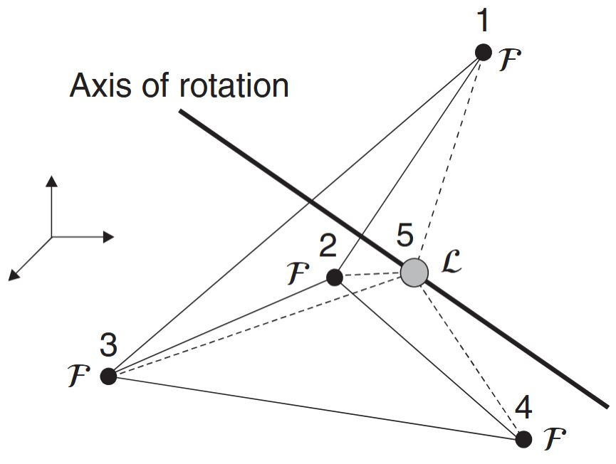
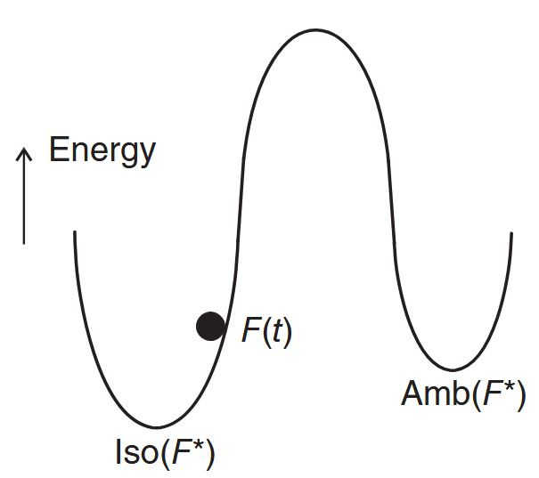
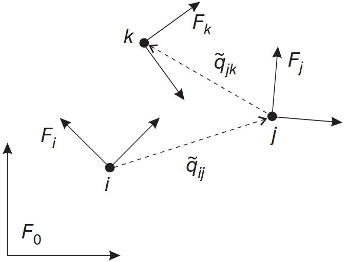
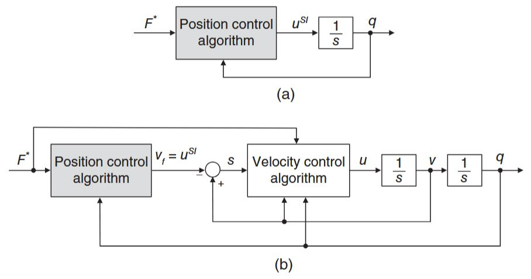
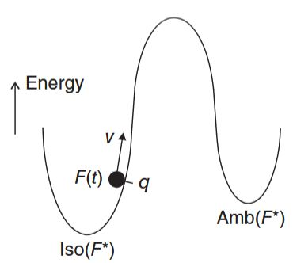
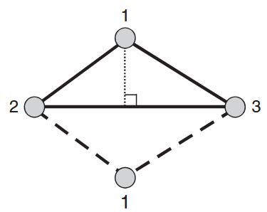
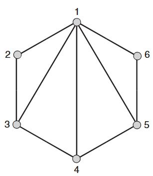

# Formation Control
## 1 Introduction [1]

Consider a system of $n$ mobile agents where $\boldsymbol{q}_i \in \mathbb{R}^m$ is the **position** of the $i^\text{th}$ agent relative to an Earth-fixed coordinate frame, and $\boldsymbol{u}_i \in \mathbb{R}^m$ is the corresponding **control input**. In subsequent parts, $\boldsymbol{u}_i$ will be a velocity-, acceleration-, or actuator-level input depending on the mathematical model used to describe the agent motion.

Let the **desired** formation for the agents be represented by an infinitesimally and minimally rigid framework $\mathcal{F}^∗ = (\mathcal{G}^∗, \boldsymbol{q}^∗)$ where $\mathcal{G}^∗ = (\mathcal{V}^∗, \mathcal{E}^∗)$ is the formation graph, $\dim(\mathcal{V}^∗) = n, \dim(\mathcal{E}^∗) = l$, and $\boldsymbol{q}^∗ = [\boldsymbol{q}^∗_1, \ldots , \boldsymbol{q}^∗_n]$. The **constant** desired distance between agents $i$ and $j$ is given by

$$
d_{ij} = \|\boldsymbol{q}_i^* - \boldsymbol{q}_j^*\| > 0, \quad i,j\in\mathcal{V}^*. \tag{1.1}
$$

In practice, the geometric shape/structure of the desired formation is dictated by the mission to be accomplished by the agents. When translating the desired shape into a framework, one needs to include enough edges to ensure that $\mathcal{F}^∗$ is indeed **infinitesimally and minimally rigid**.

The actual formation of the agents is represented by the framework $\mathcal{F}(t) = (\mathcal{G}_s, \boldsymbol{q}(t))$ where $\mathcal{G}_s$ represents the sensor graph and $\boldsymbol{q} = [\boldsymbol{q}_1, \ldots , \boldsymbol{q}_n]$. It is important to clarify the difference between the formation graph $\mathcal{G}^∗$ and the sensor graph $\mathcal{G}_s$, which in general need not be the same.
- $\mathcal{G}^∗$ indicates the **minimum number of inter-agent distances** that need to be controlled for the desired formation to be successfully reached. 
- $\mathcal{G}_s$ indicates the agent pairs that **can sense** and/or communicate with each other.

We make the following assumptions regarding the desired and actual formations:

> [!info] Assumption 1
The set where the agents achieve the desired formation is nonempty, i.e., there exist $\boldsymbol{q}^∗$ such that $r_\mathcal{G}(\boldsymbol{q}^∗) = \boldsymbol{d}$ where $\boldsymbol{d} = [\ldots, d^2_{ij}, \ldots] \in \mathbb{R}^l$.

> [!info] Assumption 2
> The formation and sensor graphs are the same, i.e., $\mathcal{G}_s = \mathcal{G}^∗$. Furthermore, inter-agent connectivity is always maintained in the sense that agent $i$ is always within the sensing/communication range of agent $j$, $\forall j \in \mathcal{N}_i(\mathcal{E}^∗)$. In other words, $\mathcal{G}^∗$ is **fixed**.

Connectivity maintenance prevents the occurrence of flex ambiguities since temporary loss of edges cannot happen.

> [!info] Assumption 3
At $t = 0$, the agents do not satisfy the desired inter-agent distance constraints, i.e., $\|\boldsymbol{q}_i(0) − \boldsymbol{q}_j(0)\| =\neq d_{ij}, \quad i, j \in \mathcal{V}^*$.

> [!info] Assumption 4
The only position information being measured is the **relative position** of agent pairs in $\mathcal{E}^∗, \boldsymbol{q}_i − \boldsymbol{q}_j, (i, j) \in \mathcal{E}^∗$^[The control could also be a function of other, nonposition-related variables depending on the agent model and formation problem being solved.]. That is, the global position of the agents, $\boldsymbol{q}_i, i = 1, \ldots , n$, are not available to the control.

We will deal with three types of control problems: 
- **Formation Acquisition**
- **Formation Maneuvering**
- **Target Interception**

> [!info] Problem 1: Formation Acquisition
> The goal is for the agents to acquire and maintain a pre-defined geometric shape in space. The control objective for formation acquisition, which serves as the common, primary objective for the other two problems, can be mathematically described as to design $\boldsymbol{u}_i$ such that
>
> 
> 
> $$ \mathcal{F}(t)\to\operatorname{Iso}(\mathcal{F}^*) \text{ as }t\to\infty. \tag{1.2} $$
>
> which is equivalent to
>
> 
> 
> $$ \|\boldsymbol{q}_i(t) - \boldsymbol{q}_j(t)\|\to d_{ij} \text{ as } t\to\infty, \quad i,j\in\mathcal{V}^*. \tag{1.3} $$

Since only the inter-agent distances are to be directly controlled, the actual formation can converge to any isometry of $\mathcal{F}^∗$. That is, the meaning is that the formation will converge to one framework in the set $\operatorname{Iso}(\mathcal{F}^*)$ with the specific one being determined by the initial position of the agents, $\boldsymbol{q}_i(0), i = 1, \ldots, n$.

> [!info] Problem 2: Formation Maneuvering
> The agents are required to simultaneously **acquire a formation** (i.e., satisfy [$(1.2)$](#eq-1.2)) and **maneuver cohesively** according to some pre-defined trajectory. Thus, the secondary objective is
>
> 
>
> $$ \dot{\boldsymbol{q}}_i(t) - \boldsymbol{v}_{di}(t) \to \mathbf{0} \text{ as }t\to\infty, \quad i=1,\ldots, n. \tag{1.4} $$
> 
> where $\boldsymbol{v}_{di} \in \mathbb{R}^3$ represents the **desired rigid body velocity** for the swarm of agents. That is, the fixed-shape, desired formation evolves in space as a virtual rigid body undergoing translation and/or rotation.

In practice, the selection of $\boldsymbol{v}_{di}$ is mission-dependent. For example, it could be related to a path planning algorithm that provides an optimal solution to the coverage problem where agents cooperatively maximize the coverage area of a given mission under certain time and/or fuel consumption constraints.

When $\boldsymbol{v}_{di}$ **only includes a translation velocity**, the formation maneuvering problem is also called **flocking**. For the case where $\boldsymbol{v}_{di}$ has a rotational component, we assign the $n^\text{th}$ agent (without lost of generality) to be the “leader” while the remaining agents are “followers”. This assignment is for the sole purpose of one agent serving as a reference point for the axis of rotation of the virtual rigid body. Therefore, $\mathcal{F}^∗$ should be constructed with the following additional conditions:
- $\boldsymbol{q}^*_n\in\operatorname{conv}\{\boldsymbol{q}_1^*, \ldots,\boldsymbol{q}_{n-1}^*\}$.
- $(i,n)\in\mathcal{E}^*, i=1,\ldots,n-1$, i.e., there is an edge between each follower and  the leader.

<figure>
   
   
<figcaption> Figure 1.1: Example of the construction of $F^∗$: a tetrahedron formation where L stands for leader and F for follower.</figcaption>

</figure>

An example of $\mathcal{F}^∗$ is illustrated by the 3D formation in [Figure 1.1](#fig-1.1) where the leader is located in the interior of the tetrahedron. **The axis of rotation passes through the leader**, which is inside the tetrahedron. Since $n = 5$, we need $3n − 6 = 9$ for the framework to be **minimally rigid**. The solid lines indicate edges that form the faces of the tetrahedron while the dashed lines are edges in its interior. Notice that edge $(1, 4)$ is not necessary.

The association of a leader agent (instead of a virtual leader) with the axis of rotation is done for convenience (not necessity) since the leader’s relative position to the followers can be measured and it will not have to undergo any rotation. Note that if one uses a virtual leader, its location would have to be known in order to calculate its position relative to the agents (see [$(3)$ in Distance](./1distance.md#eq-3)). This in turn would require extra measurements and/or calculations.

> [!info] Problem 3: Target Interception
> The agents should intercept and surround a (possibly evading) moving target with a pre-defined formation. Here, we will also use the leader–follower approach by taking the $n^\text{th}$ agent to be the leader while the remaining agents are followers. The control protocol will consist of:
> 1. Selecting $\mathcal{F}^∗$ such that $\boldsymbol{q}^*_n\in\operatorname{conv}\{\boldsymbol{q}_1^*, \ldots,\boldsymbol{q}_{n-1}^*\}$ (Unlike formation maneuvering with rotation, we do not need the second condition for target interception)
> 2. The leader chasing the target
> 3. The followers tracking the leader while maintaining the desired formation.
> Thus, if $\boldsymbol{q}_T \in \mathbb{R}^m$ denotes the **target position**, the secondary objective for this problem is that $\boldsymbol{q}_T(t)$ approach $\operatorname{conv}\{\boldsymbol{q}_1(t), \boldsymbol{q}_2(t), \ldots, \boldsymbol{q}_{n−1}(t)\}$ as time evolves, which (with abuse of notation) we express as
>
> 
>
> $$ \boldsymbol{q}_T(t)\in\operatorname{conv}\{\boldsymbol{q}_1(t), \boldsymbol{q}_2(t), \ldots, \boldsymbol{q}_{n−1}(t)\}\text{ as }t\to\infty. \tag{1.5} $$

Before beginning with the control design, some theorem and corollary statements will be made without proof.

> [!caution] Theorem 1.1 (Originally from [1] of Theorem C. 1)
> Consider the SISO LTI system
>
> $$ \begin{aligned} & \dot{\boldsymbol{x}}=\mathbf{A} \boldsymbol{x}+\mathbf{B} \boldsymbol{u} \\ & \boldsymbol{y}=\mathbf{C} \boldsymbol{x} \end{aligned} $$
>
> where $\mathbf{A} \in \mathbb{R}^{n \times n}$ is a **Hurwitz** matrix. Then, the following results hold:
> - If $\boldsymbol{u}(t) \in \mathcal{L}_2$, then $\boldsymbol{y}(t) \in \mathcal{L}_2 \cap \mathcal{L}_{\infty}, \boldsymbol{y}(t) \in \mathcal{L}_2, \boldsymbol{y}(t)$ is continuous, and $\boldsymbol{y}(t) \rightarrow 0$ as $t \rightarrow \infty$.
> - If $\boldsymbol{u}(t) \in \mathcal{L}_{\infty}$, then $\boldsymbol{y}(t) \in \mathcal{L}_{\infty}, \boldsymbol{y}(t) \in \mathcal{L}_{\infty}$, and $\boldsymbol{y}(t)$ is uniformly continuous. If, in addition, $\boldsymbol{u}(t) \rightarrow 0$ as $t \rightarrow \infty$, then $\boldsymbol{y}(t) \rightarrow 0$ as $t \rightarrow \infty$.

> [!caution] Theorem 1.2 (Originally from [1] of Theorem C.2)
> Let $V: D \times \mathbb{R}_{\geqslant 0} \rightarrow \mathbb{R}$ be a continuously differentiable function such that
> 
> $$ \begin{aligned} & U_1(x) \leqslant V(x, t) \leqslant U_2(x) \\ & \dot{V}=\frac{\partial V}{\partial t}+\frac{\partial V}{\partial x} f(x, t) \leqslant-U_3(x) \end{aligned} $$
> 
> for all $t \geqslant 0$ and for all $x \in D$, where $U_i(x), i=1,2,3$ are continuous positive definite functions on $D$. Then, $x_e=0$ is uniformly asymptotically stable.

> [!tip] Corollary 1.1 (Originally from [1] of Corollary C.1)
> If $U_i(x)=c_i\|x\|^p, i=1,2,3$ where $c_i, p>0$ in Theorem 1.1, then $x_e=0$ is **exponentially stable**.

Input-to-state stability bridges the gap between the notions of Lyapunov stability and input–output stability by quantifying the effects of both initial conditions and external (control or disturbance) inputs on the system state.

> [!warning] Definition: Input-to-State Stability
> A dynamical system $\dot{\boldsymbol{x}} = \boldsymbol{f}(\boldsymbol{x}, \boldsymbol{u}), \quad \boldsymbol{x}(0)=\boldsymbol{x}_0$ with $\boldsymbol{f}: \mathbb{R}^n \times \mathbb{R}^m \rightarrow \mathbb{R}^n$ is said to be **input-to-state stable** if there exist a class $\mathcal{KL}$ function $\beta$ and a class $\mathcal{K}$ function $\alpha$ such that, for any $\boldsymbol{x}_0$ and any $u(t)\in\mathcal{L}_\infty$, the solution $\boldsymbol{x}(t)$ exists for all $t\geqslant 0$ and satisfies
> $$ \|x(t)\| \leqslant \beta(\|x_0\|, t) + \alpha(\sup_{0\leqslant\tau \leqslant t} \|u(\tau)\|). $$

The above inequality has several implications.
- For any bounded input, the state is bounded.
- As $t \to\infty$, the state is ultimately bounded by function $\alpha$.
- If $\boldsymbol{u}(t) \to \mathbf{0}$ as $t \to\infty$, so does $\boldsymbol{x}(t)$.

> [!caution] Theorem 1.3 (A corollary to Barbalat's Lemma, originally from [1] of Theorem C.3)
> Consider the function $F: \mathbb{R}_{\geqslant 0} \rightarrow \mathbb{R}$. If $f(t)\in\mathcal{L}_\infty, \dot{f}(t)\in\mathcal{L}_\infty$, and $f(t)\in\mathcal{L}_2$, then
>
> $$ f(t)\to 0 \text{ as }t\to\infty. $$

> [!caution] Theorem 1.4 (Originally from [1] of Theorem C.4)
> Consider that $f(\boldsymbol{x}, \boldsymbol{u})$ in $\dot{\boldsymbol{x}=\boldsymbol{f}(\boldsymbol{x}, \boldsymbol{u})}, \quad \boldsymbol{x}(0)=\boldsymbol{x}_0$ is locally Lipschitz in $(\boldsymbol{x}, \boldsymbol{u})$ in some neighborhood of $(\boldsymbol{x}=0, \boldsymbol{u}=0)$. Then, the system is locally input-to-state stable if and only if the unforced system $\dot{\boldsymbol{x}}=\boldsymbol{f}(\boldsymbol{x}, 0)$ has a locally asymptotically stable equilibrium point at the origin.

> [!caution] Theorem 1.5 (Originally from [1] of Theorem C.5)
> Consider the interconnected system
>
> 
> 
> $$ \begin{aligned} & \Sigma_1: \dot{x}=f(x, y) \\ & \Sigma_2: \dot{y}=g(y) . \end{aligned} \tag{1.6} $$
>
> If subsystem $\Sigma_1$ with input $y$ is locally input-to-state stable and $y=0$ is a locally asymptotically stable equilibrium point of subsystem $\Sigma_2$, then $[x, y]=0$ is a locally asymptotically stable equilibrium point of the interconnected system.

> [!caution] Theorem 1.6 (Originally from [1] of Theorem C. 6)
> If $0 \in K[f](0, t)$ in a region $Q \supset B(0, \delta) \times\left[t_0, \infty\right)$ and $V$ : $D \times \mathbb{R}_{\geqslant 0} \rightarrow \mathbb{R}$ is a regular function satisfying $V(0, t)=0$,
> 
> $$ \alpha_1(\|x\|) \leqslant V(x, t) \leqslant \alpha_2(\|x\|) \quad \forall x \neq 0 $$
> 
> and
> 
> $$ \dot{V} \stackrel{\text { a.e. }}{\in} \underset{\xi \in \partial V(x, t)}{\cap} \xi^{\top}\left[\begin{array}{c} K[f](x, t) \\ 1 \end{array}\right] \leqslant-\alpha_3(\|x\|) $$
> 
> in $Q$ where $\alpha_i(\cdot), i=1,2,3$ are class $\mathcal{K}$ functions, $K[f](x, t)$ is an upper semi-continuous, nonempty, compact, convex-valued map on $D$ defined as
> 
> $$ K[f](x,t) := \underset{\delta>0}{\cap}\underset{\mu N=0}{\cap} \overline{\operatorname{co}}f(B(x, \delta) \backslash N, t), $$
>
> where $\underset{\mu N=0}{\cap}$ denotes the intersection over all sets $N$ of Lebesgue measure zero, $\overline{\operatorname{co}}$ is the convex closure, and $B$ was defined as 
>
> $$ B(\bar{\boldsymbol{x}},r) = \{\boldsymbol{x}\in\mathbb{R}^n: \|\boldsymbol{x} - \bar{\boldsymbol{x}}\| < r\} $$
>
> represents the "ball" of radius $r$ centered at $\bar{\boldsymbol{x}}$.
> 
> Then $x=0$ is a **uniformly asymptotically stable equilibrium point** of system $\dot{\boldsymbol{x}}=\boldsymbol{f}(\boldsymbol{x}, t), \quad \boldsymbol{x}(t_0)=\boldsymbol{x}_0$ where $\boldsymbol{f}: D \times \mathbb{R}_{\geqslant 0} \rightarrow \mathbb{R}^n$ is discontinuous in ${\boldsymbol{x}}$ and piecewise continuous in $t$ on $D \times \mathbb{R}_{\geqslant 0}$.

## 2 Single-Integrator Model [1]
This section will set the foundation for the formation control designs. We use here a very simple model for the motion of the agents known as the **single-integrator model**, which only includes two variables: **position and velocity**. This is a simplified kinematic model for omnidirectional robots (e.g., mobile robots with Swedish wheels). Specifically, we consider a system of $n$ agents governed by the first-order differential equation

$$
\dot{\boldsymbol{q}}_i = \boldsymbol{u}_i, \quad i = 1, \ldots, n. \tag{2.1}
$$

where $\boldsymbol{q}_i \in \mathbb{R}^m$ is the position and $\boldsymbol{u}_i \in \mathbb{R}^m$ is the **velocity-level control input** of the $i^\text{th}$ agent with respect to an Earth-fixed coordinate frame. The name “single integrator” originates from the fact that the transfer function matrix of [$(2.1)$](#eq-2.1) is

$$
G_i(s) = \frac{1}{s}I_m \tag{2.2}
$$

where $s$ is the Laplace variable, i.e., the inputs and outputs are separated by one integrator.

Formation controllers based on [$(2.1)$](#eq-2.1) are called **high-level control laws** because they are often embedded in controllers designed for more refined agent models. Therefore, the control laws introduced in this section will form the basis for all subsequent designs.

### 2.1 Formation Acquisition
We begin with the formation acquisition problem defined in [Section 1](#1-introduction-1). Given [$(2.1)$](#eq-2.1), we seek to design $\boldsymbol{u}_i = \boldsymbol{u}_i(\boldsymbol{q}_i − \boldsymbol{q}_j, d_{ij}), i = 1, \ldots , n$ and $j ∈ \mathcal{N}_i(\mathcal{E}^∗)$, where $\mathcal{N}_i(\cdot)$ was defined in [Preliminary of Graph Theory](./1distance.md#preliminary-graph-theory-45) to achieve the control objective described by [$(1.2)$](#eq-1.2) (or equivalently [$(1.3)$](#eq-1.3)).

It is appropriate at this point to elaborate on an issue mentioned at the end of [Section of framework ambiguities](./1distance.md#framework-ambiguities). The inputs $\boldsymbol{u}_i, i = 1, \ldots , n$ will directly control the distances $\|\boldsymbol{q}_i − \boldsymbol{q}_j\|, (i, j) \in \mathcal{E}^∗$. Therefore, they can only directly ensure that

$$
\|\boldsymbol{q}_i(t) − \boldsymbol{q}_j(t)\|\to d_{ij}\text{ as }t\to\infty, \quad (i,j)\in\mathcal{E}^*, \tag{2.3}
$$

which is equivalent to

$$
r_\mathcal{G}(\boldsymbol{q}(t))\to r_\mathcal{G}(\boldsymbol{q}^*) = \boldsymbol{d}\text{ as }t\to\infty. \tag{2.4}
$$

Note that [$(2.3)$](#eq-2.3) is different than [$(1.3)$](#eq-1.3) since it is only defined for $(i, j) \in \mathcal{E}^∗$ while [$(1.3)$](#eq-1.3) is defined for all $i, j \in \mathcal{V}^∗$. This is potentially problematic since (with abuse of notation) $r_\mathcal{G}(\operatorname{Iso}(\mathcal{F}^∗)) = r_\mathcal{G}(\operatorname{Amb}(\mathcal{F}^∗))$. Therefore, the control scheme will need to avoid the possibility that $\mathcal{F}(t) \to \operatorname{Amb}(\mathcal{F}^∗)$ as $t \to \infty$. This will be accomplished by initializing the agents **sufficiently close to** $\operatorname{Iso}(\mathcal{F}^∗)$ in the sense that $\operatorname{dist}(\boldsymbol{q}(0), \operatorname{Iso}(\mathcal{F}^∗)) < \operatorname{dist}(\boldsymbol{q}(0), \operatorname{Amb}(\mathcal{F}^∗))$.

To simplify the notation in the following derivations, we define the relative position of two agents as

$$
\tilde{\boldsymbol{q}}_{ij} = \boldsymbol{q}_i - \boldsymbol{q}_j. \tag{2.5}
$$

and let $\tilde{\boldsymbol{q}} = [\ldots , \tilde{\boldsymbol{q}}_{ij}, \ldots] \in \mathbb{R}^{ml}, (i, j) \in \mathcal{E}^∗$ with the same ordering of terms as the edge function $r_\mathcal{G}(\cdot)$. The distance error is given by

$$
e_{ij} = \|\tilde{\boldsymbol{q}}_{ij}\| - d_{ij}. 
\tag{2.6}
$$

Note that [$(1.3)$](#eq-1.3) is equivalent to $e_{ij}(t) \to 0$ as $t \to\infty, i, j \in \mathcal{V}^∗$. The distance error dynamics can be derived from [$(2.6)$](#eq-2.6) and [$(2.1)$](#eq-2.1) as

$$
\begin{align*}
   \dot{e}_{ij} &= \frac{\mathrm{d}}{\mathrm{d}t}\left(\sqrt{\tilde{\boldsymbol{q}}_{ij}^\top\tilde{\boldsymbol{q}}_{ij}}\right) \\
   &= (\tilde{\boldsymbol{q}}_{ij}^\top\tilde{\boldsymbol{q}}_{ij})^{-\frac12}\tilde{\boldsymbol{q}}_{ij}^\top(\boldsymbol{u}_i - \boldsymbol{u}_j) \\
   &= \frac{\tilde{\boldsymbol{q}}_{ij}^\top(\boldsymbol{u}_i - \boldsymbol{u}_j)}{e_{ij} + d_{ij}}. \tag{2.7}
\end{align*}
$$

Let

$$
z_{ij} = \|\tilde{\boldsymbol{q}}_{ij}\|^2 - d_{ij}^2, \tag{2.8}
$$

which can be rewritten as

$$
z_{ij} = e_{ij}(e_{ij} + 2d_{ij}) \tag{2.9}
$$

using [$(2.6)$](#eq-2.6). Given that $\|\tilde{\boldsymbol{q}}_{ij}\| \geqslant 0$ (or equivalently, $e_{ij} \geqslant −d_{ij}$), it is not difficult to see that $z_{ij} = 0$ if and only if $e_{ij} = 0$. We now introduce the following **Lyapunov function candidate**

$$
W(\boldsymbol{e}) = \frac14\sum_{(i,j)\in\mathcal{E}^*}z_{ij}^2 = \frac14 \boldsymbol{z}^\top\boldsymbol{z} \tag{2.10}
$$

where $\boldsymbol{e} = [\ldots , e_{ij}, \ldots] \in \mathbb{R}^l$ and $\boldsymbol{z} = [\ldots, z_{ij}, \ldots] \in \mathbb{R}^l, (i, j) \in \mathcal{E}^∗$ are ordered as $r_\mathcal{G}$. This function is **positive definite** in $\boldsymbol{e}$ and its level surfaces, $W (\boldsymbol{e}) = c$ for some $c > 0$, are **closed** since $e_{ij} \geqslant −d_{ij}$. The time derivative of [$(2.10)$](#eq-2.10) along [$(2.7)$](#eq-2.7) is given by

$$
\dot{W} = \sum_{(i,j)\in\mathcal{E}^*}e_{ij}(e_{ij}+2d_{ij})\tilde{\boldsymbol{q}}^\top_{ij}(\boldsymbol{u}_i - \boldsymbol{u}_j). \tag{2.11}
$$

Using definition of rigidity matrix $R_\mathcal{D}$ i.e., [$(6)$](./1distance.md#eq-6) in Infinitesimal Rigidity, and [$(2.9)$](#eq-2.9), [$(2.11)$](#eq-2.11) can be conveniently written as[^2.1]

$$
\dot{W} = \boldsymbol{z}^\top R_\mathcal{D}(\tilde{\boldsymbol{q}})\boldsymbol{u} \tag{2.12}
$$

where $\boldsymbol{u} = [\boldsymbol{u}_1, \ldots, \boldsymbol{u}_n] \in \mathbb{R}^{mn}$ is the stacked vector of control inputs. Before presenting the main result, we introduce a lemma that establishes the **relationship** between [Corollary](./1distance.md#corollary-thm-2) of Theorem 2 in Graph Rigidity and the level surfaces of the Lyapunov function candidate.

> [!tip] Lemma 2.1
> For **nonnegative** constants $c$ and $\delta$, the level set $W (e) \leqslant c$ is equivalent to $\Psi(\mathcal{F}, \mathcal{F}^∗) \leqslant \delta$ where $\Psi$ and $W$ were defined in [Corollary](./1distance.md#corollary-thm-2) of Theorem 2 in Graph Rigidity and [$(2.10)$](#eq-2.10), respectively.

**Proof**:

    
 Details of Proof 

First, from the definition of $\Psi(\cdot,\cdot)$ in [Corollary](./1distance.md#corollary-thm-2) of Theorem 2 in Graph Rigidity, [$(1.1)$](#eq-1.1), [$(2.5)$](#eq-2.5), [$(2.6)$](#eq-2.6), we have that

$$
\begin{align*}
   \Psi(\mathcal{F},\mathcal{F}^*) &= \sum_{(i,j)\in\mathcal{E}^*}(\|\boldsymbol{q}_i - \boldsymbol{q}_j\| - \|\boldsymbol{q}_i^* - \boldsymbol{q}_j^*\|)^2 \\
   &= \sum_{(i,j)\in\mathcal{E}^*}(\|\boldsymbol{q}_i - \boldsymbol{q}_j\| - d_{ij})^2 \\
   &= \sum_{(i,j)\in\mathcal{E}^*} e_{ij}^2 \tag{2.13}
\end{align*}
$$

From [$(2.10)$](#eq-2.10), we know $W (e) \leqslant c$ implies that $e_{ij}, (i, j) \in \mathcal{E}^*$ is bounded. This  boundedness along with [$(2.13)$](#eq-2.13) implies $\Psi(\mathcal{F}, \mathcal{F}^*) \leqslant \delta$ where $\delta$ is some nonnegative constant. Now, given $\Psi(\mathcal{F}, \mathcal{F}^*) \leqslant \delta$, it follows from [$(2.13)$](#eq-2.13) that $e_{ij}$ is  bounded for $(i, j) \in \mathcal{E}^*$. This implies $z_{ij}, (i, j) \in \mathcal{E}^*$ is bounded, and $W (e) \leqslant c$ where $c$ is some nonnegative constant. Q.E.D. 
$\square$

The control law for solving the formation acquisition problem is given in the following theorem. Its structure is based on [$(2.12)$](#eq-2.12) and Lyapunov stability theory. Specifically, the goal is to make the time derivative of the Lyapunov function candidate **negative definite**.

> [!caution] Theorem 2.1
> Consider the formation $\mathcal{F}(t)=\left(\mathcal{G}^{*}, \boldsymbol{q}(t)\right)$, and let the initial conditions of the error dynamics be such that $\boldsymbol{e}(0) \in \Omega_{1} \cap \Omega_{2}$ where
>
> $$ \begin{align*} & \Omega_{1}=\left\{\boldsymbol{e} \in \mathbb{R}^{l} \mid \Psi\left(\mathcal{F}, \mathcal{F}^{*}\right) \leqslant \delta\right\}, \\ & \Omega_{2}=\left\{\boldsymbol{e} \in \mathbb{R}^{l} \mid \operatorname{dist}\left(\boldsymbol{q}, \operatorname{Iso}\left(\mathcal{F}^{*}\right)\right)<\operatorname{dist}\left(\boldsymbol{q}, \operatorname{Amb}\left(\mathcal{F}^{*}\right)\right)\right\}, \tag{2.14} \end{align*} $$
>
> and $\delta$ is a sufficiently small positive constant. The control law[^2.2]
>
> 
> 
> $$ \boldsymbol{u}=\boldsymbol{u}_{a}:=-k_{v} R^{\top}_\mathcal{D}(\tilde{\boldsymbol{q}}) \boldsymbol{z}, \tag{2.15} $$
>
> where $k_{v}>0$ is a user-defined control gain, renders $\boldsymbol{e}=0$ exponentially stable and ensures [$(1.2)$](#eq-1.2) is satisfied.

**Proof**:

    
 Details of Proof 

Given that $\mathcal{F}^{*}$ and $\mathcal{F}(t)$ have the same number of edges and that $\mathcal{F}^{*}$ is minimally rigid by design, then $\mathcal{F}(t)$ is minimally rigid for all $t \geqslant 0$. Substituting [$(2.15)$](#eq-2.15) into [$(2.12)$](#eq-2.12) yields

$$
\begin{equation*}
\dot{W}=-k_{v} \boldsymbol{z}^{\top} R_\mathcal{D}(\tilde{\boldsymbol{q}}) R_\mathcal{D}^{\top}(\tilde{\boldsymbol{q}}) \boldsymbol{z} . \tag{2.16}
\end{equation*}
$$

Since $\mathcal{F}^{*}$ is infinitesimally rigid, we know from [Corollary](./1distance.md#corollary-thm-2) of Theorem 2 in Graph Rigidity that $\mathcal{F}(t)$ is infinitesimally rigid for $\boldsymbol{e}(t) \in \Omega_{1}$. Therefore, we know $\mathcal{F}(t)$ is infinitesimally and minimally rigid for $\boldsymbol{e}(t) \in \Omega_{1}$, so we can invoke [Corollary](./1distance.md#corollary-thm-3) of Theorem 3 in Minimal Rigidity to state

$$
\begin{equation*}
\dot{W} \leqslant-k \lambda_{\min }\left(R_\mathcal{D} R_\mathcal{D}^{\top}\right) \boldsymbol{z}^{\top} \boldsymbol{z}=-4 k \lambda_{\min }\left(R_\mathcal{D} R_\mathcal{D}^{\top}\right) W \quad \text { for } \quad \boldsymbol{e}(t) \in \Omega_{1} \tag{2.17}
\end{equation*}
$$

where [$(2.10)$](#eq-2.10) was used. From [$(2.17)$](#eq-2.17), we know that $\dot{W}(t) \leqslant 0$ for all $t \geqslant 0$; hence, $W(t)$ is **nonincreasing** for all $t \geqslant 0$. Then, since $\boldsymbol{e}(t) \in \Omega_{1}$ is equivalent to $\boldsymbol{e}(t) \in\left\{\boldsymbol{e} \in \mathbb{R}^{3 n} \mid W(\boldsymbol{e}) \leqslant c\right\}$ from [Lemma 2.1](#lem-2.1), a **sufficient condition** for [$(2.17)$](#eq-2.17) is given by

$$
\begin{equation*}
\dot{W} \leqslant-4 k \lambda_{\min }\left(R_\mathcal{D} R_\mathcal{D}^{\top}\right) W \quad \text { for } \quad \boldsymbol{e}(0) \in \Omega_{1} . \tag{2.18}
\end{equation*}
$$

From the form of [$(2.18)$](#eq-2.18) and the fact that $W$ is positive definite in $\boldsymbol{e}$, we can invoke [Corollary 1.1](#corollary-1.1) to conclude that $\boldsymbol{e}=0$ is exponentially stable for $\boldsymbol{e}(0) \in \Omega_{1}$. Given that $\boldsymbol{e}$ is only defined for $(i, j) \in \mathcal{E}^{*}$, the exponential stability of $\boldsymbol{e}=0$ implies that $\mathcal{F}(t) \rightarrow \operatorname{Iso}\left(\mathcal{F}^{*}\right)$ or $\mathcal{F}(t) \rightarrow \operatorname{Amb}\left(\mathcal{F}^{*}\right)$ as $t \rightarrow \infty$. If we choose $\boldsymbol{e}(0) \in \Omega_{1} \cap \Omega_{2}$, we have from [$(2.14)$](#eq-2.14) that

$$
\begin{equation*}
\operatorname{dist}\left(\boldsymbol{q}(0), \operatorname{Iso}\left(\mathcal{F}^{*}(0)\right)\right)<\operatorname{dist}\left(\boldsymbol{q}(0), \operatorname{Amb}\left(\mathcal{F}^{*}(0)\right)\right) . \tag{2.19}
\end{equation*}
$$

Due to [$(2.19)$](#eq-2.19), the energy-like function $W(t)$ would need to increase for a period of time for $\mathcal{F}(t) \rightarrow \operatorname{Amb}\left(\mathcal{F}^{*}\right)$ as $t \rightarrow \infty$, which is a **contradiction** since [$(2.18)$](#eq-2.18) establishes that $W(t)$ is nonincreasing for all $t \geqslant 0$. Therefore, we know $\mathcal{F}(t) \rightarrow \operatorname{Iso}\left(\mathcal{F}^{*}\right)$ as $t \rightarrow \infty$ for $\boldsymbol{e}(0) \in \Omega_{1} \cap \Omega_{2}$. This argument is conceptually illustrated by [Figure 2.1](#fig-2.1), where the ball, representing $\mathcal{F}(t)$, would have to overcome the energy barrier to reach $\operatorname{Amb}\left(\mathcal{F}^{*}\right)$. Q.E.D. 
$\square$

<figure>
   
   
<figcaption> Figure 2.1: Energy landscape showing the two equilibrium points, Iso(\mathcal{F}^{*}) and Amb(\mathcal{F}^{*})$, at the bottom of each well.</figcaption>

</figure>

The initial condition $\boldsymbol{e}(0) \in \Omega_{1} \cap \Omega_{2}$ in [Theorem 2.1](#thm-2.1) is a sufficient condition for the actual formation $\mathcal{F}(t)$ to
1. Remain infinitesimally rigid for all time and
2. Be closer to a framework in $\operatorname{Iso}\left(\mathcal{F}^{*}\right)$ at $t=0$ than to one in $\operatorname{Amb}\left(\mathcal{F}^{*}\right)$ in order to avoid converging to an ambiguous framework.

The former constraint is satisfied by $\boldsymbol{e}(0) \in \Omega_{1}$ while the latter is satisfied by $\boldsymbol{e}(0) \in \Omega_{2}$. The set $\Omega_{1} \cap \Omega_{2}$ exists because it is always possible to select $\mathcal{F}(0)$ sufficiently close to a framework in $\operatorname{Iso}\left(\mathcal{F}^{*}\right)$.

The control [$(2.15)$](#eq-2.15) can be expressed element-wise as

$$
\begin{equation*}
\boldsymbol{u}_{i}=-k_{v} \sum_{j \in \mathcal{N}_{i}\left(\mathcal{E}^{*}\right)} \tilde{\boldsymbol{q}}_{i j} \boldsymbol{z}_{i j}, \quad i=1, \ldots n, \tag{2.20}
\end{equation*}
$$

which is only a function of $\tilde{\boldsymbol{q}}_{i j}$ and $d_{i j}$ for $(i, j) \in \mathcal{E}^{*}$. Thus, the control law is **decentralized** since it only requires the $i^\text{th}$ agent to measure its relative position to neighboring agents.

Notice that each individual term of the summation in [$(2.20)$](#eq-2.20) is a vector whose direction is along $\tilde{\boldsymbol{q}}_{i j}$. If all $n$ agents are positioned collinearly at $t=0$, the control input of each one will necessarily be **directed along the line**. As a result, the agents will be stuck in a collinear formation and will never converge to the desired formation. In other words, the collinear formation is an **invariant set**. However, if at least one agent is not initially collinear with the others, the agents will not necessarily remain collinear because the edges between these agents and the noncollinear ones will create **control components whose directions are not parallel to the line**.

The stability result of [Theorem 2.1](#thm-2.1) guarantees that the desired formation is acquired up to rotation and translation. In other words, the formation acquisition controller does not regulate the formation to a pre-defined global location in space. This is a reflection of the facts that $\boldsymbol{u}_{i}$ is not a function of $\boldsymbol{q}_{i}$ but only of the relative positions $\tilde{\boldsymbol{q}}_{i j},(i, j) \in \mathcal{E}^{*}$ and that the control objective is to regulate $\left\|\tilde{\boldsymbol{q}}_{i j}\right\|$.

Since we are only concerned with the inter-agent distances, any coordinate frame can be used to implement $\boldsymbol{u}_{i}$. That is, although the above analysis was done with the variables defined with respect to a common, fixed coordinate frame for convenience, [$(2.20)$](#eq-2.20) can be implemented in practice with respect to the $i^\text{th}$ agent's own local coordinate frame. This means that the agents do not need to have a common sense of orientation and [$(2.20)$](#eq-2.20) is rotationally invariant. To see this, let $\mathcal{F}_{0}$ and $\mathcal{F}_{i}$ denote the Earth-fixed coordinate frame and the local coordinate frame of the $i^\text{th}$ agent, respectively (see [Figure 2.2](#fig-2.2)). If $\mathcal{R}_{i}^{0} \in \mathbb{R}^{m}$ denotes the rotation matrix representing the orientation of $\mathcal{F}_{i}$ with respect to $\mathcal{F}_{0}$, we have that

$$
\begin{aligned}
& \tilde{\boldsymbol{q}}_{i j}:=\tilde{\boldsymbol{q}}_{i j}^{0}=\mathcal{R}_{i}^{0} \tilde{\boldsymbol{q}}_{i j}^{i} \\
& \boldsymbol{u}_{i}:=\boldsymbol{u}_{i}^{0}=\mathcal{R}_{i}^{0} \boldsymbol{u}_{i}^{i}
\end{aligned}
$$

where the superscript denotes the coordinate frame in which the vector is specified. From [$(2.20)$](#eq-2.20), we can then write

$$
\begin{aligned}
\boldsymbol{u}_{i}^{i} & =-k_{v} \sum_{j \in \mathcal{N}_{i}\left(E^{*}\right)}\left(\mathcal{R}_{i}^{0}\right)^{\mathrm{T}} \tilde{\boldsymbol{q}}_{i j} \boldsymbol{z}_{i j} \\
& =-k_{v} \sum_{j \in \mathcal{N}_{i}\left(E^{*}\right)} \tilde{\boldsymbol{q}}_{i j}^{i} \boldsymbol{z}_{i j}
\end{aligned}
$$

since $\boldsymbol{z}_{i j}$ is independent of the coordinate frame.

<figure>
   
   
<figcaption> Figure 2.2: Fixed and local coordinate frames.</figcaption>

</figure>

Finally, the control [$(2.7)$](#eq-2.7) is in fact the standard gradient descent law that often appears in the literature. If we rewrite $\boldsymbol{z}$ as

$$
\begin{equation*}
\boldsymbol{z}=r_\mathcal{G}(\boldsymbol{q})-r_\mathcal{G}\left(\boldsymbol{q}^{*}\right) \tag{2.21}
\end{equation*}
$$

where $r_\mathcal{G}$ and [$(2.8)$](#eq-2.8) were used, it follows from [$(2.10)$](#eq-2.10) that

$$
\begin{equation*}
W=\frac{1}{4}\left\|r_\mathcal{G}(\boldsymbol{q})-r_\mathcal{G}\left(\boldsymbol{q}^{*}\right)\right\|^{2} . \tag{2.22}
\end{equation*}
$$

The derivative of [$(2.22)$](#eq-2.22) with respect to $\boldsymbol{q}$ is given by

$$
\frac{\partial W}{\partial \boldsymbol{q}}=\frac{1}{2}\left(r_\mathcal{G}(\boldsymbol{q})-r_\mathcal{G}\left(\boldsymbol{q}^{*}\right)\right)^{\top} \frac{\partial r_\mathcal{G}(\boldsymbol{q})}{\partial \boldsymbol{q}}=\left(r_\mathcal{G}(\boldsymbol{q})-r_\mathcal{G}\left(\boldsymbol{q}^{*}\right)\right)^{\top} R_\mathcal{D}(\tilde{\boldsymbol{q}})
$$

where $R_\mathcal{D}(\boldsymbol{p})$ was used. Therefore,

$$
\boldsymbol{u}=-\nabla_{\boldsymbol{q}} W=-\left(\frac{\partial W}{\partial \boldsymbol{q}}\right)^{\top}=-R_\mathcal{D}^{\top}(\tilde{\boldsymbol{q}}) \boldsymbol{z},
$$

which is the same as [$(2.7)$](#eq-2.7) without the control gain. That is, since [$(2.22)$](#eq-2.22) (also called a **potential function**) has a minimum when $r_\mathcal{G}(\boldsymbol{q})=r_\mathcal{G}\left(\boldsymbol{q}^{*}\right)$, it is well known from optimization theory that the negative gradient causes the system trajectory to approach the local minimum.

### 2.2 Formation Maneuvering

In this section, we solve the formation maneuvering problem defined in Section 1.4 using model [$(2.1)$](#eq-2.1). Since formation acquisition is embedded in the formation maneuvering problem, we use [$(2.12)$](#eq-2.12) as the starting point. The control law here will take the form $\boldsymbol{u}_{i}=\boldsymbol{u}_{i}\left(\tilde{\boldsymbol{q}}_{i j}, d_{i j}, \boldsymbol{v}_{d i}\right), i=1, \ldots, n$ and $j \in \mathcal{N}_{i}\left(\mathcal{E}^{*}\right)$ where $\boldsymbol{v}_{d i}(t)$, which was defined in [$(1.4)$](#eq-1.4), is a bounded continuous function.

> [!caution] Theorem 2.2
> Consider the formation $\mathcal{F}(t)=\left(\mathcal{G}^{*}, \boldsymbol{q}(t)\right)$ with the initial conditions on $\boldsymbol{e}(0)$ given in [Theorem 2.1](#thm-2.1). Then, the control
>
> 
>
> $$ \boldsymbol{u}=\boldsymbol{u}_{a}+\boldsymbol{v}_{d}, \tag{2.23} $$
>
> where $\boldsymbol{u}_{a}$ was defined in [$(2.15)$](#eq-2.15), $\boldsymbol{v}_{d}=\left[\boldsymbol{v}_{d 1}, \ldots, \boldsymbol{v}_{d n}\right] \in \mathbb{R}^{3 n}$ is the desired rigid body velocity specified by[^2.3]
>
> 
>
> $$ \boldsymbol{v}_{d i}=\boldsymbol{v}_{0}+\boldsymbol{\omega}_{0} \times \tilde{\boldsymbol{q}}_{i n}, i=1, \ldots, n \tag{2.24} $$
>
> $\boldsymbol{v}_{0}(t) \in \mathbb{R}^{3}$ denotes the desired translation velocity for the formation, $\boldsymbol{\omega}_{0}(t) \in \mathbb{R}^{3}$ is the desired angular velocity, renders $\boldsymbol{e}=0$ exponentially stable and ensures that [$(1.2)$](#eq-1.2) and [$(1.4)$](#eq-1.4) are satisfied.

**Proof**:

    
 Details of Proof 

Substituting [$(2.23)$](#eq-2.23) into [$(2.12)$](#eq-2.12) yields

$$
\begin{equation*}
\dot{W}=-k_{v} \boldsymbol{z}^{\top} R_\mathcal{D}(\tilde{\boldsymbol{q}}) R_\mathcal{D}^{\top}(\tilde{\boldsymbol{q}}) \boldsymbol{z}+\boldsymbol{z}^{\top} R_\mathcal{D}(\tilde{\boldsymbol{q}}) \boldsymbol{v}_{d} . \tag{2.25}
\end{equation*}
$$

TODO It follows from (1.20) and [$(2.24)$](#eq-2.24) that

$$
\begin{equation*}
R_\mathcal{D}(\tilde{\boldsymbol{q}}) \boldsymbol{v}_{d}=0 . \tag{2.26}
\end{equation*}
$$

Therefore, the proof of [Theorem 2.1](#thm-2.1) can be directly followed to show that $\boldsymbol{e}=0$ is exponentially stable for $\boldsymbol{e}(0) \in \Omega_{1} \cap \Omega_{2}$ and [$(1.2)$](#eq-1.2) holds.

From [$(2.9)$](#eq-2.9) it is clear that $\boldsymbol{z} \rightarrow 0$ as $\boldsymbol{e} \rightarrow 0$. The exponential stability of $\boldsymbol{e}=0$ implies that $\tilde{\boldsymbol{q}}$ is bounded from [$(2.6)$](#eq-2.6). Therefore, $R_\mathcal{D}(\tilde{\boldsymbol{q}})$ is bounded and we know from [$(2.23)$](#eq-2.23) and [$(2.15)$](#eq-2.15) that

$$
\begin{equation*}
\boldsymbol{u} \rightarrow \boldsymbol{v}_{d} \quad \text { as } \quad \boldsymbol{e} \rightarrow 0 \tag{2.27}
\end{equation*}
$$

Since we proved that $\boldsymbol{e}(t) \rightarrow 0$ as $t \rightarrow \infty$, it follows from [$(2.27)$](#eq-2.27) and [$(2.1)$](#eq-2.1) that [$(1.4)$](#eq-1.4) holds. Q.E.D. 
$\square$

The control [$(2.23)$](#eq-2.23) has two independent components: the term $\boldsymbol{u}_{a}$ is responsible for formation acquisition while $\boldsymbol{v}_{d}$ is responsible for rigid body maneuvers of the whole formation. We can see from [$(2.26)$](#eq-2.26) that the control exploits the special structure of the rigidity matrix to disassociate the formation acquisition stability analysis from the formation maneuvering analysis. 

Another interesting point is that, despite being based on the single-integrator model, [$(2.24)$](#eq-2.24) is generally **not open-loop** in nature since it depends on feedback of $\tilde{\boldsymbol{q}}_{i n}$. That is, [$(2.24)$](#eq-2.24) has an open-loop form only when the maneuver is purely translational.

The control law can be written element-wise as

$$
\boldsymbol{u}_{i}=-k_{v} \sum_{j \in \mathcal{N}_{i}\left(E^{*}\right)} \tilde{\boldsymbol{q}}_{i j} \boldsymbol{z}_{i j}+\boldsymbol{v}_{0}+\boldsymbol{\omega}_{0} \times \tilde{\boldsymbol{q}}_{i n}, \quad i=1, \ldots n,
$$

which shows that it is **decentralized**. Note that in many applications the signals $\boldsymbol{v}_{0}$ and $\boldsymbol{\omega}_{0}$ are known a priori and therefore can be stored on each agent's onboard computer. Also, since $\tilde{\boldsymbol{q}}_{n n}=0$, the formation maneuvering term of the leader only has the translation component $\boldsymbol{v}_{0}$. This is expected since the leader by design lies on the axis of rotation of the virtual rigid body.

### 2.3 Flocking

Here, we consider the special case of formation maneuvering where the **desired velocity only includes the translation component**. Recall from Section 1 that this is commonly referred to as **flocking**. Unlike last Section, we consider that the desired flocking velocity is only **available to a subset of agents**. We will overcome this constraint by employing a distributed observer that estimates this velocity by exploiting the connectedness of the formation graph.

#### Constant Flocking Velocity

We first consider the case where the flocking velocity is **constant**. Let $\boldsymbol{v}_{0} \in \mathbb{R}^{m}$ be the constant flocking velocity and $\mathcal{V}_{0} \subset \mathcal{V}^{*}$ be the nonempty subset of agents that have direct access to $\boldsymbol{v}_{0}$. To solve this flocking problem, we use the continuous controller-observer scheme

$$
\begin{align*}
& \boldsymbol{u}=\boldsymbol{u}_{a}+\hat{\boldsymbol{v}}  \tag{2.28a}\\
& \dot{\hat{\boldsymbol{v}}}_{i}=-\alpha \sum_{j \in \mathcal{N}_{i}\left(\mathcal{E}^{*}\right)}\left(\hat{\boldsymbol{v}}_{i}-\hat{\boldsymbol{v}}_{j}\right)-\alpha b_{i}\left(\hat{\boldsymbol{v}}_{i}-\boldsymbol{v}_{0}\right), \quad i=1, \ldots n \tag{2.28b}
\end{align*}
$$

where

$$
b_{i}= \begin{cases}1, & \text { if } i \in \mathcal{V}_{0}  \\ 0, & \text { otherwise }\end{cases} \tag{2.29}
$$

$\boldsymbol{u}_{a}$ was defined in [$(2.15)$](#eq-2.15), $\hat{\boldsymbol{v}}=\left[\hat{\boldsymbol{v}}_{1}, \ldots, \hat{\boldsymbol{v}}_{n}\right] \in \mathbb{R}^{m n}$ contains the velocity estimates for each agent, and $\alpha>0$ is a user-defined observer gain.

>[!caution] Theorem 2.3
> Consider the formation $\mathcal{F}(t)=\left(\mathcal{G}^{*}, \boldsymbol{q}(t)\right)$ with the initial conditions in [Theorem 2.1](#thm-2.1). Then, the controller-observer scheme [$(2.28)$](#eq-2.28) with any $\hat{\boldsymbol{v}}(0)$ renders $\boldsymbol{e}=\boldsymbol{0}$ **asymptotically stable** and ensures that [$(1.2)$](#eq-1.2) and [$(1.4)$](#eq-1.4) are satisfied with $\boldsymbol{v}_{d i}=\boldsymbol{v}_{0}, i=1, \ldots, n$.

**Proof**:

    
 Details of Proof 

Let

$$
\begin{equation*}
\tilde{\boldsymbol{v}}_{i}=\hat{\boldsymbol{v}}_{i}-\boldsymbol{v}_{0} \tag{2.30}
\end{equation*}
$$

denote the flocking velocity estimation error for agent $i$. If $\tilde{\boldsymbol{v}}=\left[\tilde{\boldsymbol{v}}_{1}, \ldots, \tilde{\boldsymbol{v}}_{n}\right] \in \mathbb{R}^{m n}$, then

$$
\begin{equation*}
\tilde{\boldsymbol{v}}=\hat{\boldsymbol{v}}-\mathbf{1}_{n} \otimes \boldsymbol{v}_{0} . \tag{2.31}
\end{equation*}
$$

As part of this proof, we will show that [$(2.28b)$](#eq-2.28) guarantees $\tilde{\boldsymbol{v}}(t) \rightarrow \mathbf{0}$ as $t \rightarrow \infty$. From the time derivative of [$(2.8)$](#eq-2.8), we have that

$$
\begin{equation*}
\dot{\boldsymbol{z}}=2 R_\mathcal{D}(\tilde{\boldsymbol{q}}) \boldsymbol{u} . \tag{2.32}
\end{equation*}
$$

After substituting [$(2.28a)$](#eq-2.28) into [$(2.32)$](#eq-2.32), we get the closed-loop system

$$
\begin{equation*}
\dot{\boldsymbol{z}}=-2 k_{v} R_\mathcal{D}(\tilde{\boldsymbol{q}}) R_\mathcal{D}^{\top}(\tilde{\boldsymbol{q}}) \boldsymbol{z}+2 R_\mathcal{D}(\tilde{\boldsymbol{q}}) \hat{\boldsymbol{v}} . \tag{2.33}
\end{equation*}
$$

Using [$(2.31)$](#eq-2.31) in [$(2.33)$](#eq-2.33) yields

$$
\begin{equation*}
\dot{\boldsymbol{z}}=-2 k_{v} R_\mathcal{D}(\tilde{\boldsymbol{q}}) R_\mathcal{D}^{\top}(\tilde{\boldsymbol{q}}) \boldsymbol{z}+2 R_\mathcal{D}(\tilde{\boldsymbol{q}}) \tilde{\boldsymbol{v}} \tag{2.34}
\end{equation*}
$$

upon application of Property $R_\mathcal{D}(\boldsymbol{p})(\mathbf{1}_n\otimes\boldsymbol{x})=0$ in [Infinitesimal Rigidity](./1distance.md#infinitesimal-rigidity).

Now, we turn our attention to deriving the dynamics of the estimation error. First, notice that

$$
\sum_{j \in \mathcal{N}_{i}\left(E^{*}\right)}\left(\hat{v}_{i}-\hat{v}_{j}\right)=\sum_{j=1}^{n} a_{i j}\left(\hat{v}_{i}-\hat{v}_{j}\right)
$$

where $a_{i j}$ are the elements of the adjacency matrix. Taking the time derivative of [$(2.31)$](#eq-2.31) and substituting [$(2.28b)$](#eq-2.28) gives

$$
\begin{align*}
\dot{\tilde{v}} & =-\alpha\left(\mathcal{L} \otimes \mathbf{I}_{m}\right) \tilde{v}-\alpha\left(\mathbf{B} \otimes \mathbf{I}_{m}\right) \tilde{v} \\
& =-\alpha\left(\mathbf{M} \otimes \mathbf{I}_{m}\right) \tilde{v} \tag{2.35}
\end{align*}
$$

where we used the fact that $\hat{\boldsymbol{v}}_{i}-\hat{\boldsymbol{v}}_{j}=\tilde{\boldsymbol{v}}_{i}-\tilde{\boldsymbol{v}}_{j}, \mathbf{B}:=\operatorname{diag}\left(b_{1}, \ldots b_{n}\right), \mathcal{L}$ is the Laplacian matrix defined in [$(1.4)$](#eq-1.4), and $\mathbf{M}:=\mathcal{L}+\mathbf{B}$ is symmetric. Our overall closed-loop system is composed of two interconnected subsystems, [$(2.34)$](#eq-2.34) and [$(2.35)$](#eq-2.35), which are in the form of [$(1.6)$](#eq-1.6). Notice that [$(2.34)$](#eq-2.34) with $\tilde{\boldsymbol{v}}=0$ is input-to-state stable by [Theorem 1.4](#thm-1.4) since it reduces to the closed-loop system analyzed in [Theorem 2.1](#thm-2.1). Since the graph of a rigid framework is always connected, we know that $\mathcal{G}^{*}$ is connected. Therefore, we know from Lemmas 1.1 and nonautonomous (time-varying) system $\dot{\boldsymbol{x}}=f(\boldsymbol{x},t), \quad \boldsymbol{x}(t_0)=\boldsymbol{x}_0$ that $\mathbf{M}$ and $\mathbf{M} \otimes \mathbf{I}_{m}$ are positive definite, respectively. It then follows from [$(2.35)$](#eq-2.35) that $\tilde{\boldsymbol{v}}=0$ is exponentially stable. We can now invoke [Theorem 1.5](#thm-1.5) to claim that $(\boldsymbol{z}, \tilde{\boldsymbol{v}})=0$ is an asymptotically stable equilibrium point of the interconnected system. Since $\boldsymbol{z}=0$ if and only if $\boldsymbol{e}=0$, we know $\boldsymbol{e}=0$ is asymptotically stable. Finally, by virtue of the initial conditions, we know that $\mathcal{F}(t) \rightarrow \operatorname{Iso}\left(\mathcal{F}^{*}\right)$ as $t \rightarrow \infty$ as argued in the proof of [Theorem 2.1](#thm-2.1).

Finally, due to the asymptotic stability of $\boldsymbol{e}=0$, we know $\boldsymbol{u}_{a}(t) \rightarrow 0$ as $t \rightarrow \infty$ and therefore from [$(2.28a)$](#eq-2.28) that $\boldsymbol{u}(t)-\hat{\boldsymbol{v}}(t) \rightarrow 0$ as $t \rightarrow \infty$. Since $\tilde{\boldsymbol{v}}_{i}(t)=\hat{\boldsymbol{v}}_{i}(t)- \boldsymbol{v}_{0} \rightarrow 0$ as $t \rightarrow \infty$, then we know from [$(2.1)$](#eq-2.1) that [$(1.4)$](#eq-1.4) holds. Q.E.D. 
$\square$

The form of [$(2.28b)$](#eq-2.28) is inspired by **multi-agent consensus algorithms**. The premise behind the observer is that agents that do not have direct access to $\boldsymbol{v}_{0}$ can acquire this information from its neighbors since the graph modeling the communication network is connected. Note that the observer [$(2.28b)$](#eq-2.28) can accommodate a **leader-follower strategy** (only one agent has access to $\boldsymbol{v}_{0}$ ) as well as the general case where the velocity information exchange happens between any two agents.

#### Time-Varying Flocking Velocity

The observer scheme in [$(2.28b)$](#eq-2.28) cannot be proven to ensure $\tilde{\boldsymbol{v}}(t) \rightarrow 0$ as $t \rightarrow \infty$ for the case where the flocking velocity varies with time. In this situation, one can use the variable structure-type observer

$$
\begin{equation*}
\dot{\hat{\boldsymbol{v}}}_{i}=-\alpha \operatorname{sgn}\left(\sum_{j \in \mathcal{N}_{i}\left(E^{*}\right)}\left(\hat{\boldsymbol{v}}_{i}-\hat{\boldsymbol{v}}_{j}\right)+b_{i}\left(\hat{\boldsymbol{v}}_{i}-\boldsymbol{v}_{0}\right)\right), \quad i=1, \ldots n \tag{2.36}
\end{equation*}
$$

where $\boldsymbol{v}_{0}(t) \in \mathcal{L}_{\infty}$ is the time-varying flocking velocity, which is assumed to be differentiable with $\left\|\dot{\boldsymbol{v}}_{0}(t)\right\|_{\mathcal{L}_{\infty}} \leqslant \gamma$ for all time, $b_{i}$ was defined in [$(2.29)$](#eq-2.29), and $\operatorname{sgn}(\cdot)$ is the standard signum function:

$$
\operatorname{sgn}(x)=\left\{\begin{array}{cl}
1 & \text { for } x>0  \tag{2.37}\\
0 & \text { for } x=0 \\
-1 & \text { for } x<0
\end{array}\right.
$$

The dynamics of the estimation error now become

$$
\begin{equation*}
\dot{\tilde{\boldsymbol{v}}}=-\alpha \operatorname{sgn}\left(\left(\mathbf{M} \otimes \mathbf{I}_{m}\right) \tilde{\boldsymbol{v}}\right)-\mathbf{1}_{n} \otimes \dot{\boldsymbol{v}}_{0} \tag{2.38}
\end{equation*}
$$

where $\operatorname{sgn}(x)=\left[\operatorname{sgn}\left(x_{1}\right), \ldots, \operatorname{sgn}\left(x_{n}\right)\right], \forall x \in \mathbb{R}^{n}$. Notice that [$(2.38)$](#eq-2.38) has a discontinuous right-hand side; thus, its solution needs to be studied using nonsmooth analysis. Since $\operatorname{sgn}(\cdot)$ is Lebesgue measurable and essentially locally bounded, one can show the existence of generalized solutions by embedding the differential equation into the differential inclusion

$$
\begin{equation*}
\dot{\tilde{\boldsymbol{v}}} \in K[f](\tilde{\boldsymbol{v}}, t) \tag{2.39}
\end{equation*}
$$

where $K[\cdot]$ is a nonempty, compact, convex, upper semicontinuous set-valued map and $f(\tilde{\boldsymbol{v}}, t)=-\alpha \operatorname{sgn}\left(\left(\mathbf{M} \otimes \mathbf{I}_{m}\right) \tilde{\boldsymbol{v}}\right)-\mathbf{1}_{n} \otimes \dot{\boldsymbol{v}}_{0}$.

If we define the Lyapunov function candidate

$$
\begin{equation*}
W_{f}=\frac{1}{2} \tilde{\boldsymbol{v}}^{\top}\left(\mathbf{M} \otimes \mathbf{I}_{m}\right) \tilde{\boldsymbol{v}} \tag{2.40}
\end{equation*}
$$

we get that

$$
\begin{align*}
\dot{W}_{f} & \stackrel{\text { a.e. }}{\in} \frac{\partial W_{f}}{\partial \tilde{\boldsymbol{v}}} K[f](\tilde{\boldsymbol{v}}, t) \\
& \subset-\alpha \tilde{\boldsymbol{v}}^{\top}\left(\mathbf{M} \otimes \mathbf{I}_{m}\right) \operatorname{sgn}\left(\left(\mathbf{M} \otimes \mathbf{I}_{m}\right) \tilde{\boldsymbol{v}}\right)-\tilde{\boldsymbol{v}}^{\top}\left(\mathbf{M} \otimes \mathbf{I}_{m}\right)\left(\mathbf{1}_{n} \otimes \dot{\boldsymbol{v}}_{0}\right) \tag{2.41}
\end{align*}
$$

where a.e. is the abbreviation for the term "almost everywhere". If we define $\operatorname{SGN}(x):=\left[\operatorname{SGN}\left(x_{1}\right), \ldots, \operatorname{SGN}\left(x_{n}\right)\right], \forall x \in \mathbb{R}^{n}$ where

$$
\operatorname{SGN}\left(x_{i}\right)= \begin{cases}1 & \text { for } x_{i}>0  \tag{2.42}\\ {[-1,1]} & \text { for } x_{i}=0 \\ -1 & \text { for } x_{i}<0\end{cases}
$$

then [$(2.41)$](#eq-2.41) becomes

$$
\begin{align*}
\dot{W}_{f} & =-\alpha \tilde{\boldsymbol{v}}^{\top}\left(\mathbf{M} \otimes \mathbf{I}_{m}\right) \mathrm{SGN}\left(\left(\mathbf{M} \otimes \mathbf{I}_{m}\right) \tilde{\boldsymbol{v}}\right)-\tilde{\boldsymbol{v}}^{\top}\left(\mathbf{M} \otimes \mathbf{I}_{m}\right)\left(\mathbf{1}_{n} \otimes \dot{\boldsymbol{v}}_{0}\right) \\
& =-\alpha\left\|\left(\mathbf{M} \otimes \mathbf{I}_{m}\right) \tilde{\boldsymbol{v}}\right\|_{1}-\left(\mathbf{1}_{n} \otimes \dot{\boldsymbol{v}}_{0}\right)^{\top}\left(\mathbf{M} \otimes \mathbf{I}_{m}\right) \tilde{\boldsymbol{v}} \\
& =-\alpha\left\|\left(\mathbf{M} \otimes \mathbf{I}_{m}\right) \tilde{\boldsymbol{v}}\right\|_{1}+\dot{\boldsymbol{v}}_{0}^{\top} \sum_{i=1}^{m n}\left[\left(\mathbf{M} \otimes \mathbf{I}_{m}\right) \tilde{\boldsymbol{v}}\right]_{i} \\
& \leqslant-\alpha\left\|\left(\mathbf{M} \otimes \mathbf{I}_{m}\right) \tilde{\boldsymbol{v}}\right\|_{1}+\left\|\dot{\boldsymbol{v}}_{0}\right\|_{1}\left\|\left(\mathbf{M} \otimes \mathbf{I}_{m}\right) \tilde{\boldsymbol{v}}\right\|_{1} \\
& \leqslant-(\alpha-\gamma)\left\|\left(\mathbf{M} \otimes \mathbf{I}_{m}\right) \tilde{\boldsymbol{v}}\right\|_{1} . \tag{2.43}
\end{align*}
$$

By choosing $\alpha>\gamma$, we get that $\dot{W}_{f}$ is negative definite. Therefore, from [Theorem 1.6](#thm-1.6), we know that $\tilde{\boldsymbol{v}}=0$ is asymptotically stable.

Now the proof that [$(2.15)$](#eq-2.15) and [$(2.36)$](#eq-2.36) guarantee that [$(1.2)$](#eq-1.2) and [$(1.4)$](#eq-1.4) are satisfied directly follows from the proof of [Theorem 2.3](#thm-2.3).

### 2.4 Target Interception with Unknown Target Velocity

We now turn our attention to the target interception problem defined in Section 1. We assume the target motion is such that $\boldsymbol{q}_{T}(t)$ is three times continuously differentiable and $\mathrm{d}^{i} \boldsymbol{q}_{T} / \mathrm{d} t^{i} \in \mathcal{L}_{\infty}, i=0,1,2,3$. Furthermore, we consider the target velocity $\dot{\boldsymbol{q}}_{T}$ to be unknown to all agents, but that the **leader** can measure the target's relative position $\boldsymbol{q}_{T}-\boldsymbol{q}_{n}$ with its onboard sensors and can broadcast this information to the followers.

To simplify the notation, we let $\boldsymbol{v}_{T}:=\dot{\boldsymbol{q}}_{T}$ and

$$
\begin{equation*}
\boldsymbol{e}_{T}=\boldsymbol{q}_{T}-\boldsymbol{q}_{n} \tag{2.44}
\end{equation*}
$$

denote the interception error between the leader and target. The control, which will include a term to "learn" the unknown target velocity, will take the general form $\boldsymbol{u}_{i}=\boldsymbol{u}_{i}\left(\tilde{\boldsymbol{q}}_{i j}, d_{i j}, \boldsymbol{e}_{T}, \hat{\boldsymbol{v}}_{T}\right), i=1, \ldots, n$ and $j \in \mathcal{N}_{i}\left(\mathcal{E}^{*}\right)$ where $\hat{\boldsymbol{v}}_{T}$ is the target velocity estimate. This term is generated by the following continuous dynamic estimation mechanism

$$
\begin{equation*}
\hat{\boldsymbol{v}}_{T}(t)=\int_{0}^{t}\left[k_{1} \boldsymbol{e}_{T}(\tau)+k_{2} \operatorname{sgn}\left(\boldsymbol{e}_{T}(\tau)\right)\right] \mathrm{~d} \tau \tag{2.45}
\end{equation*}
$$

where $k_{1}, k_{2}>0$ are user-defined control gains. This mechanism allows one to learn or compensate for sufficiently smooth, nonperiodic signals.

Before presenting the control law, a lemma is related to [$(2.45)$](#eq-2.45) is introduced.

>[!tip] Lemma 2.2
> Let
>
> 
>
> $$ L:=\left(k_{1} \boldsymbol{e}_{T}+\dot{\boldsymbol{e}}_{T}\right)^{\top}\left(\dot{\boldsymbol{v}}_{T}-k_{2} \operatorname{sgn}\left(\boldsymbol{e}_{T}\right)\right) . \tag{2.46} $$
>
> If $k_{2}$ in (2.45) is selected to satisfy the following sufficient condition
>
> 
>
> $$ k_{2}>\left\|\dot{\boldsymbol{v}}_{T}\right\|_{\mathcal{L}_{\infty}}+\frac{1}{k_{1}}\left\|\ddot{\boldsymbol{v}}_{T}\right\|_{\mathcal{L}_{\infty}}, \tag{2.47} $$
>
> then
>
> 
>
> $$ \int_{0}^{t} L(\tau) \mathrm{~d} \tau \leqslant \zeta_{b} \tag{2.48} $$
>
> where the positive constant $\zeta_{b}$ is defined as
>
> $$ \zeta_{b}=k_{2}\left\|\boldsymbol{e}_{T}(0)\right\|_{1}-\boldsymbol{e}_{T}^{\top}(0) \dot{\boldsymbol{v}}_{T}(0) \tag{2.49} $$

**Proof**:

    
 Details of Proof 

Integrating [$(2.46)$](#eq-2.46) over time yields

$$
\begin{align*}
\int_{0}^{t} L(\tau) \mathrm{~d} \tau= & \int_{0}^{t}\left(k_{1} \boldsymbol{e}_{T}(\tau)+\dot{\boldsymbol{e}}_{T}(\tau)\right)^{\top}\left[\dot{\boldsymbol{v}}_{T}(\tau)-k_{2} \operatorname{sgn}\left(\boldsymbol{e}_{T}(\tau)\right)\right] \mathrm{~d} \tau \\
= & \int_{0}^{t} k_{1} \boldsymbol{e}_{T}^{\top}(\tau)\left[\dot{\boldsymbol{v}}_{T}(\tau)-k_{2} \operatorname{sgn}\left(\boldsymbol{e}_{T}(\tau)\right)\right] \mathrm{~d} \tau+\int_{0}^{t} \dot{\boldsymbol{e}}_{T}^{\top}(\tau) \dot{\boldsymbol{v}}_{T}(\tau) \mathrm{~d} \tau \\
& -\int_{0}^{t} k_{2} \dot{\boldsymbol{e}}_{T}^{\top}(\tau) \operatorname{sgn}\left(\boldsymbol{e}_{T}(\tau)\right) \mathrm{~d} \tau \tag{2.50}
\end{align*}
$$

After integrating by parts the second integral on the right-hand side of (2.50) and applying Lemma 1 of [44] to the third integral, we obtain

$$
\begin{align*}
\int_{0}^{t} L(\tau) \mathrm{~d} \tau= & \int_{0}^{t} k_{1} \boldsymbol{e}_{T}^{\top}(\tau)\left[\dot{\boldsymbol{v}}_{T}(\tau)-k_{2} \operatorname{sgn}\left(\boldsymbol{e}_{T}(\tau)\right)\right] \mathrm{~d} \tau \\
& +\left.\boldsymbol{e}_{T}^{\top}(\tau) \dot{\boldsymbol{v}}_{T}(\tau)\right|_{0} ^{t}-\int_{0}^{t} \boldsymbol{e}_{T}^{\top}(\tau) \ddot{\boldsymbol{v}}_{T}(\tau) \mathrm{~d} \tau-\left.k_{2}\left\|\boldsymbol{e}_{T}(\tau)\right\|_{1}\right|_{0} ^{t} \\
= & \int_{0}^{t} k_{1} \boldsymbol{e}_{T}^{\top}(\tau)\left[\dot{\boldsymbol{v}}_{T}(\tau)-\frac{1}{k_{1}} \ddot{\boldsymbol{v}}_{T}(\tau)-k_{2} \operatorname{sgn}\left(\boldsymbol{e}_{T}(\tau)\right)\right] \mathrm{~d} \tau \\
& +\boldsymbol{e}_{T}^{\top}(t) \dot{\boldsymbol{v}}_{T}(t)-\boldsymbol{e}_{T}^{\top}(0) \dot{\boldsymbol{v}}_{T}(0)-k_{2}\left\|\boldsymbol{e}_{T}(t)\right\|_{1}+k_{2}\left\|\boldsymbol{e}_{T}(0)\right\|_{1} \tag{2.51}
\end{align*}
$$

Using the fact that $\|x\|_{1} \geqslant\|x\|$ for any $x \in \mathbb{R}^{n}$, we can upper bound the right-hand side of [$(2.51)$](#eq-2.51) by

$$
\begin{align*}
\int_{0}^{t} L(\tau) \mathrm{~d} \tau \leqslant & \int_{0}^{t} k_{1}\left\|\boldsymbol{e}_{T}(\tau)\right\|\left(\left\|\dot{\boldsymbol{v}}_{T}(\tau)\right\|+\frac{1}{k_{1}}\left\|\ddot{\boldsymbol{v}}_{T}(\tau)\right\|-k_{2}\right) \mathrm{~d} \tau \\
& +\left\|\boldsymbol{e}_{T}(t)\right\|\left(\left\|\dot{\boldsymbol{v}}_{T}(t)\right\|-k_{2}\right)+k_{2}\left\|\boldsymbol{e}_{T}(0)\right\|_{1}-\boldsymbol{e}_{T}^{\top}(0) \dot{\boldsymbol{v}}_{T}(0) \tag{2.52}
\end{align*}
$$

Applying [$(2.47)$](#eq-2.47) to [$(2.52)$](#eq-2.52) gives [$(2.48)$](#eq-2.48). Finally, the positiveness of (2.49) follows from the fact that

$$
k_{2}\left\|\boldsymbol{e}_{T}(0)\right\|_{1}-\boldsymbol{e}_{T}^{\top}(0) \dot{\boldsymbol{v}}_{T}(0) \geqslant\left\|\boldsymbol{e}_{T}(0)\right\|\left(k_{2}-\left\|\dot{\boldsymbol{v}}_{T}(0)\right\|\right)>0
$$

when $k_{2}$ is selected according to [$(2.47)$](#eq-2.47). Q.E.D. 
$\square$

>[!caution] Theorem 2.4
> Consider the formation $\mathcal{F}(t)=\left(\mathcal{G}^{*}, \boldsymbol{q}(t)\right)$ with the initial conditions on $e(0)$ given in [Theorem 2.1](#thm-2.1). Then, the control
>
> 
>
> $$ u=u_{a}+\mathbf{1}_{n} \otimes \boldsymbol{h}, \tag{2.53} $$
>
> where $u_{a}=\left[u_{a 1}, \ldots, u_{a n}\right]$ was defined in [$(2.15)$](#eq-2.15) and
>
> 
> $$ \boldsymbol{h}=\left(k_{1}+1\right) \boldsymbol{e}_{T}+\hat{\boldsymbol{v}}_{T}-\boldsymbol{u}_{a n}, \tag{2.54} $$
>
> renders $e=0$ **exponentially stable** and ensures that [$(1.2)$](#eq-1.2) and [$(1.5)$](#eq-1.5) are satisfied. Further, the target velocity can be identified in the sense that $\boldsymbol{v}_{T}(t)-\hat{\boldsymbol{v}}_{T}(t) \rightarrow 0$ as $t \rightarrow \infty$.

**Proof**:

    
 Details of Proof 

After substituting [$(2.53)$](#eq-2.53) into [$(2.12)$](#eq-2.12), we obtain

$$
\begin{equation*}
\dot{W}=-k_{v} z^{\top} R(\tilde{\boldsymbol{q}}) R^{\top}(\tilde{\boldsymbol{q}}) z+z^{\top} R(\tilde{\boldsymbol{q}})\left(\mathbf{1}_{n} \otimes \boldsymbol{h}\right) . \tag{2.55}
\end{equation*}
$$

Due to Property in the [Infinitesimal Rigidity](./1distance.md#infinitesimal-rigidity), the second term on the right-hand side of [$(2.55)$](#eq-2.55) disappears and the proof of [Theorem 2.1](#thm-2.1) can be again followed to prove the exponential stability of $e=0$ and [$(1.2)$](#eq-1.2).

We now proceed to prove [$(1.5)$](#eq-1.5). From [$(2.53)$](#eq-2.53) and [$(2.54)$](#eq-2.54), we have that the leader control input is[^2.4]

$$
\begin{equation*}
u_{n}=\left(k_{1}+1\right) \boldsymbol{e}_{T}+\hat{\boldsymbol{v}}_{T} . \tag{2.56}
\end{equation*}
$$

Differentiating [$(2.44)$](#eq-2.44) and using [$(2.56)$](#eq-2.56) yields

$$
\begin{align*}
\dot{e}_{T} & =\boldsymbol{v}_{T}-u_{n}  \tag{2.57}\\
& =\boldsymbol{v}_{T}-\left(k_{1}+1\right) \boldsymbol{e}_{T}-\hat{\boldsymbol{v}}_{T}  \tag{2.58}\\
& =-k_{1} \boldsymbol{e}_{T}+w \tag{2.59}
\end{align*}
$$

where

$$
\begin{equation*}
w=\boldsymbol{v}_{T}-\boldsymbol{e}_{T}-\hat{\boldsymbol{v}}_{T} \tag{2.60}
\end{equation*}
$$

The derivative of [$(2.60)$](#eq-2.60) is given by

$$
\begin{equation*}
\dot{w}=\dot{\boldsymbol{v}}_{T}-\dot{\boldsymbol{e}}_{T}-k_{1} \boldsymbol{e}_{T}-k_{2} \operatorname{sgn}\left(\boldsymbol{e}_{T}\right)=-w+\dot{\boldsymbol{v}}_{T}-k_{2} \operatorname{sgn}\left(\boldsymbol{e}_{T}\right) \tag{2.61}
\end{equation*}
$$

where [$(2.45)$](#eq-2.45) and [$(2.59)$](#eq-2.59) were used.
Next, define the auxiliary function

$$
\begin{equation*}
P=\frac{1}{2} w^{\top} w, \tag{2.62}
\end{equation*}
$$

whose derivative along [$(2.61)$](#eq-2.61) is given by

$$
\begin{equation*}
\dot{P}=w^{\top}\left(-w+\dot{\boldsymbol{v}}_{T}-k_{2} \operatorname{sgn}\left(\boldsymbol{e}_{T}\right)\right)=-w^{\top} w+L \tag{2.63}
\end{equation*}
$$

where [$(2.46)$](#eq-2.46) was used. After integrating both sides of [$(2.63)$](#eq-2.63) with respect to time and applying Lemma 2.2, we obtain

$$
\begin{align*}
\int_{0}^{t} \dot{P}(\tau) \mathrm{~d} \tau=P(t)-P(0) & =-\int_{0}^{t} w^{\top}(\tau) w(\tau) \mathrm{~d} \tau+\int_{0}^{t} L(\tau) \mathrm{~d} \tau \\
& \leqslant-\int_{0}^{t} w^{\top}(\tau) w(\tau) \mathrm{~d} \tau+\zeta_{b} \leqslant \zeta_{b} \tag{2.64}
\end{align*}
$$

[^2]Since $P(0)$ is finite, it follows from (2.64) that $P(t) \in \mathcal{L}_{\infty}$, which implies that $w(t) \in \mathcal{L}_{\infty}$ from (2.62). From (2.64), we also have that

$$
\int_{0}^{t} w^{\top}(\tau) w(\tau) \mathrm{~d} \tau \leqslant \zeta_{b}+P(0)-P(t)<\infty
$$

which means that $w(t) \in \mathcal{L}_{2}$. Therefore, we know from [$(2.59)$](#eq-2.59) and [Theorem 1.1](#thm-1.1) that $e_{T}(t) \rightarrow 0$ as $t \rightarrow \infty$. We can also use [$(2.59)$](#eq-2.59) to claim that $\dot{e}_{T} \in \mathcal{L}_{\infty}$, which implies from [$(2.57)$](#eq-2.57) (together with the boundedness of $\boldsymbol{v}_{T}(t)$ ) that $u_{n}(t) \in \mathcal{L}_{\infty}$. From [$(2.56)$](#eq-2.56), we then know that $\hat{\boldsymbol{v}}_{T}(t) \in \mathcal{L}_{\infty}$. Since (1.26) holds and $F^{*}$ is constructed such that $\boldsymbol{q}_{n}^{*} \in \operatorname{conv}\left\{\boldsymbol{q}_{1}^{*}, \ldots, \boldsymbol{q}_{n-1}^{*}\right\}$, we know that $\boldsymbol{q}_{n}(t) \in \operatorname{conv}\left\{\boldsymbol{q}_{1}(t), \boldsymbol{q}_{2}(t), \ldots, \boldsymbol{q}_{n-1}(t)\right\}$ as $t \rightarrow \infty$. Therefore, from the fact that $e_{T}(t) \rightarrow 0$ as $t \rightarrow \infty$, we conclude that [$(1.5)$](#eq-1.5) holds.

Finally, we know $\dot{w}(t) \in \mathcal{L}_{\infty}$ from [$(2.61)$](#eq-2.61) since $\dot{\boldsymbol{v}}_{T}$ is assumed bounded. It then follows from [Theorem 1.3](#thm-1.3) that $w(t) \rightarrow 0$ as $t \rightarrow \infty$. Therefore, we can use (2.59) to show that $\dot{e}_{T}(t) \rightarrow 0$ as $t \rightarrow \infty$, and then (2.58) to conclude that $\boldsymbol{v}_{T}(t)-\hat{\boldsymbol{v}}_{T}(t) \rightarrow 0$ as $t \rightarrow \infty$. Q.E.D. 
$\square$

Similar to the formation maneuvering control, the target interception controller [$(2.53)$](#eq-2.53) and [$(2.54)$](#eq-2.54) has two components with well-defined roles:
- $\boldsymbol{u}_{a}$ ensures formation acquisition
- $\boldsymbol{h}$ guarantees target interception

The controller for the followers can be written element-wise as

$$
\boldsymbol{u}_{i}=-k_{v} \sum_{j \in \mathcal{N}_{i}\left(E^{*}\right)} \tilde{\boldsymbol{q}}_{i j} \boldsymbol{z}_{i j}+\left(k_{1}+1\right) \boldsymbol{e}_{T}+\int_{0}^{t}\left[k_{1} \boldsymbol{e}_{T}(\tau)+k_{2} \operatorname{sgn}\left(\boldsymbol{e}_{T}(\tau)\right)\right] \mathrm{~d} \tau-\boldsymbol{u}_{a n}
$$

for $i=1, \ldots, n-1$ where

$$
\boldsymbol{u}_{a n}=-k_{v} \sum_{j \in \mathcal{N}_{n}\left(\mathcal{E}^{*}\right)} \tilde{\boldsymbol{q}}_{n j} \boldsymbol{z}_{n j}
$$

whereas the control for the leader is given by [$(2.56)$](#eq-2.56). As one can see, each follower control input depends on its relative position to neighboring agents, the target interception error, and the formation acquisition control term of the leader. Therefore, it is less **decentralized** than the formation acquisition and maneuvering controllers since now **information needs to be wirelessly broadcast from the leader to the followers**.

Finally, note that the target interception error [$(2.44)$](#eq-2.44) could be redefined to include a constant **offset** so that the leader **does not collide** with the target, i.e., $\boldsymbol{e}_{T}=\boldsymbol{q}_{n}-\boldsymbol{q}_{T}-\boldsymbol{c}$ where $\boldsymbol{c} \in \mathbb{R}^{m}$ is a constant vector.

### 2.5 Dynamic Formation Acquisition

So far, we have only considered formation acquisition when the desired formation $\mathcal{F}^{*}$ is static. In certain applications it may be necessary that the **formation size and/or geometric shape change in time**, such as to **avoid obstacles, dynamically adapt to a change of mission, or adapt to limits in communication range and bandwidth**. Thus, we consider now the problem of **dynamic** formation acquisition in the sense that the desired formation is a function of time, $\mathcal{F}^{*}(t)$. In control systems jargon, we will deal here with the more general **tracking** problem instead of the simpler setpoint problem.

Note that dynamic formation acquisition is independent of what we call formation maneuvering. In the former, the time-varying nature is related to the formation itself, whereas in the latter, the formation (whether static or dynamic) maneuvers as a virtual rigid body. The formal statement of the dynamic formation acquisition problem is as follows.

>[!info] Problem 4 (Dynamic Formation Acquisition)
> Let the desired formation be represented by a **dynamic**, infinitesimally and minimally rigid framework $\mathcal{F}^{*}(t)=\left(\mathcal{G}^{*}, \boldsymbol{q}^{*}(t)\right)$[^2.5] where the time-varying desired distance between agents $i$ and $j$ is given by
>
> 
>
> $$ d_{i j}(t)=\left\|\boldsymbol{q}_{i}^{*}(t)-\boldsymbol{q}_{j}^{*}(t)\right\|>0, \quad i, j \in \mathcal{V}^{*} . \tag{2.65} $$
>
> We assume the desired distances are sufficiently smooth functions of time[^2.6]. The control objective is to design $\boldsymbol{u}_{i}$ such that
>
> $$ \mathcal{F}(t)-\operatorname{Iso}\left(\mathcal{F}^{*}(t)\right) \rightarrow 0 \text { as } t \rightarrow \infty, \tag{2.66} $$
>
> or equivalently
>
> $$ e_{i j}(t) \rightarrow 0 \text { as } t \rightarrow \infty, \quad i, j \in \mathcal{V}^{*} . \tag{2.67} $$

Because of the time-varying nature of [$(2.65)$](#eq-2.65), the distance error dynamics is now given by

$$
\begin{equation*}
\dot{e}_{i j}=\frac{\tilde{\boldsymbol{q}}_{i j}^{\top}\left(\boldsymbol{u}_{i}-\boldsymbol{u}_{j}\right)}{e_{i j}+d_{i j}}-\dot{d}_{i j}, \tag{2.68}
\end{equation*}
$$

where [$(2.6)$](#eq-2.6) and [$(2.1)$](#eq-2.1) were used. As a result, the derivative of [$(2.10)$](#eq-2.10) along [$(2.68)$](#eq-2.68) becomes

$$
\dot{W}=\sum_{(i, j) \in \mathcal{E}^{*}} e_{i j}\left(e_{i j}+2 d_{i j}\right)\left[\tilde{\boldsymbol{q}}_{i j}^{\top}\left(\boldsymbol{u}_{i}-\boldsymbol{u}_{j}\right)-d_{i j} \dot{d}_{i j}\right]=\boldsymbol{z}^{\top}\left(R_\mathcal{D}(\tilde{\boldsymbol{q}}) \boldsymbol{u}-\boldsymbol{d}_{v}\right) \tag{2.69}
$$

where

$$
\boldsymbol{d}_{v}=\left[\ldots, d_{i j} \dot{d}_{i j}, \ldots\right] \in \mathbb{R}^{l}, \quad(i, j) \in \mathcal{E}^{*} \tag{2.70}
$$

with elements ordered as $r_\mathcal{G}$. We assume $d_{i j}$ is a continuously differentiable function of time and $d_{i j}(t), \dot{d}_{i j}(t) \in \mathcal{L}_{\infty}$. The presence of the extra term, $\boldsymbol{d}_{v}$, in the derivative of the Lyapunov function candidate will dictate a different control structure.

>[!caution] Theorem 2.5
> Consider the formation $\mathcal{F}(t)=\left(\mathcal{G}^{*}, \boldsymbol{q}(t)\right)$ with the initial conditions given in [Theorem 2.1](#thm-2.1). The control law
>
> 
>
> $$ \boldsymbol{u}=R^{\dagger}_\mathcal{D}(\tilde{\boldsymbol{q}})\left(-k_{v} \boldsymbol{z}+\boldsymbol{d}_{v}\right) \tag{2.71} $$
>
> where $R^{\dagger}_\mathcal{D}(\tilde{\boldsymbol{q}})=R^{\top}_\mathcal{D}(\tilde{\boldsymbol{q}})\left[R_\mathcal{D}(\tilde{\boldsymbol{q}}) R^{\top}_\mathcal{D}(\tilde{\boldsymbol{q}})\right]^{-1}$ is the Moore-Penrose pseudoinverse, yields $\boldsymbol{e}=0$ exponentially stable and guarantees that [$(2.66)$](#eq-2.66) is satisfied.

The proof of this theorem is nearly identical to the proof of [Theorem 2.1](#thm-2.1) so the details are omitted. The main difference is that, since $R_\mathcal{D}(\tilde{\boldsymbol{q}})$ has full row rank for $\boldsymbol{e}(t) \in \Omega_{1}$, then $R_\mathcal{D}(\tilde{\boldsymbol{q}}) R^{\dagger}_\mathcal{D}(\tilde{\boldsymbol{q}})=\mathbf{I}$ for $\boldsymbol{e}(t) \in \Omega_{1}$. Therefore, substituting [$(2.71)$](#eq-2.71) into [$(2.69)$](#eq-2.69) yields

$$
\dot{W}=-k_{v} \boldsymbol{z}^{\top} \boldsymbol{z}=-4 k_{v} W \quad \text { for } \boldsymbol{e}(t) \in \Omega_{1} . \tag{2.72}
$$

From this point on, the proof of [Theorem 2.1](#thm-2.1) can be directly followed to show that [$(2.66)$](#eq-2.66) holds for $\boldsymbol{e}(0) \in \Omega_{1} \cap \Omega_{2}$.

A fundamental difference exists in the implementation of (2.71) in comparison to the previous controllers of this chapter. Namely, the matrix $R^{\dagger}_\mathcal{D}(\tilde{\boldsymbol{q}})$ couples the variables such that $\boldsymbol{u}_{i}=\boldsymbol{u}_{i}\left(\tilde{\boldsymbol{q}}_{i j}, d_{i j}, \dot{d}_{i j}\right), i=1, \ldots, n$ and $(i, j) \in \mathcal{E}^{*}$. That is, unlike in the previous cases where $j \in \mathcal{N}_{i}\left(\mathcal{E}^{*}\right)$ for the $i^\text{th}$ input, here each input is dependent on all $(i, j) \in \mathcal{E}^{*}$ variables.

Formation maneuvering can be performed on top of dynamic formation acquisition by modifying [$(2.71)$](#eq-2.71) to

$$
\begin{equation*}
\boldsymbol{u}=R^{\dagger}_\mathcal{D}(\tilde{\boldsymbol{q}})\left(-k_{v} \boldsymbol{z}+\boldsymbol{d}_{v}\right)+\boldsymbol{v}_{d} \tag{2.73}
\end{equation*}
$$

where $\boldsymbol{v}_{d}$ was defined in [$(2.24)$](#eq-2.24). It is straightforward to show that [$(2.73)$](#eq-2.73) ensures [$(1.4)$](#eq-1.4) properties by following the proof of [Theorem 2.2](#thm-2.2).

### Notes
**The directionality of the information exchange among agents** is an important design factor. This issue is of practical importance since it relates to **the number of communication, sensing, and/or control channels of the multi-agent system**.

In the case of bidirectional information exchange, a pair of agents concurrently controls the distance between them, whereas only one agent in the pair is responsible for this task in the unidirectional case. In terms of graph theory, bidirectional (resp., unidirectional) formation controllers are based on undirected (resp., directed) graphs. Undirected formation controllers have built-in redundancy, providing robustness. However, it can also lead to **instability** in the formation acquisition if agent pairs use **slightly different values** for the distance between them due to measurement errors. It was shown that this measurement mismatch causes a distortion of the formation from its desired shape and a circular (resp., helical) orbit of the distorted formation in 2D (resp., 3D).

One possible remedy for this problem is to have the agents communicate their respective measurements to one another and then **use a common value** for control (e.g., the average of the two measurements).

Yet another solution is to **use a directed graph-based controller** since it reduces the overall number of communication/sensing/control channels while avoiding the potential conflict between a pair of agents trying to achieve the same objective. However, in directed graphs it is possible to have cycles in the pathways, which are more challenging to control and can lead to formation instability. Therefore, the issue of **cyclic versus acyclic graphs** is an important consideration for directed formation control.

## 3 Double-Integrator Model [1]
In this section, we re-discuss the class of formation controllers presented in [Chapter 2](#2-single-integrator-model-1) in the context of a slightly more refined model, viz., the **double-integrator model**. We will follow the same format as the previous section for ease of correlation.

The double-integrator model accounts for the agent acceleration by treating the agent as a point mass. Therefore, it can be considered a very simple dynamic model for omnidirectional robots. Given a system of $n$ agents, the equations of motion for the double-integrator model are

$$
\begin{align*}
& \dot{\boldsymbol{q}}_{i}=\boldsymbol{v}_{i}  \tag{3.1a}\\
& \dot{\boldsymbol{v}}_{i}=\boldsymbol{u}_{i}, \quad i=1, \ldots, n \tag{3.1b}
\end{align*}
$$

where $\boldsymbol{v}_{i} \in \mathbb{R}^{m}$ represents the velocity of the $i$ th agent with respect to an Earth-fixed coordinate frame, $\boldsymbol{u}_{i} \in \mathbb{R}^{m}$ is the acceleration-level control input, and $\boldsymbol{q}_{i}$ is defined as in [$(2.1)$](#eq-2.1). Since the agent velocity is now a system state rather than the control input, the formation control laws in this section will be a function of the agent velocities in addition to the positions.

Note that the system transfer function matrix is now $G_{i}(s)=1 / s^{2} \mathbf{I}_{m}$, which gives rise to the model name. Since the only difference between this transfer function and [$(2.2)$](#eq-2.2) is an additional integrator, the extension of the single-integrator-based control laws to [$(3.1)$](#eq-3.1) is rather **seamless** if one exploits the **integrator backstepping** methodology (see Appendix A).

### Double-Integrator Model for Formation Control
As in [Section 2.1](#2-single-integrator-model-1), we begin by deriving the distance error dynamics. To this end, we use [$(2.6)$](#eq-2.6) and [$(3.1a)$](#eq-3.1a) to obtain

$$
\dot{e}_{i j}=\frac{\tilde{\boldsymbol{q}}_{i j}^{\top}\left(\boldsymbol{v}_{i}-\boldsymbol{v}_{j}\right)}{e_{i j}+d_{i j}} \tag{3.2}
$$

Differentiating [$(2.10)$](#eq-2.10) along [$(3.2)$](#eq-3.2) gives

$$
\dot{W}=\frac{1}{2} \boldsymbol{z}^{\top} \dot{\boldsymbol{z}}=\boldsymbol{z}^{\top} R_\mathcal{D}(\tilde{\boldsymbol{q}}) \boldsymbol{v} \tag{3.3}
$$

where $\boldsymbol{v}=\left[\boldsymbol{v}_{1}, \ldots, \boldsymbol{v}_{n}\right] \in \mathbb{R}^{m n}$.

Given that $\boldsymbol{v}$ in [$(3.3)$](#eq-3.3) cannot be directly prescribed since it is a **system state**, we follow the **backstepping** technique and introduce the following variable

$$
\boldsymbol{s}=\boldsymbol{v}-\boldsymbol{v}_{f} \tag{3.4}
$$

where $\boldsymbol{v}_{f} \in \mathbb{R}^{m n}$ denotes the **fictitious** (or desired) velocity input, which will be specified later. The variable $\boldsymbol{s}$ quantifies the error between the actual agent velocity and the desired velocity-level input. The design of $\boldsymbol{v}_{f}$ will be problem-specific, and will come from the velocity-level control laws of Chapter 2. That is, generally speaking, $\boldsymbol{v}_{f}=\boldsymbol{u}^\mathrm{S I}$ where the superscript $\mathrm{S I}$ stands for one of the control input designs for the single-integrator model. The block diagrams in [Figure 3.1](#fig-3.1) illustrate the relationship between the control designs for the single- and double-integrator models. As one can see, the velocity-level, position control algorithms from [Chapter 2](#2-single-integrator-model-1) will be **embedded in the acceleration-level, velocity control loop** to be designed in this chapter.

<figure>
   
   
<figcaption> Figure 3.1: Relationship between the (a) single- and (b) double-integrator control designs.</figcaption>

</figure>

Due to the new error variable [$(3.4)$](#eq-3.4), we introduce the **augmented Lyapunov function candidate**

$$
W_{d}(\boldsymbol{e}, \boldsymbol{s})=W(\boldsymbol{e})+\frac{1}{2} \boldsymbol{s}^{\top} \boldsymbol{s} \tag{3.5}
$$

where $W$ was defined in [$(2.10)$](#eq-2.10). Notice that $W$ is a potential energy-like term since it is only position dependent, whereas $\frac{1}{2} \boldsymbol{s}^{\top} \boldsymbol{s}$ is a **kinetic energy-like term** due to its dependence on velocity. Therefore, $W_{d}$ captures the total energy of the double-integrator model formation.

After taking the time derivative of [$(3.5)$](#eq-3.5), we obtain

$$
\begin{align*}
\dot{W}_{d} & =\boldsymbol{z}^{\top} R_\mathcal{D}(\tilde{\boldsymbol{q}}) \boldsymbol{v}+\boldsymbol{s}^{\top} \dot{\boldsymbol{s}} \\
& =\boldsymbol{z}^{\top} R_\mathcal{D}(\tilde{\boldsymbol{q}})\left(\boldsymbol{s}+\boldsymbol{v}_{f}\right)+\boldsymbol{s}^{\top}\left(\boldsymbol{u}-\dot{\boldsymbol{v}}_{f}\right) \\
& =\boldsymbol{z}^{\top} R_\mathcal{D}(\tilde{\boldsymbol{q}}) \boldsymbol{v}_{f}+\boldsymbol{s}^{\top}\left(\boldsymbol{u}+R_\mathcal{D}^{\top}(\tilde{\boldsymbol{q}}) \boldsymbol{z}-\dot{\boldsymbol{v}}_{f}\right) \tag{3.6}
\end{align*}
$$

where [$(3.3)$](#eq-3.3), [$(3.1b)$](#eq-3.1), and [$(3.4)$](#eq-3.4) were used. Equation [$(3.6)$](#eq-3.6) is the analogue of [$(2.12)$](#eq-2.12) since it will be the starting point for all double-integrator control designs as [$(2.12)$](#eq-2.12) was for the single-integrator designs.

### 3.1 Cross-Edge Energy

Before presenting the formation controllers, we need to discuss a complication in the stability analysis of the closed-loop system that arises from the double-integrator model. Specifically, this complication is related to the **avoidance of flip ambiguities**.

Recall that for the single-integrator model, the position of the initial formation needs to be restricted to prevent convergence to a flip ambiguity since the velocity-level control input is designed to promote **convergence** to $\operatorname{Iso}\left(\mathcal{F}^{*}\right)$ or $\operatorname{Amb}\left(\mathcal{F}^{*}\right)$, whichever is closer at $t=0$. Unfortunately, this condition is **not sufficient** for the double-integrator model. In this case, the agents' **velocity** will also affect the convergence since it is a system state. This idea is conceptually illustrated by [Figure 3.2](#fig-3.2). Note that even if the formation position is closer to $\operatorname{Iso}\left(\mathcal{F}^{*}\right)$, the formation will overcome the energy barrier and converge to $\operatorname{Amb}\left(\mathcal{F}^{*}\right)$ if its velocity is large enough. In other words, the total formation energy is now affected by the combination of **potential energy and kinetic energy**. The implication of this for stability is that **a restriction also needs to be imposed on the initial velocity of the formation**, which means that we need to limit the **initial total energy** of the formation.

<figure>
   
   
<figcaption> Figure 3.2: Energy landscape where the formation is at position q with velocity v.</figcaption>

</figure>

While the need for an upper bound on the initial energy of the formation is evident, its precise value is difficult to calculate in general. For simple formations, one may be able to calculate a conservative value for the energy upper bound as illustrated next. Consider the desired triangular formation in [Figure 3.3](#fig-3.3) along with one of its flipped versions. Note that a flip may occur whenever an agent has enough energy to cross the edge connecting the two other agents, e.g., agent 1 crossing edge $(2,3)$. Once the agent crosses the edge, it is closer to $\operatorname{Amb}\left(\mathcal{F}^{*}\right)$ and may be attracted to this undesired equilibrium.

<figure>
   
   
<figcaption> Figure 3.3: Desired formation (solid line) and a flip ambiguity (dashed line).</figcaption>

</figure>

The question is then: What is the **minimum energy** needed for this to happen? Hereafter, we refer to this minimum energy as the **cross-edge energy**, $E_{c}$.

A conservative estimate for the cross-edge energy can be made by using the following observations: 
1. The cross-edge energy is related to the energy that drives the agents to a **collinear formation** 
2. The minimum collinearity energy is given by the agent with the **smallest distance** to its cross-edge, e.g., the dotted line in [Figure 3.3](#fig-3.3).

These rules facilitate the cross-edge energy estimation because they are **only position dependent**. Furthermore, we have from [$(3.5)$](#eq-3.5) and [$(2.10)$](#eq-2.10) that $W_{d} \geqslant W=\frac{1}{4} \boldsymbol{z}^{\top} \boldsymbol{z}$, which is also only position dependent. That is, **a sufficient condition for $E_{c}$ can be determined by calculating the minimum value of $W$ when the three agents are collinear**. For example, let $d_{12}= d_{13}=\sqrt{2}$ and $d_{23}=2$. When agent 1 is collinear with agents 2 and 3 , we have that $\left\|\tilde{\boldsymbol{q}}_{12}\right\|+\left\|\tilde{\boldsymbol{q}}_{13}\right\|=\left\|\tilde{\boldsymbol{q}}_{23}\right\|$. For notational convenience, we use $\boldsymbol{q} \in \mathcal{C}$ where $\boldsymbol{q}=\left[\boldsymbol{q}_{1}, \boldsymbol{q}_{2}, \boldsymbol{q}_{3}\right]$ to denote that the agents are collinear. Therefore,

$$
\begin{aligned}
E_{c} & =\min _{\boldsymbol{q} \in \mathcal{C}} W=\min _{\boldsymbol{q} \in \mathcal{C}} \frac{1}{4}\left(z_{12}^{2}+z_{13}^{2}+z_{23}^{2}\right) \\
& =\min _{\boldsymbol{q} \in \mathcal{C}} \frac{1}{4}\left[\left(\left\|\tilde{\boldsymbol{q}}_{12}\right\|^{2}-d_{12}^{2}\right)^{2}+\left(\left\|\tilde{\boldsymbol{q}}_{13}\right\|^{2}-d_{13}^{2}\right)^{2}+\left(\left\|\tilde{\boldsymbol{q}}_{23}\right\|^{2}-d_{23}^{2}\right)^{2}\right] \\
& =\min \frac{1}{4}\left[\left(\left\|\tilde{\boldsymbol{q}}_{12}\right\|^{2}-2\right)^{2}+\left(\left(\left\|\tilde{\boldsymbol{q}}_{23}\right\|-\left\|\tilde{\boldsymbol{q}}_{12}\right\|\right)^{2}-2\right)^{2}+\left(\left\|\tilde{\boldsymbol{q}}_{23}\right\|^{2}-4\right)^{2}\right] .
\end{aligned}
$$

It can be found that the above function reaches a minimum at $\left\|\tilde{\boldsymbol{q}}_{12}\right\|= \left\|\tilde{\boldsymbol{q}}_{23}\right\| / 2=\sqrt{10} / 3$ and $E_{c}=0.444$. This means that if $W_{d}(0) \leqslant E_{c}$, the agents will not converge to the flip ambiguity.

Notice that the condition $W_{d}(0) \leqslant E_{c}$ imposes a **trade-off between the initial distance error and the initial velocity error**. The larger the initial distance error, the smaller the initial velocity error needs to be, and vice versa. Based on [$(3.4)$](#eq-3.4), a small $\boldsymbol{s}$ implies that the agents' velocities are close to $\boldsymbol{v}_{f}$, which is the desired velocity that ensures convergence to $\operatorname{Iso}\left(\mathcal{F}^{*}\right)$.

For formations with $n>3$, one may apply the above estimation method by triangulating the framework and comparing the cross-edge energy of each triangle to estimate $E_{c}$. For example, consider the infinitesimally rigid framework in [Figure 3.4](#fig-3.4). The agents most likely to flip are agents 2 and 6 about cross-edges $(1,3)$ and $(1,5)$, respectively, since they only have two edges (constraints) each. Thus, $E_{c}=\min \left\{\mathcal{E}_{c 2}, \mathcal{E}_{c 6}\right\}$ where $\mathcal{E}_{c i}$ denotes the cross-edge energy of agent $i$. Note that **higher order flips** are also possible, but they would require more energy than aforementioned single-agent flips. For example, agents $\{2,3\}$ or $\{5,6\}$ could simultaneously also flip about cross-edge $(1,4)$, or agents $\{2,3,4,5,6\}$ could simultaneously flip about agent 1 , leading to a full reflection of the formation.

<figure>
   
   
<figcaption> Figure 3.4: Triangulated hexagon framework.</figcaption>

</figure>

### 3.2 Formation Acquisition

The formation acquisition controller for [$(3.1)$](#eq-3.1) will have the general form $\boldsymbol{u}_{i}=\boldsymbol{u}_{i}\left(\boldsymbol{q}_{i}-\boldsymbol{q}_{j}, \boldsymbol{v}_{i}-\boldsymbol{v}_{j}, \boldsymbol{v}_{i}, d_{i j}\right), i=1, \ldots, n$ and $j \in \mathcal{N}_{i}\left(\mathcal{E}^{*}\right)$. Based on [$(3.6)$](#eq-3.6), the following theorem introduces the control law that solves the formation acquisition problem.

> [!caution] Theorem 3.1
> Given the formation $\mathcal{F}(t)=\left(\mathcal{G}^{*}, \boldsymbol{q}(t)\right)$, let the initial conditions be such that $(\boldsymbol{e}(0), \boldsymbol{s}(0)) \in \Omega_{1} \cap \Omega_{2} \cap \Omega_{3}$ where $\Omega_{1}$ and $\Omega_{2}$ were defined in [$(2.14)$](#eq-2.14),
>
> 
>
> $$ \Omega_{3}=\left\{\boldsymbol{e} \in \mathbb{R}^{l}, \boldsymbol{s} \in \mathbb{R}^{m n} \mid W_{d} \leqslant E_{c}\right\}, \tag{3.7} $$
>
> and $E_{c}$ is the total cross-edge energy of the formation. Then, the control
>
> 
>
> $$ \boldsymbol{u}=-k_{a} \boldsymbol{s}+\dot{\boldsymbol{v}}_{f}-R^{\top}_\mathcal{D}(\tilde{\boldsymbol{q}}) \boldsymbol{z}, \tag{3.8} $$
>
> where
>
> 
>
> $$ \boldsymbol{v}_{f}=\boldsymbol{u}_{a}, \tag{3.9} $$
>
> $\boldsymbol{u}_{a}$ was defined in [$(2.15)$](#eq-2.15), and $k_{a}>0$ is a user-defined control gain, renders $(\boldsymbol{e}, \boldsymbol{s})=0$ **exponentially stable** and ensures that [$(1.2)$](#eq-1.2) is satisfied.

**Proof**:

  
Details of Proof

Substituting [$(3.8)$](#eq-3.8) and [$(3.9)$](#eq-3.9) into [$(3.6)$](#eq-3.6) yields

$$
\dot{W}_{d}=-k_{v} \boldsymbol{z}^{\top} R_\mathcal{D}(\tilde{\boldsymbol{q}}) R^{\top}_\mathcal{D}(\tilde{\boldsymbol{q}}) \boldsymbol{z}-k_{a} \boldsymbol{s}^{\top} \boldsymbol{s} . \tag{3.10}
$$

Following the arguments used in the proof of [Theorem 2.1](#thm-2.1), we have that

$$
\begin{align*}
  \dot{W}_{d} &\leqslant-k_{v} \lambda_{\min }\left(R_\mathcal{D} R_\mathcal{D}^{\top}\right) \boldsymbol{z}^{\top} \boldsymbol{z}-k_{a} \boldsymbol{s}^{\top} \boldsymbol{s} \\
  &\leqslant-\min \left\{2 k_{a}, 4 k_{v} \lambda_{\min }\left(R_\mathcal{D} R_\mathcal{D}^{\top}\right)\right\} W_{d} \tag{3.11}  
\end{align*}
$$

for $\boldsymbol{e}(0) \in \Omega_{1}$. From [$(3.5)$](#eq-3.5) and [$(3.11)$](#eq-3.11), we know that $(\boldsymbol{e}, \boldsymbol{s})=0$ is exponentially stable for $\boldsymbol{e}(0) \in \Omega_{1}$ from [Corollary 1.1](#corollary-1.1), and therefore, $\mathcal{F}(t) \rightarrow \operatorname{Iso}\left(\mathcal{F}^{*}\right)$ or $\mathcal{F}(t) \rightarrow \operatorname{Amb}\left(\mathcal{F}^{*}\right)$ as $t \rightarrow \infty$ for $\boldsymbol{e}(0) \in \Omega_{1}$. Now, if the initial conditions are chosen such that $(\boldsymbol{e}(0), \boldsymbol{s}(0)) \in \Omega_{1} \cap \Omega_{2} \cap \Omega_{3}$, we know that the formation starts closer to $\operatorname{Iso}\left(\mathcal{F}^{*}\right)$ than $\operatorname{Amb}\left(\mathcal{F}^{*}\right)$ and $W_{d}(\boldsymbol{e}(0), \boldsymbol{s}(0))<E_{c}$. Since $\dot{W}_{d} \leqslant 0$, we know that $W_{d}(\boldsymbol{e}(t), \boldsymbol{s}(t))<E_{c}$ for all $t>0$, indicating that the formation energy is always less than the minimum energy required for a flip to occur. Thus, we have that [$(1.2)$](#eq-1.2) holds for $(\boldsymbol{e}(0), \boldsymbol{s}(0)) \in \Omega_{1} \cap \Omega_{2} \cap \Omega_{3}$. Q.E.D. 
$\square$

The expression for $\dot{\boldsymbol{v}}_{f}$ in [$(3.8)$](#eq-3.8) is given by

$$
\dot{\boldsymbol{v}}_{f}=-k_{v} \dot{R}_\mathcal{D}^{\top} \boldsymbol{z}-k_{v} R_\mathcal{D}^{\top} \dot{\boldsymbol{z}} \tag{3.12}
$$

where from [$(6)$ in Distance](./1distance.md#eq-6)

$$
\dot{R}_\mathcal{D}(\tilde{\boldsymbol{q}})=R_\mathcal{D}(\tilde{\boldsymbol{v}}),  \tag{3.13}
$$

$\tilde{\boldsymbol{v}}=\left[\ldots, \boldsymbol{v}_{i}-\boldsymbol{v}_{j}, \ldots\right] \in \mathbb{R}^{l},(i, j) \in \mathcal{E}^{*}$, and from [$(3.3)$](#eq-3.3)

$$
\dot{\boldsymbol{z}}=2 R_\mathcal{D}(\tilde{\boldsymbol{q}}) \boldsymbol{v} . \tag{3.14}
$$

The control [$(3.8)$](#eq-3.8)-[$(3.9)$](#eq-3.9) can be written element-wise as

$$
\boldsymbol{u}_{i}=-k_{a} \boldsymbol{v}_{i}-\sum_{j \in \mathcal{N}_{i}\left(\mathcal{E}^{*}\right)}\left[\left(k_{a} k_{v}+1\right) \tilde{\boldsymbol{q}}_{i j} z_{i j}+k_{v}\left(z_{i j} \mathbf{I}_{2}+2 \tilde{\boldsymbol{q}}_{i j} \tilde{\boldsymbol{q}}_{i j}^{\top}\right) \tilde{v}_{i j}\right] \tag{3.15}
$$

for $i=1, \ldots n$ and

$$
\tilde{\boldsymbol{v}}_{i j}=\boldsymbol{v}_{i}-\boldsymbol{v}_{j}, \quad(i, j) \in \mathcal{E}^{*} . \tag{3.16}
$$

This control is **decentralized** since its implementation only requires each agent to measure its **own velocity** and the **relative position** and **relative velocity** to neighboring agents. The agent's velocity can be measured using onboard sensors such as an odometer and a compass.

### 3.3 Formation Maneuvering

The formation maneuvering control law for the double-integrator model [$(3.1a)$](#eq-3.1)-[$(3.1b)$](#eq-3.1) is simply a combination of the designs in Sections [2.2](#22-formation-maneuvering) and [3.2](#32-formation-acquisition). Specifically, $\boldsymbol{u}$ is given by [$(3.8)$](#eq-3.8) with

$$
\boldsymbol{v}_{f}=\boldsymbol{u}_{a}+\boldsymbol{v}_{d} \tag{3.17}
$$

where the formation maneuvering velocity $\boldsymbol{v}_{d}$ was specified in [$(2.24)$](#eq-2.24). Note that [$(3.17)$](#eq-3.17) is exactly the right-hand side of [$(2.23)$](#eq-2.23).

We will not present the formal statement and proof of this result, but only discuss the aspects in which it differs from the proofs of Theorems [2.2](#thm-2.2) and [3.1](#thm-3.1). This is namely the proof that [$(1.4)$](#eq-1.4) holds. First, after substituting [$(3.17)$](#eq-3.17) into [$(3.6)$](#eq-3.6), the proofs of the exponentially stability of $(\boldsymbol{e}, \boldsymbol{s})=0$ and [$(1.2)$](#eq-1.2) are straightforward given that $R_\mathcal{D}(\tilde{\boldsymbol{q}}) \boldsymbol{v}_{d}=0$ (see [$(1.20)$](#eq-1.20) and [$(2.24)$](#eq-2.24)). Now, since $\boldsymbol{e}(t) \rightarrow 0$ as $t \rightarrow \infty$, we know from [$(2.9)$](#eq-2.9) that $\boldsymbol{z}(t) \rightarrow \mathbf{0}$ as $t \rightarrow \infty$. Since $R_\mathcal{D}(\tilde{\boldsymbol{q}})$ is bounded, then $\boldsymbol{u}_{a}(t) \rightarrow \mathbf{0}$ as $t \rightarrow \infty$ from [$(2.15)$](#eq-2.15). Therefore, we have that $\boldsymbol{v}_{f}(t) \rightarrow \boldsymbol{v}_{d}(t)$ as $t \rightarrow \infty$ from [$(3.17)$](#eq-3.17). Since we know $\boldsymbol{s}(t) \rightarrow \mathbf{0}$ as $t \rightarrow \infty$, it follows from [$(3.4)$](#eq-3.4) that $v(t)-\boldsymbol{v}_{f}(t) \rightarrow \mathbf{0}$ as $t \rightarrow \infty$. Therefore, $\boldsymbol{v}_{i}(t)-\boldsymbol{v}_{d i}(t) \rightarrow 0$ as $t \rightarrow \infty, i=1, \ldots, n$, which is the same as [$(1.4)$](#eq-1.4) due to [$(3.1a)$](#eq-3.1).

The term $\dot{\boldsymbol{v}}_{f}$ in [$(3.8)$](#eq-3.8) will contain additional terms from the derivative of $\boldsymbol{v}_{d}$. Specifically, from [$(2.24)$](#eq-2.24), we have that

$$
\dot{\boldsymbol{v}}_{d i}=\dot{\boldsymbol{v}}_{t}+\dot{\boldsymbol{\omega}} \times \tilde{\boldsymbol{q}}_{i n}+\boldsymbol{\omega} \times \tilde{\boldsymbol{v}}_{i n}, \quad i=1, \ldots n \tag{3.18}
$$

where $\dot{\boldsymbol{v}}_{t} \in \mathbb{R}^{3}$ denotes the desired translational acceleration and $\dot{\boldsymbol{\omega}} \in \mathbb{R}^{3}$ is the desired angular acceleration for the virtual rigid body. Therefore, for the double-integrator model, $\boldsymbol{v}_{t}$ and $\boldsymbol{\omega}$ need to be continuously differentiable functions of time with bounded first derivative for the control input to be continuous and bounded. Note that element-wise the formation maneuvering control law is simply made up of the sum of the right-hand sides of [$(3.15)$](#eq-3.15) and [$(3.18)$](#eq-3.18). Like $\boldsymbol{v}_{t}$ and $\boldsymbol{\omega}$, the signals $\dot{\boldsymbol{v}}_{t}$ and $\dot{\boldsymbol{\omega}}$ can be stored on each agent's onboard computer since they are typically known a priori.

### 3.4 Target Interception with Unknown Target Acceleration

Solving the target interception problem for the double-integrator model requires a more elaborate solution than the one presented in Section [2.4](#24-target-interception-with-unknown-target-velocity) for the single-integrator model. Here, we consider that the target position $\boldsymbol{q}_{T}(t)$ is twice continuously differentiable and $\boldsymbol{q}_{T}(t), \dot{\boldsymbol{q}}_{T}(t), \ddot{\boldsymbol{q}}_{T}(t) \in \mathcal{L}_{\infty}$. We also assume the signals $\boldsymbol{q}_{T}-\boldsymbol{q}_{n}, \dot{\boldsymbol{q}}_{T}-\dot{\boldsymbol{q}}_{n}, \dot{\boldsymbol{q}}_{n}$, and $\dot{\boldsymbol{q}}_{T}$ are **known** and can be **broadcast from the leader to the followers**; however, the signal $\ddot{\boldsymbol{q}}_{T}$ is unknown. A variable structure-type control term will be used to compensate for the unknown target acceleration. As a result, the right-hand side of the resulting error system dynamics will be **discontinuous**, requiring us to apply some ideas from Lyapunov stability of nonsmooth systems. As in Section [2.4](#24-target-interception-with-unknown-target-velocity), we let $\boldsymbol{v}_{T}:=\dot{\boldsymbol{q}}_{T}$ to simplify the notation.

> [!caution] Theorem 3.2
> Let the initial conditions be such that $(\boldsymbol{e}(0), \boldsymbol{s}(0)) \in \Omega_{1} \cap \Omega_{2} \cap \Omega_{3}$ where $\Omega_{1}$ and $\Omega_{2}$ were defined in [$(2.14)$](#eq-2.14) and $\Omega_{3}$ was defined in [$(3.7)$](#eq-3.7). Consider the control
> 
> 
> 
> $$ \boldsymbol{u}=-k_{a} \boldsymbol{s}+\dot{\boldsymbol{u}}_{a}+\mathbf{1}_{n} \otimes k_{T}\left(\boldsymbol{v}_{T}-\boldsymbol{v}_{n}\right)-k_{s} \operatorname{sgn}(\boldsymbol{s})-R_\mathcal{D}^{\top}(\tilde{\boldsymbol{q}}) \boldsymbol{z} \tag{3.19} $$
> 
> where $\boldsymbol{s}$ was defined in [$(3.4)$](#eq-3.4),
> 
> 
> 
> 
> $$ \begin{align*} \boldsymbol{v}_{f} & =\boldsymbol{u}_{a}+\mathbf{1}_{n} \otimes \boldsymbol{h},  \tag{3.20}\\ \boldsymbol{h} & =k_{T} \boldsymbol{e}_{T}+\boldsymbol{v}_{T}, \tag{3.21} \end{align*} $$
> 
> $\boldsymbol{u}_{a}$ was defined in [$(2.15)$](#eq-2.15), $\boldsymbol{e}_{T}$ was defined in [$(2.44)$](#eq-2.44), $k_{s} \geqslant \sqrt{n}\left\|\dot{\boldsymbol{v}}_{T}\right\|_{\mathcal{L}_{\infty}}$, and $k_{T}>0$. Then, [$(3.19)$](#eq-3.19) renders $(\boldsymbol{e}, \boldsymbol{s})=0$ **asymptotically stable** and ensures that [$(1.2)$](#eq-1.2) and [$(1.5)$](#eq-1.5) are satisfied.

**Proof**:

    
Details of Proof

First, notice that the differential equations describing the $( \boldsymbol{e}, \boldsymbol{s} )$-error system dynamics in a closed loop with [$(3.19)$](#eq-3.19)-[$(3.21)$](#eq-3.21) have a discontinuous right-hand side due to the term $\operatorname{sgn}(\boldsymbol{s})$ in [$(3.19)$](#eq-3.19). That is, if $\dot{\boldsymbol{\xi}}=f(\boldsymbol{\xi}, t)$ denotes the closed-loop system where $\boldsymbol{\xi}=[\boldsymbol{e}, \boldsymbol{s}]$, then $f(\boldsymbol{\xi}, t)$ is continuous everywhere except in the set $\{(\boldsymbol{\xi}, t) \mid \boldsymbol{s}=0\}$. For such a system, a generalized solution exists by embedding the differential equations into the differential inclusions $\dot{\boldsymbol{\xi}} \in K[f](\boldsymbol{\xi}, t)$. In this case, the time derivative of [$(3.5)$](#eq-3.5) is given by

$$
\begin{align*}
\dot{W}_{d} & \stackrel{\text { a.e. }}{\in} \frac{\partial W_{d}}{\partial \xi} K[f](\xi, t) \\
& \subset \boldsymbol{z}^{\top} R_\mathcal{D}(\tilde{\boldsymbol{q}}) \boldsymbol{v}_{f}+s^{\top}\left(\boldsymbol{u}+R_\mathcal{D}^{\top}(\tilde{\boldsymbol{q}}) \boldsymbol{z}-\dot{\boldsymbol{v}}_{f}\right) \tag{3.22}
\end{align*}
$$

where [$(3.6)$](#eq-3.6) was used. Substituting [$(2.15)$](#eq-2.15), [$(3.19)$](#eq-3.19), [$(3.20)$](#eq-3.20), and [$(3.21)$](#eq-3.21) into [$(3.22)$](#eq-3.22) and then applying $R_\mathcal{D}(\boldsymbol{p})(\mathbf{1}_n\otimes\boldsymbol{x})=0$ gives [42]

$$
\begin{align*}
\dot{W}_{d} & \subset-k_{v} \boldsymbol{z}^{\top} R_\mathcal{D} R_\mathcal{D}^{\top} \boldsymbol{z}-k_{a} \boldsymbol{s}^{\top} \boldsymbol{s}-\boldsymbol{s}^{\top}\left(k_{s} \operatorname{sgn}(\boldsymbol{s})+\mathbf{1}_{n} \otimes \dot{\boldsymbol{v}}_{T}\right) \\
& =-k_{v} \boldsymbol{z}^{\top} R_\mathcal{D} R_\mathcal{D}^{\top} \boldsymbol{z}-k_{a} \boldsymbol{s}^{\top} \boldsymbol{s}-\boldsymbol{s}^{\top}\left(k_{s} \operatorname{SGN}(\boldsymbol{s})+\mathbf{1}_{n} \otimes \dot{\boldsymbol{v}}_{T}\right) \\
& \leqslant-k_{v} \boldsymbol{z}^{\top} R_\mathcal{D} R_\mathcal{D}^{\top} \boldsymbol{z}-k_{a} \boldsymbol{s}^{\top} \boldsymbol{s}+\|\boldsymbol{s}\|\left(\sqrt{n}\left\|\dot{\boldsymbol{v}}_{T}\right\|_{\mathcal{L}_{\infty}}-k_{s}\right) \tag{3.23}
\end{align*}
$$

where $\operatorname{sgn}(\cdot)$ and $\operatorname{SGN}(x)$ were defined in [$(2.37)$](#eq-2.37) and [$(2.42)$](#eq-2.42), respectively.

For $k_{s} \geqslant \sqrt{n}\left\|\dot{\boldsymbol{v}}_{T}\right\|_{\mathcal{L}_{\infty}}$, [$(3.23)$](#eq-3.23) reduces to [$(3.11)$](#eq-3.11) so $\dot{W}_{d}$ is negative definite for $\boldsymbol{e}(0) \in \Omega_{1}$. Therefore, from [Theorem 1.6](#thm-1.6), we know that $(\boldsymbol{z}, \boldsymbol{s})=0$ is asymptotically stable. Since $W_{d}$ is positive definite in $\boldsymbol{e}$, we know that $(\boldsymbol{e}, \boldsymbol{s})=0$ is asymptotically stable for $\boldsymbol{e}(0) \in \Omega_{1}$. The proof of [$(1.2)$](#eq-1.2) for $(\boldsymbol{e}(0), \boldsymbol{s}(0)) \in \Omega_{1} \cap \Omega_{2} \cap \Omega_{3}$ now follows from the same arguments used in the proof of [Theorem 3.1](#thm-3.1).

Next, from [$(3.20)$](#eq-3.20), we have

$$
\boldsymbol{v}_{f n}=\boldsymbol{u}_{a n}+\boldsymbol{v}_{T}+k_{T} \boldsymbol{e}_{T} \tag{3.24}
$$

where the subscript $n$ denotes the $n$th element of the corresponding vector. Differentiating [$(2.44)$](#eq-2.44) and applying [$(3.24)$](#eq-3.24) yields

$$
\begin{align*}
\dot{\boldsymbol{e}}_{T} & =\boldsymbol{v}_{T}-\boldsymbol{v}_{n}=\boldsymbol{v}_{T}-\left(\boldsymbol{v}_{f n}+\boldsymbol{s}_{n}\right) \\
& =-k_{1} \boldsymbol{e}_{T}+\boldsymbol{r} \tag{3.25}
\end{align*}
$$

where $\boldsymbol{r}:=-\boldsymbol{s}_{n}-\boldsymbol{u}_{a n}$. Since [$(3.25)$](#eq-3.25) is a stable linear system with input $\boldsymbol{r}$ and output $\boldsymbol{e}_{T}$, the output will converge to zero if the input converges to zero (see [Theorem 1.1](#thm-1.1)). Given that $(\boldsymbol{z}, \boldsymbol{s})=\mathbf{0}$ is asymptotically stable, we know that $(\boldsymbol{s}(t), \boldsymbol{z}(t)) \rightarrow \mathbf{0}$ as $t \rightarrow \infty$ and therefore $\boldsymbol{u}_{a}(t) \rightarrow \mathbf{0}$ as $t \rightarrow \infty$. As a result, $\boldsymbol{r}(t) \rightarrow \mathbf{0}$ as $t \rightarrow \infty$ and, from [$(3.25)$](#eq-3.25), $\boldsymbol{e}_{T}(t) \rightarrow \mathbf{0}$ as $t \rightarrow \infty$. Finally, since [$(1.2)$](#eq-1.2) implies that $\boldsymbol{q}_{n}(t) \in \operatorname{conv}\left\{\boldsymbol{q}_{1}(t), \boldsymbol{q}_{2}(t), \ldots, \boldsymbol{q}_{n-1}(t)\right\}$ as $t \rightarrow \infty$ due to the manner in which $F^{*}$ is constructed for the target interception problem, we conclude from the convergence of $\boldsymbol{e}_{T}$ to zero that [$(1.5)$](#eq-1.5) holds. Q.E.D. 
$\square$

A few observations are in order concerning the structure of [$(3.19)$](#eq-3.19)-[$(3.21)$](#eq-3.21).
1. $\dot{\boldsymbol{v}}_{f}$ is not included in [$(3.19)$](#eq-3.19) as it is in [$(3.8)$](#eq-3.8) because the derivative of [$(3.20)$](#eq-3.20) is a function of the unknown signal $\dot{\boldsymbol{v}}_{T}$. Hence, only the measurable terms of $\dot{\boldsymbol{v}}_{f}$ appear in [$(3.19)$](#eq-3.19). Since $\dot{\boldsymbol{v}}_{T}$ cannot be directly cancelled by the control, it is instead dominated by the variable structure term $k_{s} \operatorname{sgn}(\boldsymbol{s})$ as shown in [$(3.23)$](#eq-3.23).
2. Comparing [$(2.54)$](#eq-2.54) and [$(3.21)$](#eq-3.21), notice the absence of the term $-u_{a n}$ in the latter. Unlike the control in [Theorem 2.4](#thm-2.4), the presence of this term in [$(3.21)$](#eq-3.21) is not necessary for proving the converge of $\boldsymbol{e}_{T}$ to zero. If $-\boldsymbol{u}_{a n}$ was included [$(3.21)$](#eq-3.21), the above stability analysis would still hold with the exception that the auxiliary variable $\boldsymbol{r}$ in [$(3.25)$](#eq-3.25) would become simply $\boldsymbol{r}=-\boldsymbol{s}_{n}$.

When expressed element-wise, the control [$(3.19)$](#eq-3.19)-[$(3.21)$](#eq-3.21) takes the form

$$
\begin{aligned}
\boldsymbol{u}_{i}= & -k_{a} \boldsymbol{v}_{i}+k_{a}\left(\boldsymbol{v}_{T}+k_{T} \boldsymbol{e}_{T}\right)+k_{T}\left(\boldsymbol{v}_{T}-\boldsymbol{v}_{n}\right) \\
& -\sum_{j \in \mathcal{N}_{i}\left(\mathcal{E}^{*}\right)}\left[k_{v}\left(z_{i j} \mathbf{I}_{2}+2 \tilde{\boldsymbol{q}}_{i j} \tilde{\boldsymbol{q}}_{i j}^{\top}\right) \tilde{v}_{i j}+\left(k_{a} k_{v}+1\right) \tilde{\boldsymbol{q}}_{i j} z_{i j}\right] \\
& -k_{s} \operatorname{sgn}\left(\boldsymbol{v}_{i}-\boldsymbol{v}_{T}-k_{T} \boldsymbol{e}_{T}+k_{v} \sum_{j \in \mathcal{N}_{i}} \tilde{\boldsymbol{q}}_{i j} z_{i j}\right)
\end{aligned}
$$

As one can see, the $i^\text{th}$ agent's control input is dependent on its own velocity and the relative position/velocity to neighboring agents, $\boldsymbol{e}_{T}, \boldsymbol{v}_{T}$, and $\boldsymbol{v}_{n}$.

### 3.5 Dynamic Formation Acquisition

When solving the dynamic formation acquisition problem (see [Problem 4](#problem-4) in Section 2.5) for the double-integrator model, we require that the time-varying distance $d_{i j}(t)$ be twice continuously differentiable and $d_{i j}(t), \dot{d}_{i j}(t), \ddot{d}_{i j}(t) \in \mathcal{L}_{\infty}$ for the control law to be continuous and bounded.

Similar to the formation maneuvering control law of this chapter, the dynamic formation acquisition control input will take the form of [$(3.8)$](#eq-3.8) but with the problem-specific design for $\boldsymbol{v}_{f}$. That is, $\boldsymbol{v}_{f}$ is set to the right-hand side of [$(2.71)$](#eq-2.71) for dynamic formation acquisition.

The term $\dot{\boldsymbol{v}}_{f}$ in [$(3.8)$](#eq-3.8) can be explicitly calculated from [$(2.71)$](#eq-2.71) as follows

$$
\dot{\boldsymbol{v}}_{f}=\dot{R}^{\dagger}(\tilde{\boldsymbol{q}})\left(-k_{v} \boldsymbol{z}+d_{v}\right)+R^{\dagger}(\tilde{\boldsymbol{q}})\left(-k_{v} \dot{\boldsymbol{z}}+\dot{d}_{v}\right) \tag{3.26}
$$

where $d_{v}$ was defined in [$(2.70)$](#eq-2.70),

$$
\begin{aligned}
\dot{d}_{v} & =\left[\ldots, \dot{d}_{i j}^{2}+d_{i j} \ddot{d}_{i j}, \ldots\right],(i, j) \in \mathcal{E}^{*}, \\
\dot{\boldsymbol{z}} & =2\left(R_\mathcal{D}(\tilde{\boldsymbol{q}}) \boldsymbol{v}-d_{v}\right), \\
\dot{R}^{\dagger} & =\dot{R}_\mathcal{D}^{\top}\left(R_\mathcal{D} R_\mathcal{D}^{\top}\right)^{-1}-R_\mathcal{D}^{\top}\left(R_\mathcal{D} R_\mathcal{D}^{\top}\right)^{-1} \frac{\mathrm{d}\left(R_\mathcal{D} R_\mathcal{D}^{\top}\right)}{\mathrm{d} t}\left(R_\mathcal{D} R_\mathcal{D}^{\top}\right)^{-1},
\end{aligned}
$$

and $\dot{R}_\mathcal{D}$ was defined in [$(3.13)$](#eq-3.13). It is not difficult to see that [$(3.26)$](#eq-3.26) is a function of $\tilde{\boldsymbol{q}}_{i j}, \tilde{\boldsymbol{v}}_{i j}, d_{i j}, \dot{d}_{i j}$, and $\ddot{d}_{i j}$ for $(i, j) \in \mathcal{E}^{*}$. This control also suffers from the coupling issue discussed in Section 2.5 due to the presence of the pseudoinverse matrix $R^{\dagger}$in [$(2.71)$](#eq-2.71) and [$(3.26)$](#eq-3.26).

The proof of stability uses the same Lyapunov function candidate [$(3.5)$](#eq-3.5) and combines the arguments from the proofs of Theorems [2.5](#thm-2.5) and [3.1](#thm-3.1). A sketch of the proof is as follows. Substituting [$(3.8)$](#eq-3.8) and [$(2.71)$](#eq-2.71) into [$(3.6)$](#eq-3.6) yields

$$
\dot{W}_{d}=-k_{v} \boldsymbol{z}^{\top} \boldsymbol{z}-k_{a} \boldsymbol{s}^{\top} \boldsymbol{s} \leqslant-2 \min \left(k_{v}, k_{a}\right) W_{d} \tag{3.27}
$$

for $\boldsymbol{e}(t) \in \Omega_{1}$ from which we conclude that $(\boldsymbol{e}, \boldsymbol{s})=\mathbf{0}$ is exponentially stable for $\boldsymbol{e}(0) \in \Omega_{1}$ in the same vein of [Theorem 3.1](#thm-3.1). The proof of [$(2.66)$](#eq-2.66) for $(\boldsymbol{e}(0), \boldsymbol{s}(0)) \in \Omega_{1} \cap \Omega_{2} \cap \Omega_{3}$ proceeds as in [Theorem 3.1](#thm-3.1).

As in the single-integrator case, formation maneuvering can be performed concurrently with dynamic formation acquisition by setting $\boldsymbol{v}_{f}$ to the right-hand side of [$(2.73)$](#eq-2.73). The derivative of $\boldsymbol{v}_{f}$ will then be given by [$(3.26)$](#eq-3.26) plus $\dot{\boldsymbol{v}}_{d}$ as defined in [$(3.18)$](#eq-3.18).

## Appendix
### A. Integrator Backstepping Methodology

Integrator backstepping is a recursive control design methodology for systems in so-called **strict-feedback form**. It provides a systematic way of designing Lyapunov functions and nonlinear controllers for systems of any order. Unlike the feedback linearization method, backstepping can accommodate model uncertainties and avoid the unnecessary cancellation of "useful" (stabilizing) nonlinearities.

Since the dynamic model of the individual agents here have **at most order two**, we illustrate the backstepping technique by considering the system

$$
\begin{align*}
& \dot{x}=f(x)+\eta  \tag{A.1}\\
& \dot{\eta}=u \tag{A.2}
\end{align*}
$$

where $[x, \eta] \in \mathbb{R}^{2}$ is the system state, $u \in \mathbb{R}$ is the control input, and $f(x)$ is continuously differentiable with $f(0)=0$. Say that our control objective is to stabilize the system at the equilibrium point $[x, \eta]=0$ for any initial conditions.

Notice that the above system is a cascaded connection of subsystems [$(A.1)$](#eq-a.1) and [$(A.2)$](#eq-a.2). The idea behind backstepping is to first consider $\eta$ as a **control input** for subsystem [$(A.1)$](#eq-a.1). Under this assumption, we could design $\eta=-f(x)-x$ to obtain the exponentially stable closed-loop system $\dot{x}=-x$. Since in reality $\eta$ is a system state and thus **cannot be directly manipulated**, we use the trick of adding and subtracting a **fictitious control input** $\eta_{f}$ to the right-hand side of [$(A.1)$](#eq-a.1) and introducing the variable transformation

$$
\xi=\eta-\eta_{f}
$$

As a result, our system becomes

$$
\begin{aligned}
\dot{x} & =f(x)+\eta_{f}+\xi \\
\dot{\xi} & =u-\dot{\eta}_{f} .
\end{aligned}
$$

Now, if we design

$$
\begin{align*}
\eta_{f} & =-f(x)-x \\
u & =\dot{\eta}_{f}-\xi-x \tag{A.3}
\end{align*}
$$

where

$$
\dot{\eta}_{f}=\frac{\partial \eta_{f}}{\partial x}(f(x)+\eta),
$$

we get the closed-loop system

$$
\begin{align*}
\dot{x} & =-x+\xi \\
\dot{\xi} & =-\xi-x \tag{A.4}
\end{align*}
$$

whose **unique equilibrium point** is $[x, \xi]=0$.
Using the Lyapunov function candidate

$$
V(x, \xi)=\frac{1}{2}\left(x^{2}+\xi^{2}\right)
$$

and taking its time derivative along [$(A.4)$](#eq-a.4) yields

$$
\dot{V}=-x^{2}-\xi^{2}
$$

From [Corollary 1.1](#corollary-1.1), we can conclude that $[x, \xi]=0$ is exponentially stable. Since $\eta_{f}(x=0)=0$, we know that $[x, \eta]=0$ is an exponentially stable equilibrium point for [$(A.1)$](#eq-a.1) and [$(A.2)$](#eq-a.2) in closed-loop with [$(A.3)$](#eq-a.3).

[^2.1]: Although the argument of the rigidity matrix function is commonly written as q, it is obvious from $r_\mathcal{G}$ and $R_\mathcal{D}$ that $R_\mathcal{D}$ is dependent on $\tilde{\boldsymbol{q}}$ only. Henceforth, we write $R_\mathcal{D}(\tilde{\boldsymbol{q}})$ so it is clear that the matrix is a function of the relative position.

[^2.2]: The variable $u_{a}$ in [$(2.15)$](#eq-2.15)$ denotes the basic formation acquisition control term that will be embedded in all control algorithms.

[^2.3]: Recall from the statement of the formation maneuvering problem in Section 1 that agent $n$ serves as the reference point through which the rotation axis passes. Therefore, $\tilde{\boldsymbol{q}}_{\text {in }}$ in [$(2.24)$](#eq-2.24) is the relative position between each agent and agent $n$.

[^2.4]: The introduction of the term $-\boldsymbol{u}_{a n}$ in [$(2.54)$](#eq-2.54) is crucial for the following stability analysis of the target interception error since it allows $\boldsymbol{u}_{n}$ to have the simple form in [$(2.56)$](#eq-2.56).

[^2.5]: It is important to point out that the framework $\mathcal{F}^{*}(t)$ is required to be **infinitesimally and minimally rigid** for all time.

[^2.6]: Since the precise smoothness properties are agent model-dependent, they will be specified later.

----

> 1. Marcio de Queiroz, Xiaoyu Cai, and Matthew Feemster, *[*Formation Control of Multi-Agent Systems: A Graph Rigidity Approach](https://onlinelibrary.wiley.com/doi/book/10.1002/9781118887455)*. USA: John Wiley & Sons, Ltd, 2019. Accessed: Dec. 31, 2025: `Section 2 & 3, Appendix C`.