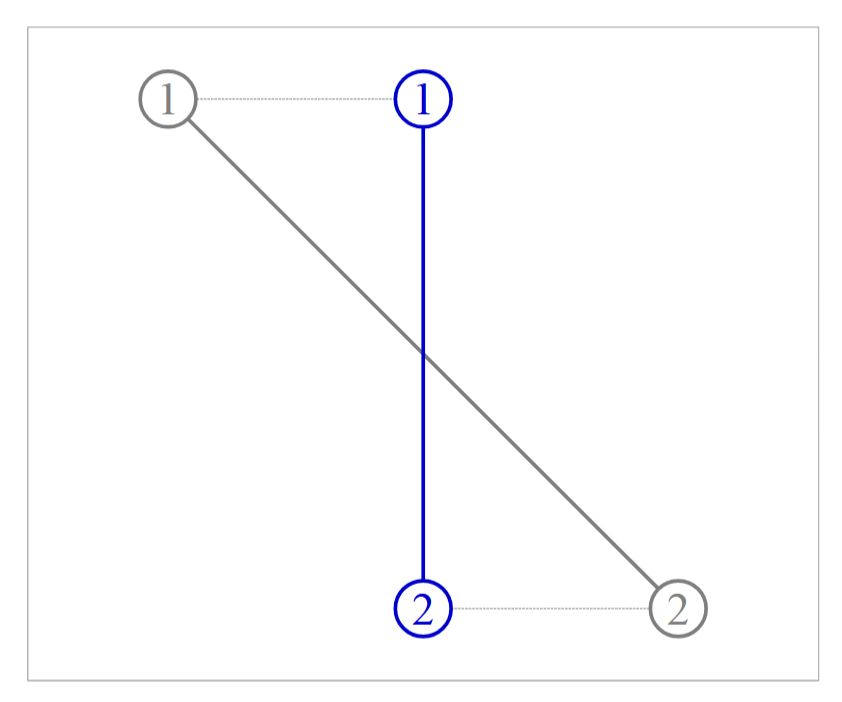
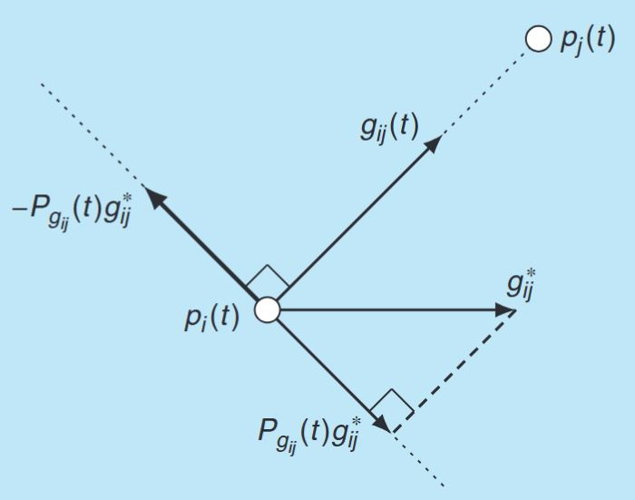

# Bearing-based Formation Control [1]
## 1 Introduction
This section introduces the theory of bearing-based formation control, which studies how to steer a group of agents to achieve a bearing-constrained target formation using relative position measurements.

Consider a group of mobile agents, where the first $n_{l}$ agents are leaders and the remaining $n_{f}\left(n_{f}=n-n_{l}\right)$ agents are followers. Let $\mathcal{V}_{l}=\left\{1, \ldots, n_{l}\right\}$ and $\mathcal{V}_{f}=\mathcal{V} \backslash \mathcal{V}_{l}$ be the sets of leaders and followers, respectively. The positions of the leaders and followers are denoted as $\boldsymbol{p}_{l}=\left[\boldsymbol{p}_{1}^{T}, \ldots, \boldsymbol{p}_{n_{l}}^{T}\right]^{T}$ and $\boldsymbol{p}_{f}=\left[\boldsymbol{p}_{n-n_{l}}^{T}, \ldots, \boldsymbol{p}_{n}^{T}\right]^{T}$, respectively. The target formation is specified by the constant bearing constraints $\left\{\boldsymbol{g}_{i j}^{*}\right\}_{(i, j) \in \varepsilon}$ and the leader positions $\left\{\boldsymbol{p}_{i}(t)\right\}_{i \in \mathcal{V}_{l}}$, where $\boldsymbol{g}_{ij}$ is defined in [Bearing](./2bearing.md#basic-conceptions). The **control objective** is to govern the positions of the followers $\left\{\boldsymbol{p}_{i}(t)\right\}_{i \in \mathcal{V}_{f}}$ such that $\boldsymbol{g}_{i j}(t) \rightarrow \boldsymbol{g}_{i j}^{*}$ as $t \rightarrow \infty$ for all $(i, j) \in \varepsilon$. All of the bearings are expressed in a common reference frame.

Before giving the proposed controllers with convergence proofs, the following assumption is adopted.

> [!info] Assumption 1
> Any formation $\mathcal{G}(\boldsymbol{p}^*)$ that satisfies the bearing constraints $\{\boldsymbol{g}_{ij}^*\}_{(i,j) \in \varepsilon}$ is **infinitesimally bearing rigid**.

Assumption 1 gives 2 useful conditions.
1. By [Theorem 10 in Chapter: Bearing](./2bearing.md#thm-10), the target formation specified by the bearing constraints has a unique shape.
2. By [Theorem 8 in Chapter: Bearing](./2bearing.md#thm-8), a mathematical condition that $\operatorname{rank}(R_\mathcal{B}(\boldsymbol{p}^∗)) = dn − d − 1$ and $\operatorname{Null}(R_\mathcal{B}(\boldsymbol{p}^∗)) = \operatorname{span}\{\mathbf{1} \otimes \mathbf{I}_d, \boldsymbol{p}^∗\}$ where $R_\mathcal{B}(\boldsymbol{p}^∗) = \operatorname{diag} (P_{g^∗_k} /\|e^∗_k\|) \bar{H}$ is the bearing rigidity matrix. Since the distance term $\|e^∗_k\|$ in $R_\mathcal{B}(\boldsymbol{p}^∗)$ does not affect its rank or null space, the condition given by Assumption 1 actually is

$$
\operatorname{Null}(\operatorname{diag}\left(P_{g^∗_k}\right) \bar{H}) = \operatorname{span}\{\mathbf{1} \otimes \mathbf{I}_d, \boldsymbol{p}^∗\}.
$$

This condition will be crucial to the following convergence analysis.

## 2 Single Integrators

First, consider the case where the dynamics of each mobile agent can be modeled as the single integrator

$$
\dot{\boldsymbol{p}}_{i}(t)=\boldsymbol{u}_{i}(t) \tag{2.1}
$$

where $\boldsymbol{u}_{i}(t)$ is the velocity input to be designed.

### 2.1 Leaderless Case [2]
If there are **no leaders**, then the bearing-based formation control problem can be solved by

$$
\dot{\boldsymbol{p}}_{i}(t)=-\sum_{j \in \mathcal{N}_{i}} P_{\boldsymbol{g}_{i j}^{*}}\left(\boldsymbol{p}_{i}(t)-\boldsymbol{p}_{j}(t)\right), \quad i \in \mathcal{V} \tag{2.2}
$$

where $P_{\boldsymbol{g}_{i j}^{*}}=\mathbf{I}_{d}-\boldsymbol{g}_{i j}^{*}\left(\boldsymbol{g}_{i j}^{*}\right)^{T}$. The matrix form of the control law is

$$
\dot{\boldsymbol{p}}(t)=-L_{\mathcal{B}} \boldsymbol{p}(t). \tag{2.3}
$$

where $L_\mathcal{B}$ is the **bearing Laplacian** of the target formation.

#### Convergence analysis
Since the system [$(2.2)$](#eq-2.2) is linear and time-invariant, its convergence is totally determined by the spectrum of $L_\mathcal{B}$. $1^\text{st}, 3^\text{rd}$ point of [Lemma 2 in Chapter: Bearing](./2bearing.md#lem-2) characterizes the rank and null space of $L_\mathcal{B}$. Based on it, we can analyze the convergence of system [$(2.3)$](#eq-2.3).

Since $L_\mathcal{B}$ is symmetric, its left and right null spaces are the same. Although $\{\mathbf{1} \otimes \mathbf{I}_d, \boldsymbol{p}^*\}$ is a basis of $\operatorname{Null}(L_\mathcal{B})$, it is not an orthogonal basis in general. In order to obtain an orthogonal basis, we first define the formation centroid (denoted $c(\boldsymbol{p})$), normalized formation (denoted $\boldsymbol{r}(\boldsymbol{p})$), and formation scale (denoted $s(\boldsymbol{p})$) as

$$
c(\boldsymbol{p}) \triangleq \frac{\mathbf{1}^\top\boldsymbol{p}}{n}, \quad \boldsymbol{r}(\boldsymbol{p}) \triangleq \boldsymbol{p} - \mathbf{1}\otimes c(\boldsymbol{p}), \quad s(\boldsymbol{p}) \triangleq \|\boldsymbol{r}(\boldsymbol{p})\|. \tag{2.4}
$$

Note $\boldsymbol{r}(\boldsymbol{p})$ is always orthogonal to $\mathbf{1} \otimes \mathbf{I}_d$. As a result, if denoting $\boldsymbol{r}^* = \boldsymbol{p}^* - \mathbf{1}\otimes c(\boldsymbol{p}^*)$, we have $\{\mathbf{1} \otimes \mathbf{I}_d, \boldsymbol{r}^*\}$ is an orthogonal basis of $\operatorname{Null}(L_\mathcal{B})$. When the context is clear, we will simply write $c(\boldsymbol{p})$, $\boldsymbol{r}(\boldsymbol{p})$, $s(\boldsymbol{p})$ as $c$, $\boldsymbol{r}$, $s$.

> [!caution] Theorem 1: Convergence of Leaderless Control
> Under [Assumption 1](#assumption-1), the trajectory of system [$(2.3)$](#eq-2.3) converges **exponentially** from any initial point $\boldsymbol{p}(0)$ to
>
> $$
\boldsymbol{p}(\infty)=\mathbf{1} \otimes c(0)+\left(\frac{(\boldsymbol{r}^*)^\top}{\|\boldsymbol{r}^*\|}\boldsymbol{p}(0)\right) \frac{\boldsymbol{r}^*}{\|\boldsymbol{r}^*\|}.
> $$
>
> If $(\boldsymbol{r}^*)^\top\boldsymbol{p}(0)>0$, the leaderless controller [$(2.2)$](#eq-2.2) successfully achieves the control objective. Furthermore, the centroid and the scale of the final formation are $c(\infty) = c(0)$ and $s(\infty) =  |(\boldsymbol{r}^∗)^\top\boldsymbol{p}(0)/\|\boldsymbol{r}^∗\||$, respectively.

**Proof**:

    
 Details of Proof

  
  Denote $A=\left[\mathbf{1} \otimes \mathbf{I}_{d}, \boldsymbol{r}^{*}\right] \in \mathbb{R}^{d n \times(d+1)}$. By the linear system theory, the trajectory $\boldsymbol{p}(t)$ of system [$(2.3)$](#eq-2.3) converges to the orthogonal projection of $\boldsymbol{p}(0)$ onto $\operatorname{Range}(A)$ :

$$
\begin{aligned}
\boldsymbol{p}(\infty)= & A\left(A^{\top} A\right)^{-1} A^{\top} \boldsymbol{p}(0) \\
= & \left(\mathbf{1} \otimes \mathbf{I}_{d}\right)\left(\left(\mathbf{1} \otimes \mathbf{I}_{d}\right)^{\top}\left(\mathbf{1} \otimes \mathbf{I}_{d}\right)\right)^{-1}\left(\mathbf{1} \otimes \mathbf{I}_{d}\right)^{\top} \boldsymbol{p}(0) \\
& +\frac{\boldsymbol{r}^{*}\left(\boldsymbol{r}^{*}\right)^{\top}}{\left(\boldsymbol{r}^{*}\right)^{\top} \boldsymbol{r}^{*}} \boldsymbol{p}(0) \\
= & \mathbf{1} \otimes c(0)+\frac{\left(\boldsymbol{r}^{*}\right)^{\top} \boldsymbol{p}(0)}{\left\|\boldsymbol{r}^{*}\right\|} \frac{\boldsymbol{r}^{*}}{\left\|\boldsymbol{r}^{*}\right\|} .
\end{aligned}
$$

It is easy to verify that the centroid and the scale of the final formation are $c(\infty)=c(0)$ and $s(\infty)=\left|\left(\boldsymbol{r}^{*}\right)^{\top} \boldsymbol{p}(0) /\left\|\boldsymbol{r}^{*}\right\|\right|$, respectively. The final formation $\boldsymbol{p}(\infty)$ can be obtained by translating and scaling $\boldsymbol{r}^{*}$. Since $\mathcal{G}\left(\boldsymbol{r}^{*}\right)$ satisfies all the bearing constraints, $\mathcal{G}(\boldsymbol{p}(\infty))$ also satisfies as long as the scaling factor $\left(\boldsymbol{r}^{*}\right)^{\top} \boldsymbol{p}(0) /\left\|\boldsymbol{r}^{*}\right\|$ is positive. Q.E.D. 
$\square$

Several remarks regarding [Theorem 1](#thm-1) are given here.
> [!info] Remark 1
> 1. When $\left(\boldsymbol{r}^{*}\right)^{\top} \boldsymbol{p}(0)<0$, the formation converges to a final formation with the bearings as $\boldsymbol{g}_{i j}=-\boldsymbol{g}_{i j}^{*}, \forall(i, j) \in \mathcal{E}$ instead of $\boldsymbol{g}_{i j}=\boldsymbol{g}_{i j}^{*}, \forall(i, j) \in \mathcal{E}$. In this case, although the final formation has the **opposite bearings** as desired, it can be viewed as a point reflection of the target formation and has the same shape.
> 2. The **centroid of the final formation is the same as that of the initial formation**. In fact, it follows from $\left(\mathbf{1} \otimes \mathbf{I}_{d}\right)^{\top} \dot{\boldsymbol{p}}= 0$ that the centroid of the formation is **invariant** under controller [$(2.2)$](#eq-2.2).
> 3. Although the centroid is invariant, the scale of the formation is changed under controller [$(2.2)$](#eq-2.2). Specifically, the scale of the final formation satisfies
> $$
> 0 \leqslant s(\infty) \leqslant s(0)
> $$
> The scale of the final formation is no larger than that of the initial formation. It is clear that the lower bound of $s(\infty)$ is achieved when $\left(\boldsymbol{r}^{*}\right)^{\top} \boldsymbol{p}(0)=0$. In this case, the formation will finally reach rendezvous (i.e., consensus in terms of position). In order to obtain the upper bound, rewrite $\left(\boldsymbol{r}^{*}\right)^{\top} \boldsymbol{p}(0)=\left(\boldsymbol{r}^{*}\right)^{\top}[\boldsymbol{p}(0)-\mathbf{1} \otimes c(\boldsymbol{p}(0))]= \left(\boldsymbol{r}^{*}\right)^{\top} \boldsymbol{r}(0)$. Then $s(\infty)=\left|\left(\boldsymbol{r}^{*}\right)^{\top} \boldsymbol{r}(0) /\left\|\boldsymbol{r}^{*}\right\|\right| \leq\|\boldsymbol{r}(0)\|= s(0)$. As a result, the upper bound of $s(\infty)$ is achieved when $\boldsymbol{r}^{*}$ is parallel to $\boldsymbol{p}(0)$ or $\boldsymbol{r}(0)$.

<figure>
   
   
<figcaption> Figure 2.1: The simplest example to demonstrate the geometric interpretation of the leaderless controller (2.2). Initial formation: gray; target/final formation: blue; agent trajectory: dotted line.</figcaption>

</figure>

Figure 2.1 shows the simplest example to demonstrate controller [$(2.2)$](#eq-2.2). In this example, the target formation is vertical. The final position of each agent is the orthogonal projection of its initial position to the target bearing. Moreover, the centroid of the formation is invariant but the scale is changed. It is intuitively obvious that if the initial formation is horizontal, the two agents will reach rendezvous.

Although the controller [$(2.2)$](#eq-2.2) is able to achieve the control objective without leader, the centroid and the scale of the finally converged formation are determined by the **initial formation**, which is usually undesired in practice.

### 2.2 Stationary Leaders [2]
If the **leaders are stationary**, then the bearing-based formation control problem can be also **solved by [$(2.5)$](#eq-2.5)** for the follower case. Specifically,

$$
\left\{
\begin{aligned}
  & \dot{\boldsymbol{p}}_{i}(t)=\mathbf{0}, \quad i\in\mathcal{V}_l, \\
  & \dot{\boldsymbol{p}}_{i}(t)=-\sum_{j \in \mathcal{N}_{i}} P_{\boldsymbol{g}_{i j}^{*}}\left(\boldsymbol{p}_{i}(t)-\boldsymbol{p}_{j}(t)\right), \quad i \in \mathcal{V}_{f}
\end{aligned}\right. \tag{2.5}
$$

The matrix form of the control law is

$$
\dot{\boldsymbol{p}}_{f}(t)=-L_{\mathcal{B}_{f f}} \boldsymbol{p}_{f}(t)-L_{\mathcal{B}_{f l}} \boldsymbol{p}_{l}, \tag{2.6}
$$

where

$$
L_\mathcal{B} = 
\begin{bmatrix}
  L_{\mathcal{B}_{ll}} & L_{\mathcal{B}_{l f}} \\
  L_{\mathcal{B}_{fl}} & L_{\mathcal{B}_{f f}}
\end{bmatrix}.
$$

Control law [$(2.5)$](#eq-2.5) can globally stabilize a target formation if and only if the target formation is **bearing localizable** (that is, if $L_{\mathcal{B}_{f f}}$ is **nonsingular**) [54].

#### Convergence Analysis
The centroid and the scale of the finally converged formation are determined by the **initial formation** in the leaderless case, while the centroid and the scale of the formation can be controlled by the leader-follower controller [$(2.5)$](#eq-2.5). We first analyze the properties of $L_{\mathcal{B}_{ff}}$ in the leader-follower controller.

> [!tip] Lemma 1
> Under [Assumption 1](#assumption-1), $L_{\mathcal{B}_{f f}}$ in system [$(2.5)$](#eq-2.5) is positive definite if and only if $n_{l} \geqslant 2$.

**Proof**:

  
 Details of Proof

  For any $\boldsymbol{x} \in \mathbb{R}^{d n_{l}}$, since $L_\mathcal{B} \geqslant 0$, we have

$$
\boldsymbol{x}^{\top} L_{\mathcal{B}_{f f}} \boldsymbol{x}=\left[\begin{array}{ll}
\mathbf{0} & \boldsymbol{x}^{\top}
\end{array}\right]\left[\begin{array}{cc}
L_{\mathcal{B}_{l l}} & L_{\mathcal{B}_{l f}} \\
L_{\mathcal{B}_{f l}} & L_{\mathcal{B}_{f f}}
\end{array}\right]\left[\begin{array}{c}
\mathbf{0} \\
\boldsymbol{x}
\end{array}\right] \geqslant 0 .
$$

As a result, $L_{\mathcal{B}_{f f}}$ is at least **positive semi-definite**. If there exists a nonzero vector $\boldsymbol{x}$ such that $\boldsymbol{x}^{\top} L_{\mathcal{B}_{f f}} \boldsymbol{x}=0$, then $\left[\mathbf{0}, \boldsymbol{x}^{\top}\right]^{\top} \in \operatorname{Null}(L_\mathcal{B})=\operatorname{span}\left\{\mathbf{1} \otimes \mathbf{I}_{d}, \boldsymbol{r}^{*}\right\}$. If there is only one leader ( $n_{l}=1$ ), it is easy to see that such $\boldsymbol{x}$ exists. However, if there are more than one leaders ( $n_{l} \geqslant 2$ ), such $\boldsymbol{x}$ does not exist because $p_{i} \neq p_{j}$ for all $i \neq j$. Thus, in the case of $n_{l} \geqslant 2, L_{\mathcal{B}_{f f}}$ is positive definite. Q.E.D. 
$\square$

When $n_{l} \geqslant 2$, the positions of the leaders, $p_{l}$, must be feasible such that the followers together with the leaders can possibly form a formation satisfying the bearing constraints. The following is a necessary condition for a feasible $p_{l}$.

> [!tip] Lemma 2
> Under [Assumption 1](#assumption-1), a feasible $p_{l}$ satisfies
>
> $$
\left(L_{\mathcal{B}_{l l}}-L_{\mathcal{B}_{l f}} L_{\mathcal{B}_{f f}}^{-1} L_{\mathcal{B}_{f l}}\right) \boldsymbol{p}_{l}=0
> $$

**Proof**:

  
 Details of Proof

  
  If $\boldsymbol{p}_{l}$ is feasible, there exists $\boldsymbol{p}_{f}$ such that $\boldsymbol{p}= \left[\boldsymbol{p}_{l}^{\top}, \boldsymbol{p}_{f}^{\top}\right]^{\top}$ satisfies the bearing constraints $\left\{\boldsymbol{g}_{i j}^{*}\right\}_{(i, j) \in \mathcal{E}}$. By [Theorem 10 in Chapter: Bearing](./2bearing.md#thm-10), infinitesimal bearing rigidity can uniquely determine $\boldsymbol{p}$ up to a translation and a scaling factor. That means $\boldsymbol{p} \in \operatorname{span}\left\{\mathbf{1} \otimes \mathbf{I}_{d}, \boldsymbol{r}^{*}\right\}=\operatorname{Null}(L_\mathcal{B})$ and consequently

$$
\left[\begin{array}{cc}
L_{\mathcal{B}_{l l}} & L_{\mathcal{B}_{l f}} \\
L_{\mathcal{B}_{f l}} & L_{\mathcal{B}_{f f}}
\end{array}\right]\left[\begin{array}{c}
\boldsymbol{p}_{l} \\
\boldsymbol{p}_{f}
\end{array}\right]=0
$$

which implies $L_{\mathcal{B}_{l l}} \boldsymbol{p}_{l}+L_{\mathcal{B}_{l f}} \boldsymbol{p}_{f}=\mathbf{0}$ and $L_{\mathcal{B}_{f l}} \boldsymbol{p}_{l}+L_{\mathcal{B}_{f f}} \boldsymbol{p}_{f}=\mathbf{0}$. The second equation implies $\boldsymbol{p}_{f}=-L_{\mathcal{B}_{f f}}^{-1} L_{\mathcal{B}_{f l}} \boldsymbol{p}_{l}$, substituting which into the first equation completes the proof. Q.E.D. 
$\square$

Based on [Lemmas 1](#lem-1) and [2](#lem-2), we have the following convergence result for the leader-follower formation controller.

> [!caution] Theorem 2: Convergence of Leader-Follower Control
> Under [Assumption 1](#assumption-1), given $n_{l} \geqslant 2$ and a feasible $\boldsymbol{p}_{l}$, the trajectory of system [$(2.6)$](#eq-2.6) converges **exponentially** fast from any initial $\boldsymbol{p}_{f}(0)$ to
> 
> $$
\boldsymbol{p}_{f}(\infty)=-L_{\mathcal{B}_{f f}}^{-1} L_{\mathcal{B}_{f l}} \boldsymbol{p}_{l}
> $$
> 
> The finally converged formation satisfies the bearing constraints $\left\{\boldsymbol{g}_{i j}^{*}\right\}_{(i, j) \in \mathcal{E}}$.

**Proof**:

  
 Details of Proof

  
  Since $L_{\mathcal{B}_{f f}}>0$ if $n_{l} \geqslant 2$ by [Lemma 1](#lem-1), it is obvious that the linear time-invariant system [$(2.6)$](#eq-2.6) is exponentially stable. Then the final formation (i.e., the equilibrium) satisfying $\dot{\boldsymbol{p}}_{f}=0$ is $\boldsymbol{p}_{f}(\infty)=-L_{\mathcal{B}_{f f}}^{-1} L_{\mathcal{B}_{f l}} \boldsymbol{p}_{l}$. Since $\boldsymbol{p}_{l}$ is feasible, it follows from [Lemma 2](#lem-2) that $L_\mathcal{B} \boldsymbol{p}(\infty)=0$ where $\boldsymbol{p}(\infty)=\left[\boldsymbol{p}_{l}^{\top}, \boldsymbol{p}_{f}^{\top}(\infty)\right]^{\top}$. Therefore, $\mathcal{G}(\boldsymbol{p}(\infty))$ satisfies the bearing constraints.
  Q.E.D. 
$\square$
 

As shown in [Theorem 2](#thm-2), the final formation $\boldsymbol{p}_{f}(\infty)$ is a function of $\boldsymbol{p}_{l}$. As a result, we can control the centroid and the scale of the final formation $\boldsymbol{p}(\infty)$ by choosing appropriate positions of the leaders $\boldsymbol{p}_{l}$.

Note that control law [$(2.5)$](#eq-2.5) has an expression similar to the network localization protocol[^2.1]. In fact, the bearing-based formation control problem is **mathematically equivalent to the bearing-based network localization problem** when the target formation is stationary and each agent is a single integrator.

### 2.3 Moving Leaders with constant nonzero velocities [3]
One key problem that follows the definition of the target formation (with constant nonzero velocities for leaders) is whether the target formation **exists** and is **unique**.

In fact, this problem is equivalent to the localizability problem in bearing-only network localization. A formation can be uniquely determined by the bearings and the leaders if and only if the formation is **localizable**.

One useful **sufficient condition** is that a formation would be localizable if the formation is infinitesimally bearing rigid and has at least two leaders. This sufficient condition is intuitively easy to understand. Specifically, if the formation is infinitesimally bearing rigid, then it can be uniquely determined up to a translation and a scaling factor by the bearings. The translation and scaling ambiguity can be further eliminated by the introduction of **at least two leaders**. Then the formation can be fully and uniquely determined. Due to space limitations, we omit the details and simply make the following stronger assumption.

> [!info] Assumption 2
> The target formation $\mathcal{G}(\boldsymbol{p}^*)$ is infinitesimally bearing rigid and has at least two leaders.

The mathematical condition implied by Assumption 2 is [Lemma 1](#lem-1). It is worth noting that the infinitesimal bearing rigidity is merely sufficient but not necessary to ensure the existence and uniqueness of the target formation.

If the **leaders move at a constant nonzero speed**, then [$(2.5)$](#eq-2.5) would yield a constant nonzero tracking error. The tracking error may be eliminated using the following proportional-integral control law (PID control)

$$
\begin{equation*}
\dot{\boldsymbol{p}}_{i}(t)=-\sum_{j \in \mathcal{N}_{i}} P_{\boldsymbol{g}_{i j}}\left[k_{p}\left(\boldsymbol{p}_{i}(t)-\boldsymbol{p}_{j}(t)\right)-k_{I} \int_{0}^{t}\left(\boldsymbol{p}_{i}(\tau)-\boldsymbol{p}_{j}(\tau)\right) {~d} \tau\right] \tag{2.7}
\end{equation*}
$$

where $i \in \mathcal{V}_{f}$ and $k_{p}$ and $k_{I}$ are constant positive control gains. Control law [$(2.7)$](#eq-2.7) is distributed because the control of each agent only requires the relative positions of its neighbors. The control law consists of a proportional term and an integral term. When $k_{{I}}=0$, the control law would become the one proposed in [Section 2.2](#22-stationary-leaders-2). If the velocities of the leaders are zero, the proportional control alone is able to stabilize the target formation. But if the velocities of the leaders are nonzero, the integral control is required to eliminate the steady state tracking error.

By defining a new state for the integral term, control law [$(2.7)$](#eq-2.7) can be rewritten as

$$
\begin{align*}
& \dot{\boldsymbol{p}}_{i}(t)=-k_{P} \sum_{j \in \mathcal{N}_{i}} P_{\boldsymbol{g}_{i j}^{*}}\left(\boldsymbol{p}_{i}(t)-\boldsymbol{p}_{j}(t)\right)-k_{I} \boldsymbol{\xi}_{i}(t), \\
& \dot{\boldsymbol{\xi}}_{i}(t)=\sum_{j \in \mathcal{N}_{i}} P_{\boldsymbol{g}_{i j}^{*}}\left(\boldsymbol{p}_{i}(t)-\boldsymbol{p}_{j}(t)\right), \quad i \in \mathcal{V}_{f} . 
\end{align*}\tag{2.8}
$$

We next derive the matrix expression of control law [$(2.8)$](#eq-2.8), which will be useful for the convergence analysis. It is straightforward to see that the matrix expression of control law [$(2.8)$](#eq-2.8) is

$$
\begin{align*}
\dot{\boldsymbol{p}}_{f}(t) & =-k_{P}\left(L_{\mathcal{B}_{f f}} \boldsymbol{p}_{f}(t)+L_{\mathcal{B}_{f l}} \boldsymbol{p}_{l}(t)\right)-k_{I} \boldsymbol{\xi}(t) \\
\dot{\boldsymbol{\xi}}(t) & =L_{\mathcal{B}_{f f}} \boldsymbol{p}_{f}(t)+L_{\mathcal{B}_{f l}} \boldsymbol{p}_{l}(t) \tag{2.9}
\end{align*}
$$

where $\boldsymbol{\xi}(t)=\left[\boldsymbol{\xi}_{n_{l}+1}(t)^{T}, \ldots, \boldsymbol{\xi}_{n}(t)^{T}\right]^{T} \in \mathbb{R}^{d n_{f}}$.

#### Convergence Analysis
Define the tracking error for the followers as

$$
\boldsymbol{\delta}(t) \triangleq \boldsymbol{p}_{f}(t)-\boldsymbol{p}_{f}^{*}(t) \tag{2.10}
$$

where $\boldsymbol{p}_{f}(t)$ is the real position of the followers and $\boldsymbol{p}_{f}^{*}(t)$ is the time-varying expected position of the followers in the target formation. The aim of the convergence analysis is to show that $\boldsymbol{\delta}(t)$ **converges to zero**. To that end, we need to first calculate $\boldsymbol{p}_{f}^{*}(t)$. The following two results on the bearing Laplacian are useful.

> [!tip] Lemma 3
> Any formation $\mathcal{G}(\boldsymbol{p})$ that satisfies the bearing constraints $\left\{\boldsymbol{g}_{i j}^{*}\right\}_{(i, j) \in \mathcal{E}}$ satisfies $L_\mathcal{B} \boldsymbol{p}=\mathbf{0}$ and $L_{\mathcal{B}_{f f}} \boldsymbol{p}_{f}+L_{\mathcal{B}_{f l}} \boldsymbol{p}_{l}=\mathbf{0}$.

**Proof**:

  
 Details of Proof 

  Note

$$
L_\mathcal{B} \boldsymbol{p}=\left[\begin{array}{cc}L_{\mathcal{B}_{l l}} & L_{\mathcal{B}_{l f}} \\ L_{\mathcal{B}_{f l}} & L_{\mathcal{B}_{f f}}\end{array}\right]\left[\begin{array}{c}\boldsymbol{p}_{l} \\ \boldsymbol{p}_{f}\end{array}\right]=\left[\begin{array}{c}\vdots \\ \sum\limits_{j \in \mathcal{N}_{i}} P_{\boldsymbol{g}_{i j}^{*}}\left(\boldsymbol{p}_{i}-\boldsymbol{p}_{j}\right) \\ \vdots\end{array}\right].
$$

By the elementwise expression of $L_\mathcal{B} \boldsymbol{p}$, it is obvious that $L_\mathcal{B} \boldsymbol{p}=\mathbf{0}$  if $\mathcal{G}(\boldsymbol{p})$ satisfies the bearing constraints, i.e, $\left(\boldsymbol{p}_{j}-\boldsymbol{p}_{i}\right) / \| \boldsymbol{p}_{j}- \boldsymbol{p}_{i} \|=\boldsymbol{g}_{i j}^{*}$. By the partitioned block matrix expression of $L_\mathcal{B} \boldsymbol{p}$, it can be seen that $L_\mathcal{B} \boldsymbol{p}=0$ implies $L_{\mathcal{B}_{f f}} \boldsymbol{p}_{f}+L_{\mathcal{B}_{f l}} \boldsymbol{p}_{l}=\mathbf{0}$. Q.E.D. 
$\square$

Since the target formation $\boldsymbol{p}^{*}(t)$ satisfies the bearing constraints, it follows from [Lemma 3](#lem-3) that $L_{\mathcal{B}_{f f}} \boldsymbol{p}_{f}^{*}(t)+L_{\mathcal{B}_{f l}} \boldsymbol{p}_{l}(t)=\mathbf{0}$. Furthermore, since $L_{\mathcal{B}_{f f}}$ is positive definite by [Lemma 1](#lem-1) under [Assumption 2](#assumption-2), we have

$$
\begin{equation*}
\boldsymbol{p}_{f}^{*}(t)=-L_{\mathcal{B}_{f f}}^{-1} L_{\mathcal{B}_{f l}} \boldsymbol{p}_{l}(t) \tag{2.11}
\end{equation*}
$$

Substituting [$(2.10)$](#eq-2.10) and [$(2.11)$](#eq-2.11) into [$(2.9)$](#eq-2.9) yields

$$
\begin{align*}
& \dot{\boldsymbol{\delta}}(t)=-k_{P} L_{\mathcal{B}_{f f}} \boldsymbol{\delta}(t)-k_{I} \boldsymbol{\xi}(t)+L_{\mathcal{B}_{f f}}^{-1} L_{\mathcal{B}_{f l}} v_{l}^{*}(t) \\
& \dot{\boldsymbol{\xi}}(t)=L_{\mathcal{B}_{f f}} \boldsymbol{\delta}(t) \tag{2.12}
\end{align*}
$$

The $\boldsymbol{\delta}$ - and $\boldsymbol{\xi}$-dynamics given above can be written in a compact form as

$$
\left[\begin{array}{l}\dot{\boldsymbol{\delta}} \\ \dot{\boldsymbol{\xi}}\end{array}\right]=\underbrace{\left[\begin{array}{cc}-k_{P} L_{\mathcal{B}_{f f}} & -k_{I} I_{n_{f}} \\ L_{\mathcal{B}_{f f}} & 0\end{array}\right]}_{A}\left[\begin{array}{l}\boldsymbol{\delta} \\ \boldsymbol{\xi}\end{array}\right]+\left[\begin{array}{c}L_{\mathcal{B}_{f f}}^{-1} L_{\mathcal{B}_{f l}} \\ 0\end{array}\right] v_{l}^{*}(t). \tag{2.13}
$$

> [!tip] Lemma 3
> The state matrix $A$ in [$(2.13)$](#eq-2.13) is **Hurwitz** for any $k_{P}, k_{I}>0$.

**Proof**:

 
  
 Details of Proof

Suppose $\lambda$ is an eigenvalue of $A$. Then,

$$
\begin{aligned}
\operatorname{det}(\lambda \mathbf{I}-A) & =\operatorname{det}\left(\left[\begin{array}{cc}
\lambda \mathbf{I}+k_{P} L_{\mathcal{B}_{f f}} & k_{I} \mathbf{I} \\
-L_{\mathcal{B}_{f f}} & \lambda \mathbf{I}
\end{array}\right]\right) \\
& =\operatorname{det}\left(\lambda^{2} \mathbf{I}+k_{P} \lambda L_{\mathcal{B}_{f f}}+k_{I} L_{\mathcal{B}_{f f}}\right) \\
& =\operatorname{det}\left(\left(k_{P} \lambda+k_{I}\right)\left(\frac{\lambda^{2} \mathbf{I}}{k_{P} \lambda+k_{I}}+L_{\mathcal{B}_{f f}}\right)\right) .
\end{aligned}
$$

As a result, $\operatorname{det}(\lambda \mathbf{I}-A)=0$ implies either $\lambda=-k_{I} / k_{P}<0$ or

$$
\frac{\lambda^{2}}{k_{P} \lambda+k_{I}}=-\sigma,
$$

where $\sigma$ is the eigenvalue of $L_{\mathcal{B}_{f f}}$. Since $L_{\mathcal{B}_{f f}}$ is symmetric positive definite, we know $\sigma$ is positive and real. The solution to the above equation can be easily calculated and it can be shown that $\lambda<-k_{I} / k_{P}<0$. Q.E.D. 
$\square$

Since $A$ is Hurwitz, system [$(2.13)$](#eq-2.13) is stable. When $v_{l}^{*}(t)$ is time-varying, the followers are not able to perfectly track the leaders. The fundamental reason is that the **followers do not have access to the time-varying velocities of the leaders**. When $v_{l}^{*}(t)$ is constant, the tracking error will globally converge to zero due to the integral action.

> [!caution] Theorem 3 (Global Convergence with Constant Leader Velocities)
> When $\boldsymbol{v}_{l}^{*}(t)=\mathbf{v}_{l}^{*}$ is constant, $\boldsymbol{\delta}(t)$ and $\boldsymbol{\xi}(t)$ exponentially and globally converges to $\boldsymbol{\delta}(\infty)=0$ and $\boldsymbol{\xi}(\infty)=L_{\mathcal{B}_{f f}}^{-1} L_{\mathcal{B}_{f l}} \mathbf{v}_{l}^{*} / k_{I}$, respectively. As a result,
>
> $$
\begin{aligned}
& \boldsymbol{p}_{f}(t) \rightarrow \boldsymbol{p}_{f}^{*}(t)=-L_{\mathcal{B}_{f f}}^{-1} L_{\mathcal{B}_{f l}} \boldsymbol{p}_{l}(t) \\
& \dot{\boldsymbol{p}}_{f}(t) \rightarrow \boldsymbol{v}_{f}^{*}=-L_{\mathcal{B}_{f f}}^{-1} L_{\mathcal{B}_{f l}} \mathbf{v}_{l}^{*}
\end{aligned}
> $$
>
> as $t \rightarrow \infty$.

**Proof**:

  
 Details of Proof

Since $A$ is Hurwitz and $\mathbf{v}_{l}^{*}$ is constant, $\boldsymbol{\delta}(t)$ and $\boldsymbol{\xi}(t)$ globally and exponentially converge to the steady state values of $\boldsymbol{\delta}$ and $\boldsymbol{\xi}$. By letting $\dot{\boldsymbol{\delta}}=0$ and $\dot{\boldsymbol{\xi}}=0$, we can easily verify that the steady state values are $\boldsymbol{\delta}(\infty)=0$ and $\boldsymbol{\xi}(\infty)= L_{\mathcal{B}_{f f}}^{-1} L_{\mathcal{B}_{f l}} \mathbf{v}_{l}^{*} / k_{I}$. It follows from $\boldsymbol{\delta}(t) \rightarrow 0$ and $\dot{\boldsymbol{\delta}}(t) \rightarrow 0$ that $\boldsymbol{p}_{f}(t) \rightarrow \boldsymbol{p}_{f}^{*}(t)$ and $\dot{\boldsymbol{p}}_{f}(t) \rightarrow \dot{\boldsymbol{p}}_{f}^{*}(t)=\boldsymbol{v}_{f}^{*}$. Q.E.D. 
$\square$

By substituting $\boldsymbol{\xi}(\infty)=L_{\mathcal{B}_{f f}}^{-1} L_{\mathcal{B}_{f l}} \mathbf{v}_{l}^{*} / k_{I}$ back into [$(2.12)$](#eq-2.12), it can be seen that the integral term $\boldsymbol{\xi}$ finally eliminates the impact of the "disturbance" $\mathbf{v}_{l}^{*}$.

The target formation is **globally stable** under the action of control law [$(2.7)$](#eq-2.7) if and only if it is **bearing localizable**.

#### Centroid and Scale Dynamics

We next study how the leaders should move in order to realize the desired translational and scaling formation maneuvers under the action of the proposed control law. In order to do that, we need to first define the centroid and scale of a formation and then analyze their dynamics. Define the
centroid $c\left(\boldsymbol{p}^{*}(t)\right)$ and the scale $s\left(\boldsymbol{p}^{*}(t)\right)$ of $\boldsymbol{p}^{*}(t)$ as

$$
\begin{aligned}
c\left(\boldsymbol{p}^{*}(t)\right) & \triangleq \frac{1}{n} \sum_{i \in \mathcal{V}} \boldsymbol{p}_{i}^{*}(t)=\frac{1}{n}\left(\mathbf{1}_{n} \otimes I_{d}\right)^{T} \boldsymbol{p}^{*}(t) \\
s\left(\boldsymbol{p}^{*}(t)\right) & \triangleq \sqrt{\frac{1}{n} \sum_{i \in \mathcal{V}}\left\|\boldsymbol{p}_{i}^{*}(t)-c\left(\boldsymbol{p}^{*}\right)\right\|^{2}} \\
& =\frac{1}{\sqrt{n}}\left\|\boldsymbol{p}^{*}(t)-\mathbf{1}_{n} \otimes c\left(\boldsymbol{p}^{*}\right)\right\|
\end{aligned}
$$

which is similar to that of [$(2.4)$](#eq-2.4) in the leaderless case. The following two propositions show how the leaders should move to realize the desired translational and scaling maneuvers, respectively.

> [!tip] Proposition 1 (Translational Maneuvering)
> If the velocity of each leader is constant and satisfies
>
> $$
\boldsymbol{v}_{i}^{*}=\mathbf{v}_{c}, \quad i \in \mathcal{V}_{l},
> $$
>
> where $\mathbf{v}_{c} \in \mathbb{R}^{d}$ is a common velocity, then
>
> $$
\dot{c}\left(\boldsymbol{p}^{*}(t)\right) \equiv \mathbf{v}_{c}, \quad \dot{s}\left(\boldsymbol{p}^{*}(t)\right) \equiv 0
> $$
>
> which means the target formation $\boldsymbol{p}^{*}(t)$ moves at the common velocity while the scale is fixed.

**Proof**:

 
  
 Details of Proof

Since $\boldsymbol{v}_{i}^{*}(t)=\mathbf{v}_{c}, \forall i \in \mathcal{V}_{l}$, we have $\boldsymbol{v}_{l}^{*}(t)=\mathbf{1}_{n_{l}} \otimes \mathbf{v}_{c}$. It follows from $L_{\mathcal{B}}\left(\mathbf{1}_{n} \otimes \mathbf{v}_{c}\right)=0$ that $L_{\mathcal{B}_{f l}}\left(\mathbf{1}_{n_{l}} \otimes \mathbf{v}_{c}\right)+ L_{\mathcal{B}_{f f}}\left(\mathbf{1}_{n_{f}} \otimes \mathbf{v}_{c}\right)=0$. As a result,

$$
\boldsymbol{v}_{f}^{*}=-L_{\mathcal{B}_{f f}}^{-1} L_{\mathcal{B}_{f l}} \boldsymbol{v}_{l}^{*}=\mathbf{1}_{n_{f}} \otimes \mathbf{v}_{c}
$$

Consequently, $\dot{\boldsymbol{p}}^{*}=\left[\left(\boldsymbol{v}_{l}^{*}\right)^{T},\left(\boldsymbol{v}_{f}^{*}\right)^{T}\right]^{T}=\mathbf{1}_{n} \otimes \mathbf{v}_{c}$. Substituting $\dot{\boldsymbol{p}}^{*}$ into $\dot{c}\left(\boldsymbol{p}^{*}\right)$ and $\dot{s}\left(\boldsymbol{p}^{*}\right)$ gives

$$
\begin{aligned}
\dot{c}\left(\boldsymbol{p}^{*}\right) & =\frac{1}{n}\left(\mathbf{1}_{n} \otimes I_{d}\right)^{T} \dot{\boldsymbol{p}}^{*}=\frac{1}{n}\left(\mathbf{1}_{n} \otimes I_{d}\right)^{T}\left(\mathbf{1}_{n} \otimes \mathbf{v}_{c}\right)=\mathbf{v}_{c}, \\
\dot{s}\left(\boldsymbol{p}^{*}\right) & =\frac{1}{\sqrt{n}} \frac{\left(\boldsymbol{p}-\mathbf{1}_{n} \otimes c\left(\boldsymbol{p}^{*}\right)\right)^{T}}{\left\|\boldsymbol{p}-\mathbf{1}_{n} \otimes c\left(\boldsymbol{p}^{*}\right)\right\|} \dot{\boldsymbol{p}}^{*} \\
& =\frac{1}{\sqrt{n}} \frac{\left(\boldsymbol{p}-\mathbf{1}_{n} \otimes c\left(\boldsymbol{p}^{*}\right)\right)^{T}}{\left\|\boldsymbol{p}-\mathbf{1}_{n} \otimes c\left(\boldsymbol{p}^{*}\right)\right\|}\left(\mathbf{1}_{n} \otimes \mathbf{v}_{c}\right)=0
\end{aligned}
$$

Q.E.D. 
$\square$

> [!tip] Proposition 2 (Scaling Maneuvering)
> If the velocity of each leader is constant and satisfies
>
> $$
\boldsymbol{v}_{i}^{*}=\alpha_{i} \frac{\boldsymbol{p}_{i}^{*}(t)-c\left(\boldsymbol{p}^{*}\right)}{\left\|\boldsymbol{p}_{i}^{*}(t)-c\left(\boldsymbol{p}^{*}\right)\right\|}, \quad i \in \mathcal{V}_{l}, \tag{2.14}
> $$
>
> where $\alpha_{i} \in \mathbb{R}$ is constant and satisfies $\alpha_{i} /\left\|\boldsymbol{p}_{i}^{*}(t)-c\left(\boldsymbol{p}^{*}\right)\right\|= \alpha_{j} /\left\|\boldsymbol{p}_{j}^{*}(t)-c\left(\boldsymbol{p}^{*}\right)\right\|$ for all $i, j \in \mathcal{V}_{l}$, then
>
> $$
\dot{c}\left(\boldsymbol{p}^{*}(t)\right) \equiv 0, \quad \dot{s}\left(\boldsymbol{p}^{*}(t)\right) \equiv \operatorname{sgn}\left(\alpha_{i}\right) \sqrt{\frac{1}{n} \sum_{i \in \mathcal{V}} \alpha_{i}^{2}},
> $$
>
> which means the scale of the target formation $\boldsymbol{p}^{*}(t)$ is continuously varying while the centroid is fixed.

**Proof**:

  
 Details of Proof

Since $\alpha_{i} /\left\|\boldsymbol{p}_{i}^{*}(t)-c\left(\boldsymbol{p}^{*}\right)\right\|=\alpha_{j} /\left\|\boldsymbol{p}_{j}^{*}(t)-c\left(\boldsymbol{p}^{*}\right)\right\|$ for all $i, j \in \mathcal{V}_{l}$, there exists $k(t)$ such that

$$
\alpha_{i}=k(t)\left\|\boldsymbol{p}_{i}^{*}(t)-c\left(\boldsymbol{p}^{*}\right)\right\|
$$

and hence $\boldsymbol{v}_{i}^{*}=k(t)\left(\boldsymbol{p}_{i}^{*}(t)-c\left(\boldsymbol{p}^{*}\right)\right)$ for all $i \in \mathcal{V}_{l}$. Then, $\boldsymbol{v}_{l}^{*}$ can be expressed as $\boldsymbol{v}_{l}^{*}=k(t)\left(\boldsymbol{p}^{*}-\mathbf{1}_{n_{l}} \otimes c\left(\boldsymbol{p}^{*}\right)\right)$. It follows from $L_{\mathcal{B}}\left(\boldsymbol{p}^{*}-\mathbf{1}_{n} \otimes c\left(\boldsymbol{p}^{*}\right)\right)=0$ that $L_{\mathcal{B}_{f l}}\left(\boldsymbol{p}_{l}^{*}-\mathbf{1}_{n_{l}} \otimes c\left(\boldsymbol{p}^{*}\right)\right)+L_{\mathcal{B}_{f f}}\left(\boldsymbol{p}_{f}^{*}-\mathbf{1}_{n_{f}} \otimes c\left(\boldsymbol{p}^{*}\right)\right)=0$. As a result,

$$
\boldsymbol{v}_{f}^{*}=-L_{\mathcal{B}_{f f}}^{-1} L_{\mathcal{B}_{f l}} \boldsymbol{v}_{l}^{*}=k(t)\left(\boldsymbol{p}_{f}^{*}-\mathbf{1}_{n_{f}} \otimes c\left(\boldsymbol{p}^{*}\right)\right) .
$$

Consequently, $\dot{\boldsymbol{p}}^{*}=\left[\left(\boldsymbol{v}_{l}^{*}\right)^{T},\left(\boldsymbol{v}_{f}^{*}\right)^{T}\right]^{T}=k(t)\left(\boldsymbol{p}^{*}-\mathbf{1}_{n} \otimes c\left(\boldsymbol{p}^{*}\right)\right)$. Substituting $\dot{\boldsymbol{p}}^{*}$ into $\dot{c}\left(\boldsymbol{p}^{*}\right)$ and $\dot{s}\left(\boldsymbol{p}^{*}\right)$ gives

$$
\begin{aligned}
\dot{c}\left(\boldsymbol{p}^{*}\right) & =\frac{1}{n}\left(\mathbf{1}_{n} \otimes I_{d}\right)^{T} \dot{\boldsymbol{p}}^{*} \\
& =\frac{1}{n}\left(\mathbf{1}_{n} \otimes I_{d}\right)^{T}\left(\boldsymbol{p}^{*}-\mathbf{1}_{n} \otimes c\left(\boldsymbol{p}^{*}\right)\right) k(t)=0,
\end{aligned}
$$

and

$$
\begin{aligned}
\dot{s}\left(\boldsymbol{p}^{*}\right) & =\frac{1}{\sqrt{n}} \frac{\left(\boldsymbol{p}^{*}-\mathbf{1}_{n} \otimes c\left(\boldsymbol{p}^{*}\right)\right)^{T}}{\left\|\boldsymbol{p}^{*}-\mathbf{1}_{n} \otimes c\left(\boldsymbol{p}^{*}\right)\right\|} \dot{\boldsymbol{p}}^{*} \\
& =k(t) \frac{1}{\sqrt{n}} \frac{\left(\boldsymbol{p}^{*}-\mathbf{1}_{n} \otimes c\left(\boldsymbol{p}^{*}\right)\right)^{T}}{\left\|\boldsymbol{p}^{*}-\mathbf{1}_{n} \otimes c\left(\boldsymbol{p}^{*}\right)\right\|}\left(\boldsymbol{p}^{*}-\mathbf{1}_{n} \otimes c\left(\boldsymbol{p}^{*}\right)\right) \\
& =k(t) \frac{1}{\sqrt{n}}\left\|\boldsymbol{p}^{*}-\mathbf{1}_{n} \otimes c\left(\boldsymbol{p}^{*}\right)\right\| \\
& =k(t) \sqrt{\frac{1}{n} \sum_{i \in \mathcal{V}}\left\|\boldsymbol{p}_{i}^{*}(t)-c\left(\boldsymbol{p}^{*}\right)\right\|^{2}} \\
& =k(t) \sqrt{\frac{1}{n} \sum_{i \in \mathcal{V}} \frac{\alpha_{i}^{2}}{k^{2}(t)}}=\operatorname{sgn}\left(\alpha_{i}\right) \sqrt{\frac{1}{n} \sum_{i \in \mathcal{V}} \alpha_{i}^{2}} .
\end{aligned}
$$

Q.E.D. 
$\square$

In [Proposition 2](#prop-2), if $\alpha_{i}>0$, the velocity of each agent is pointing from the fixed centroid to the agent and hence the formation scale dilates; otherwise, if $\alpha_{i}<0$ the formation scale shrinks. It should be noted that $\boldsymbol{v}_{i}^{*}$ given in [$(2.14)$](#eq-2.14) is constant though $\boldsymbol{p}_{i}^{*}(t)$ is time-varying.

When the velocity of the leaders is a linear combination of a translational and a scaling term, both the centroid and the scale of the formation will be time-varying. Denote $c(\boldsymbol{p}(t))$ and $s(\boldsymbol{p}(t))$ as the centroid and the scale of the real formation $\boldsymbol{p}(t)$, respectively. By combining [Theorem 3](#thm-3), [Proposition 1](#prop-1), and [Proposition 2](#prop-2), we obtain the following theorem.

> [!caution] Theorem 4
> Under [Assumption 2](#assumption-2), if the velocity of each leader is constant and there exist constant $\mathbf{v}_{c} \in \mathbb{R}^{d}$ and $\alpha_{i} \in \mathbb{R}$ such that $\boldsymbol{v}_{i}^{*}$ can be decomposed to
>
> 
>
> $$
\begin{equation*}
\boldsymbol{v}_{i}^{*}=\mathbf{v}_{c}+\alpha_{i} \frac{\boldsymbol{p}_{i}^{*}(t)-c\left(\boldsymbol{p}^{*}\right)}{\left\|\boldsymbol{p}_{i}^{*}(t)-c\left(\boldsymbol{p}^{*}\right)\right\|}, \quad \forall i \in \mathcal{V}_{l}, \tag{2.15}
\end{equation*}
> $$
>
> where $\alpha_{i}$ satisfies $\alpha_{i} /\left\|\boldsymbol{p}_{i}^{*}(t)-c\left(\boldsymbol{p}^{*}\right)\right\|=\alpha_{j} /\left\|\boldsymbol{p}_{j}^{*}(t)-c\left(\boldsymbol{p}^{*}\right)\right\|$ for all $i, j \in \mathcal{V}_{l}$. As a result,
>
> $$
\dot{c}\left(\boldsymbol{p}^{*}(t)\right) \equiv \mathbf{v}_{c}, \quad \dot{s}\left(\boldsymbol{p}^{*}(t)\right) \equiv \operatorname{sgn}\left(\alpha_{i}\right) \sqrt{\frac{1}{n} \sum_{i \in \mathcal{V}} \alpha_{i}^{2}} .
> $$
>
> Furthermore, $\dot{c}(\boldsymbol{p}(t))$ and $\dot{s}(\boldsymbol{p}(t))$ globally converge to $\dot{c}\left(\boldsymbol{p}^{*}(t)\right)$ and $\dot{s}\left(\boldsymbol{p}^{*}(t)\right)$, respectively.

**Proof**:

  
 Details of Proof

Since the target formation $\boldsymbol{p}^{*}(t)$ satisfies the bearing constraints, it follows from Lemma 1 that $L_{\mathcal{B}} \boldsymbol{p}^{*}(t)=0$, which implies $L_{\mathcal{B}} \boldsymbol{v}^{*}(t)=0$. Since the bearing constraints imply infinitesimal bearing rigidity, then $\operatorname{Null}(L_{\mathcal{B}})=\operatorname{span}\left\{\mathbf{1}_{n} \otimes\right. \left.I_{d}, \boldsymbol{p}^{*}\right\}$. As a result, if $\boldsymbol{v}^{*}$ is constant, it can always be expressed as a linear combination of $\mathbf{1}_{n} \otimes I_{d}$ and $\boldsymbol{p}^{*}-\mathbf{1}_{n} \otimes c\left(\boldsymbol{p}^{*}\right)$. Therefore, equation [$(2.15)$](#eq-2.15) holds. The rest of the theorem directly follows from [Theorem 3](#thm-3), [Proposition 1](#prop-1), and [Proposition 2](#prop-2). Q.E.D. 
$\square$

> [!info] Remarks on Theorem 4
> 1. In order to achieve the desired translational or scaling maneuvering, the leaders must collaborate and **share some global information like a common velocity and the centroid of the formation**.
> 2. $\boldsymbol{v}_{i}^{*}$ given in [$(2.15)$](#eq-2.15) is **constant** because the unit vector $\left(\boldsymbol{p}_{i}^{*}(t)-c\left(\boldsymbol{p}^{*}\right)\right) /\left\|\boldsymbol{p}_{i}^{*}(t)-c\left(\boldsymbol{p}^{*}\right)\right\|$ is invariant to translational and scaling maneuvers though $\boldsymbol{p}_{i}^{*}(t)$ is not.

### 2.4 Moving Leaders with time-varying velocities
If the leader velocities are **time varying**, then [$(2.7)$](#eq-2.7) would fail to ensure zero tracking errors. The time-varying case can be handled by the following control law that requires velocity feedback:

$$
\begin{equation*}
\dot{\boldsymbol{p}}_{i}(t)=-K_{i}^{-1} \sum_{j \in \mathcal{N}_{i}} P_{\boldsymbol{g}_{i j}^{*}}\left[k_{p}\left(\boldsymbol{p}_{i}(t)-\boldsymbol{p}_{j}(t)\right)-\dot{\boldsymbol{p}}_{j}(t)\right], i \in \mathcal{V}_{f} \tag{2.16}
\end{equation*}
$$

where $K_{i}=\sum\limits_{j \in \mathcal{N}_{i}} P_{\boldsymbol{g}_{i j}^{*}}$. The stability of [$(2.16)$](#eq-2.16) is proven next.
1. The **nonsingularity** of $K_{i}$ is guaranteed by the bearing localizability of the target formation with following Lemma 4.
2. Multiplying $K_{i}$ on both sides of [$(2.16)$](#eq-2.16) yields $\dot{\varepsilon}_{i}=-k_{p} \varepsilon_{i}$, where $\varepsilon_{i}=\Sigma_{j \in \mathcal{N}_{i}} P_{\boldsymbol{g}_{i j}^{*}}\left(\boldsymbol{p}_{i}(t)-\boldsymbol{p}_{j}(t)\right)$ for $i \in \mathcal{V}_{f}$. It follows that $\varepsilon_{i} \rightarrow 0$ as $t \rightarrow \infty$ for all $i \in \mathcal{V}_{f}$, and consequently $\boldsymbol{g}_{i j} \rightarrow \boldsymbol{g}_{i j}^{*}$ when the network is **bearing localizable**.

> [!tip] Lemma 4 [4]
> The matrix $K_i$ is **nonsingular** for all $i \in \mathcal{V}_f$ if the target formation is unique.

**Proof**:

  
 Details of Proof

  First of all, the matrix $K_i$ is singular if and only if the bearings $\{\boldsymbol{g}_{ij}^*\}_{j\in \mathcal{N}_i}$ are collinear, because for any $x \in \mathbb{R}^d,  \boldsymbol{x}^\top K_i\boldsymbol{x} = 0 \Leftrightarrow \sum\limits_{j\in \mathcal{N}_i} \boldsymbol{x}^\top P_{\boldsymbol{g}_{ij}^*} \boldsymbol{x} = 0 \Leftrightarrow P_{\boldsymbol{g}_{ij}^*} \boldsymbol{x} = 0, \forall j \in \mathcal{N}_i$. Since  $\operatorname{Null}(P_{\boldsymbol{g}_{ij}^*}) = \operatorname{span}\{P_{\boldsymbol{g}_{ij}^*}\}$, we know $\boldsymbol{x}^\top K_i\boldsymbol{x} = 0$ if and only if $\boldsymbol{x}$ and $\{\boldsymbol{g}_{ij}^*\}_{j\in \mathcal{N}_i}$ are collinear. If $\{\boldsymbol{g}_{ij}^*\}_{j\in \mathcal{N}_i}$ are collinear, the follower $\boldsymbol{p}_i^∗$ cannot be uniquely determined in the target formation because $\boldsymbol{p}_i^∗$ can move along $\boldsymbol{g}_{ij}^*$ without changing any bearings. As a result, if $K_i$ is singular, the target formation is not unique. Q.E.D. 
$\square$

Under the action of [$(2.7)$](#eq-2.7) and [$(2.16)$](#eq-2.16), the formation is able to perform translational and scaling formation maneuvers. A translational maneuver means that all agents move at a common velocity, such that the formation translates as a rigid body. A scaling maneuver means that the scale of the formation, which can be described by the distance from each agent to the formation centroid, varies while the geometric pattern of the formation is preserved. To achieve the scaling maneuver, the leaders need only to adjust the distances among them. One merit of the bearing-based control laws is that **the desired maneuver is known only to the leaders, and the followers are not required to access or estimate it**.

## 3 Double Integrators

Consider the case where the dynamics of each mobile agent can be modeled as a double integrator

$$
\begin{align*}
& \dot{\boldsymbol{p}}_{i}(t)=\boldsymbol{v}_{i}(t) \\
& \dot{\boldsymbol{v}}_{i}(t)=\boldsymbol{u}_{i}(t) \tag{12}
\end{align*}
$$

where $\boldsymbol{u}_{i}(t)$ is the acceleration input to be designed.

### 3.1 Moving Leaders with constant nonzero velocities [4]
If the velocities of the leaders are constant, then the bearing-based formation control problem can be solved by

$$
\begin{align*}
& \dot{\boldsymbol{p}}_{i}(t)=\boldsymbol{v}_{i}(t) \\
& \dot{\boldsymbol{v}}_{i}(t)=-\sum_{j \in \mathcal{N}_{i}} P_{\dot{\boldsymbol{g}}_{i j}^{*}}\left[k_{p}\left(\boldsymbol{p}_{i}(t)-\boldsymbol{p}_{j}(t)\right)+k_{v}\left(\boldsymbol{v}_{i}(t)-\boldsymbol{v}_{j}(t)\right)\right] \tag{3.1}
\end{align*}
$$

where $i \in \mathcal{V}_{f}$ and $k_{p}, k_{v}$ are positive constant control gains. Under control law [$(3.1)$](#eq-3.1), the target formation is **globally stable** if it is **bearing localizable**.

### 3.2 Moving Leaders with time-varying velocities
If the velocities of the leaders are time varying, then the following control law requiring acceleration feedback can be used to track time-varying target formations:

$$
\begin{align*}
& \dot{\boldsymbol{p}}_{i}(t)=\boldsymbol{v}_{i}(t) \\
& \dot{\boldsymbol{v}}_{i}(t)=K_{i}^{-1} \sum_{j \in \mathcal{N}_{i}} P_{\boldsymbol{g}_{i j}}^{\dot{\boldsymbol{y}}}\left[-k_{p}\left(\boldsymbol{p}_{i}(t)-\boldsymbol{p}_{j}(t)\right)-k_{v}\left(\boldsymbol{v}_{i}(t)-\boldsymbol{v}_{j}(t)\right)+\dot{\boldsymbol{v}}_{j}(t)\right] \tag{14}
\end{align*}
$$

where $i \in \mathcal{V}_{f}$ and $K_{i}=\sum\limits_{j \in \mathcal{N}_{i}} P_{\boldsymbol{g}_{i j}}$. The nonsingularity of $K_{i}$ for any $i \in \mathcal{V}_{f}$ is guaranteed by the bearing localizability of the target formation ([Lemma 4](#lem-4)). Under (14), the target formation is **globally stable** if and only if it is **bearing localizable**.

In practice, absolute acceleration can be measured by each agent using, for example, IMU and then transmitted to its neighbors by wireless communication. Because of measurement errors and transmission delays, the acceleration measurement is corrupted by errors. However, since the system is linear, bounded acceleration errors would cause bounded tracking errors. Bearing-based formation control in the presence of other problems (including input disturbance, input saturation, and collision avoidance) was addressed in [4]. TODO

## 4 Bearing-Based Formation Control of Unicycles [5]

Suppose the dynamics of agent $i \in \mathcal{V}$ can be described by the unicycle model

$$
\begin{align*}
& \dot{x}_{i}=v_{i} \cos \theta_{i}, \\
& \dot{y}_{i}=v_{i} \sin \theta_{i}, \\
& \dot{\theta}_{i}=w_{i},
\end{align*} \tag{4.1}
$$

where $\boldsymbol{p}_{i}=\left[x_{i}, y_{i}\right]^{T} \in \mathbb{R}^{2}$ is the coordinate of agent $i, \theta_{i} \in \mathcal{S}^{1}$ is the heading angle, and $v_{i} \in \mathbb{R}$ and $w_{i} \in \mathbb{R}$ are the linear and angular velocities, respectively, to be designed. Here, $\mathcal{S}^{1}$ is the 1D manifold on the unit circle. The bearing-based formation control law for unicycles is

$$
\begin{align*}
& v_{i}=\left[\cos \theta_{i}, \quad \sin \theta_{i}\right] \sum_{j \in \mathcal{N}_{i}} P_{\boldsymbol{g}_{i j}^{*}}\left(\boldsymbol{p}_{j}(t)-\boldsymbol{p}_{i}(t)\right) \\
& w_{i}=\left[-\sin \theta_{i}, \quad \cos \theta_{i}\right] \sum_{j \in \mathcal{N}_{i}} P_{\boldsymbol{g}_{i j}^{*}}\left(\boldsymbol{p}_{j}(t)-\boldsymbol{p}_{i}(t)\right)
\end{align*} \tag{4.2}
$$

When there are no leaders, [$(4.2)$](#eq-4.2) ensures global stability in the sense that $\boldsymbol{g}_{i j}(t)$ converges to either $\boldsymbol{g}_{i j}^{*}$ or $-\boldsymbol{g}_{i j}^{*}$ as $t \rightarrow \infty$, given any initial values of $\boldsymbol{p}_{i}(0)$ and $\theta_{i}(0)$ if the target formation is **infinitesimally bearing rigid** [5]. The final value of $\theta_{i}$ is not specified in the control law.

Details from [5] can be seen in [Formation Control of Mobile Agents With Motion Constraints](./0control_constraits.md).

## 5 Bearing-only Formation Control

This section introduces the theory of bearing-only formation control, which studies how to steer a group of agents to achieve a bearing-constrained target formation using bearing-only measurements. Suppose the target formation is specified by constant bearing constraints $\left\{\boldsymbol{g}_{i j}^{*}\right\}_{(i, j) \in \varepsilon}$, and there are **no leaders**. The control objective is to govern the positions of the agents $\left\{p_{i}(t)\right\}_{i \in \mathcal{V}}$ such that $\boldsymbol{g}_{i j}(t) \rightarrow \boldsymbol{g}_{i j}^{*}$ for all $(i, j) \in \varepsilon$ as $t \rightarrow \infty$. All bearings are expressed in a common reference frame.

The following nonlinear control law, proposed in [28], can be used to solve the bearing-only formation control problem:

$$
\begin{equation*}
\dot{\boldsymbol{p}}_{i}(t)=-\sum_{j \in \mathcal{N}_{i}} P_{\boldsymbol{g}_{i j}(t)} \boldsymbol{g}_{i j}^{*}, \quad i \in \mathcal{V}, \tag{5.1}
\end{equation*}
$$

where $P_{\boldsymbol{g}_{i j}(t)}=\mathbf{I}_{d}-\boldsymbol{g}_{i j}(t) \boldsymbol{g}_{i j}^{T}(t)$. The geometric interpretation of the control law is illustrated in [Figure 5.1](#fig-5.1). Some **properties** of the control law are highlighted below.
1. The control of each agent requires only bearing measurements and no distance or position estimation.
2. The control input of [$(5.1)$](#eq-5.1) is always bounded as $\left\|\dot{\boldsymbol{p}}_{i}(t)\right\| \leqslant \sum\limits_{j \in \mathcal{N}_{i}}\left\|P_{\boldsymbol{g}_{i j}(t)}\right\|\left\|\boldsymbol{g}_{i j}^{*}\right\|=\left|\mathcal{N}_{i}\right|$, since $\left\|P_{\boldsymbol{g}_{i j}(t)}\right\|=\left\|\boldsymbol{g}_{i j}^{*}\right\|=1$.
3. The centroid and scale of the formation are invariant under the control law. Here, the centroid is defined as the average position of the agents, and the scale as the standard deviation of the distances from the agents to the centroid.

<figure>
   
   
<figcaption> Figure 5.1: The geometric interpretation of the bearing-only control law in [$(5.1)$](#eq-5.1). Since the control term $-P_{\boldsymbol{g}_{i j}} \boldsymbol{g}_{i j}^{*}$ is perpendicular to the bearing $\boldsymbol{g}_{i j}$. The control law aims to reduce the bearing error of $\boldsymbol{g}_{i j}(t)$ while maintaining the distance between agents $i$ and $j$.</figcaption>

</figure>

Control law [$(5.1)$](#eq-5.1) is **nonlinear and almost globally stable if the target formation is infinitesimally bearing rigid** [28, Th. 11]. The term almost is due to the fact that **there are two isolated equilibria of the error dynamics: desired and undesired**. At the desired equilibrium, the bearings are equal to the desired values; that is, $\boldsymbol{g}_{i j}=\boldsymbol{g}_{i j}^{*}$ for $(i, j) \in \varepsilon$. At the undesired equilibrium, the bearings are opposite to the desired values; that is, $\boldsymbol{g}_{i j}=-\boldsymbol{g}_{i j}^{*}$ for $(i, j) \in \varepsilon$. The formations at the two equilibria have the same centroid and scale but opposite bearings. The almost global stability means that the formation would **converge** to the desired equilibrium **unless the initial formation lies exactly on the undesired equilibrium**, which can be shown to be an unstable one.

Control law [$(5.1)$](#eq-5.1) is a modified gradient-descent control law. Consider the following objective function:

$$
\phi_{1}=\frac{1}{2} \sum_{(i, j) \in \varepsilon}\left\|\boldsymbol{g}_{i j}-\boldsymbol{g}_{i j}^{*}\right\|^{2}=\sum_{(i, j) \in \varepsilon}\left(1-\boldsymbol{g}_{i j}^{T} \boldsymbol{g}_{i j}^{*}\right) .
$$

The objective function is equal to zero **if and only if** $\boldsymbol{g}_{i j}=\boldsymbol{g}_{i j}^{*}$ for all $(i, j) \in \varepsilon$. The corresponding gradient-descent control law is

$$
\dot{\boldsymbol{p}}_{i}(t)=-\sum_{j \in \mathcal{N}_{i}} \frac{1}{\left\|\boldsymbol{e}_{i j}(t)\right\|} P_{\boldsymbol{g}_{i j}(t)} \boldsymbol{g}_{i j}^{*} \quad i \in \mathcal{V} . \tag{5.2}
$$

This control law requires **both bearing and distance measurements**. Removing the distance term $\left\|\boldsymbol{e}_{i j}(t)\right\|$ in [$(5.2)$](#eq-5.2) yields the bearing-only formation control law in [$(5.1)$](#eq-5.1).

An optimization-based approach for bearing-only formation control can be found in [10] and [65] (TODO), where a bearing-only control law is proposed as

$$
\begin{equation*}
\dot{\boldsymbol{p}}_{i}(t)=\sum_{j \in \mathcal{N}_{i}}\left(\boldsymbol{g}_{i j}(t)-\boldsymbol{g}_{i j}^{*}\right), \quad i \in \mathcal{V} . \tag{5.3}
\end{equation*}
$$

This is a gradient-descent control law with the corresponding objective function as

$$
\phi_{2}=\frac{1}{4} \sum_{(i, j) \in \varepsilon}\left\|\boldsymbol{e}_{i j}\right\|\left\|\boldsymbol{g}_{i j}-\boldsymbol{g}_{i j}^{*}\right\|^{2}=\frac{1}{2} \sum_{(i, j) \in \varepsilon}\left\|\boldsymbol{e}_{i j}\right\|\left(1-\boldsymbol{g}_{i j}^{T} \boldsymbol{g}_{i j}^{*}\right) .
$$

Since $\phi_{2}$ contains $\left\|\boldsymbol{e}_{i j}\right\|, \phi_{2}$ is zero when $\boldsymbol{g}_{i j}=\boldsymbol{g}_{i j}^{*}$ or $\boldsymbol{e}_{i j}=0$. As a result, the scale of the formation always decreases under the action of control law [$(5.3)$](#eq-5.3). Simulation shows that this control law may steer all agents to the same position, given certain initial conditions. To avoid this problem, leaders must be introduced [65].

[^2.1]: The network localization protocol in [1] is $\dot{\hat{\boldsymbol{p}}}_i(t)=\sum\limits_{j\in\mathcal{N}_i} P_{\boldsymbol{g}_{ij}}\left( \hat{\boldsymbol{p}}_{i}(t) - \hat{\boldsymbol{p}}_{j}(t) \right), \quad i\in\mathcal{V}_f$ where $\hat{(\cdot)}$ means the estimation of position. The objective is to drive $\hat{\boldsymbol{p}}_i(t)\to \boldsymbol{p}_i$ for all $i\in\mathcal{V}_f$ as $t\to\infty$.

## References
> 1. **Shiyu Zhao** and **Daniel Zelazo**, [Bearing rigidity theory and its applications for control and estimation of framework systems: life beyond distance rigidity](https://ieeexplore.ieee.org/abstract/document/8667521), *IEEE Control Syst. Mag.*, vol. 39, no. 2, pp. 66–83, Apr. 2019: `BEARING-BASED fORMATION CONTROL`.
> 2. **Shiyu Zhao** and **Daniel Zelazo**, [Bearing-based distributed control and estimation of multi-agent systems](https://ieeexplore.ieee.org/abstract/document/7330866), in *2015 European Control Conference (ECC)*, Jul. 2015, pp. 2202–2207: `Section IV. Convergence Analysis` except the `Network Localization` part.
> 3. **Shiyu Zhao** and **Daniel Zelazo**, [Bearing-based formation maneuvering](https://ieeexplore.ieee.org/abstract/document/7307285), in *2015 IEEE International Symposium on Intelligent Control (ISIC)*, Sep. 2015, pp. 658–663: `Section III & IV`.
> 4. **Shiyu Zhao** and **Daniel Zelazo**, [Translational and Scaling Formation Maneuver Control via a Bearing-Based Approach](https://ieeexplore.ieee.org/abstract/document/7353147), *IEEE Trans. Control Netw. Syst.*, vol. 4, no. 3, pp. 429–438, Sep. 2017: `Lemma 4`.
> 5. **Shiyu Zhao**, D. V. Dimarogonas, **Zhiyong Sun**, and D. Bauso, [A General Approach to Coordination Control of Mobile Agents With Motion Constraints](https://ieeexplore.ieee.org/abstract/document/8031076), *IEEE Transactions on Automatic Control*, vol. 63, no. 5, pp. 1509–1516, May 2018.

