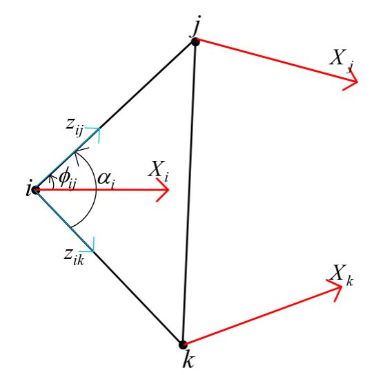
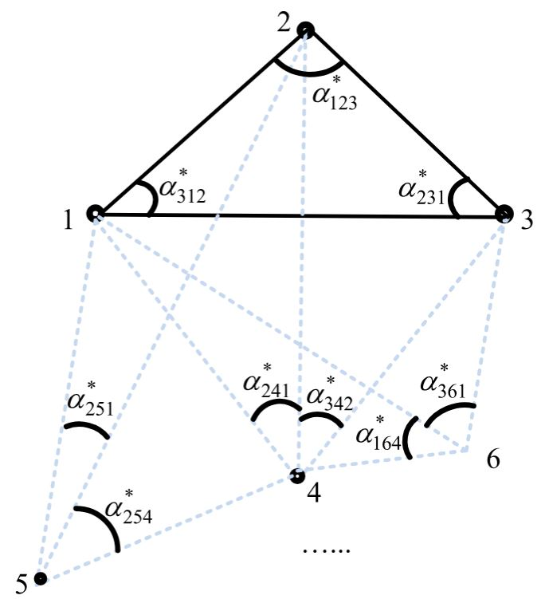
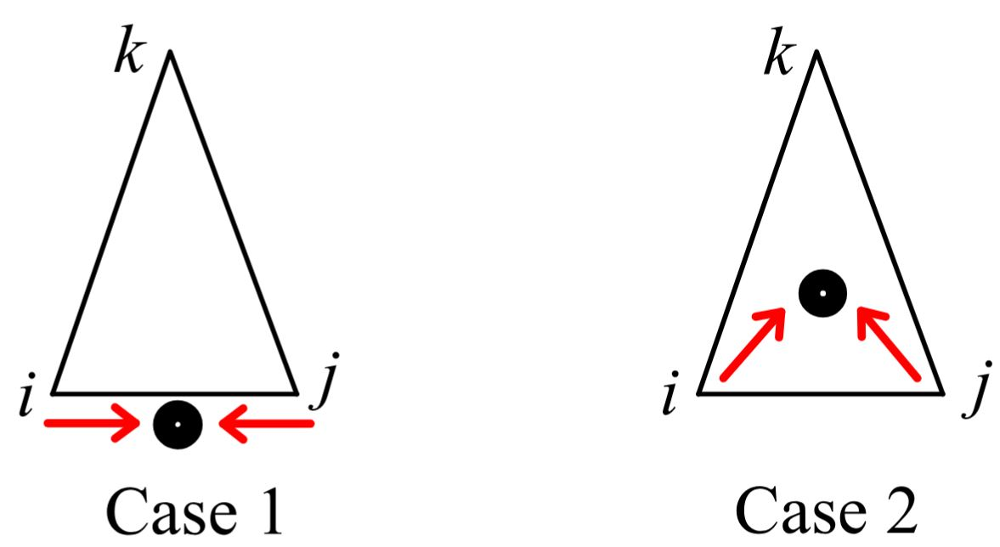

# Angle Rigidity applied in Multiagent Formation Control [1]
## 1. 2D

To achieve a planar formation by a group of mobile robots, many formation control algorithms have been designed, most of which require the measurement of relative positions[2], or aligned bearings, or communication. In [2], a gradient-based formation stabilization control law is designed to achieve an infinitesimally angle rigid formation, in which the measurements of relative position and wireless communication of neighbors' angle error information are both needed. In this section, we demonstrate how to stabilize a multiagent **planar formation** using **only local angle measurements** with the help of the angle rigidity theory.

For an agent $i$ moving in the plane, we consider its dynamics are governed by single-integrator

$$
\dot{\boldsymbol{p}}_{i}=\boldsymbol{u}_{i}, i=1, \ldots, N \tag{1.1}
$$

where $\boldsymbol{p}_{i} \in \mathbb{R}^{2}$ denotes agent $i$ 's position, $\boldsymbol{u}_{i} \in \mathbb{R}^{2}$ is the control input to be designed, and $N$ is the number of agents in the group. Agent $i$ can only measure angles; to be more specific, it can only measure the angle $\phi_{i j} \in[0,2 \pi)$ with respect to another agent $j$ evaluated counter-clockwise from the $X$-axis of its own local coordinate frame of choice that is fixed to the ground.

To avoid confusion in the stability analysis, we first describe all variables in a global coordinate frame and finally we demonstrate that this global coordinate frame is unnecessary. Now we define the bearing $\boldsymbol{g}_{i j} \in \mathbb{R}^{2}$ to be the unit vector pointing from agent $i$ to $j$, i.e.,

$$
\boldsymbol{g}_{i j}=\frac{\boldsymbol{p}_{j}-\boldsymbol{p}_{i}}{\left\|\boldsymbol{p}_{j}-\boldsymbol{p}_{i}\right\|}=\left[\begin{array}{c}
\cos \phi_{i j}\\
\sin \phi_{i j}
\end{array}\right]
$$

where $\phi_{i j}$ determines uniquely $\boldsymbol{g}_{i j}$ when $\boldsymbol{p}_{i} \neq \boldsymbol{p}_{j}$. Therefore, when $\phi_{i j}$ can be measured, $\boldsymbol{g}_{i j}$ is known. In the triangle $\triangle i j k$ shown in [Figure 1.1](#fig-1.1), the interior angle $\alpha_{i}$ can be computed by

$$
\begin{equation*}
\alpha_{i}=\measuredangle k i j=\arccos \left(\boldsymbol{g}_{i j}^{\top} \boldsymbol{g}_{i k}\right)
\end{equation*}
$$

using bearings $\boldsymbol{g}_{i j}$ and $\boldsymbol{g}_{i k}$. Note that the $X$-axes of agents $i, j$, and $k$ do not need to align, and the angle to be controlled is **not** the measured angle $\phi_{i j}$, but the **relative angle** $\alpha_{i}$.

<figure>
   
   
<figcaption> Figure 1.1: Agent i 's angle measurements.</figcaption>

</figure>

<figure>
   
   
<figcaption> Figure 1.2: Constructing desired formation by using Case 3 of Type-I vertex addition starting from △ 123.</figcaption>

</figure>

We construct the desired planar formation through a sequence of Type-I vertex additions (Case 3) from a generically angle rigid 3-vertex angularity, which is globally angle rigid according to [Proposition 1 in  angle rigidity](./3angle.md#prop-1). First, in an $N$-agent formation, we label the agents by $1\sim N$. Then, agents $1,2$ , and $3$ aim at forming the first triangular shape, and each of agents $4\sim N$ aims at achieving two desired angles formed with other three agents (see [Figure 1.2](#fig-1.2)). By repeatedly adding new agents through the Type-I vertex addition operation, the aim is to achieve the desired angle rigid formation specified as follows. For agents $1-3$

$$
\begin{align*}
& \lim _{t \rightarrow \infty} e_{1}(t)=\lim _{t \rightarrow \infty}\left(\alpha_{312}(t)-\alpha_{312}^{*}\right)=0  \tag{1.2}\\
& \lim _{t \rightarrow \infty} e_{2}(t)=\lim _{t \rightarrow \infty}\left(\alpha_{123}(t)-\alpha_{123}^{*}\right)=0  \tag{1.3}\\
& \lim _{t \rightarrow \infty} e_{3}(t)=\lim _{t \rightarrow \infty}\left(\alpha_{231}(t)-\alpha_{231}^{*}\right)=0 \tag{1.4}
\end{align*}
$$

where $\alpha_{j i k}^{*} \in(0, \pi), i, j, k \in\{1,2,3\}$ denote agent $i$ 's desired angle formed with agents $j, k$. For agents $4-N$

$$
\begin{align*}
& \lim _{t \rightarrow \infty} e_{i 1}(t)=\lim _{t \rightarrow \infty}\left(\alpha_{j_{1} i j_{2}}(t)-\alpha_{j_{1} i j_{2}}^{*}\right)=0  \tag{1.5}\\
& \lim _{t \rightarrow \infty} e_{i 2}(t)=\lim _{t \rightarrow \infty}\left(\alpha_{j_{2} i j_{3}}(t)-\alpha_{j_{2} i j_{3}}^{*}\right)=0 \tag{1.6}
\end{align*}
$$

where $i=4, \ldots, N, \quad j_{1}<i, j_{2}<i, j_{3}<i, \quad$ and $\quad \alpha_{j_{1} i j_{2}}^{*} \in (0, \pi), \alpha_{j_{2} i j_{3}}^{*} \in(0, \pi)$ denote agent $i$ 's two desired angles formed with agents $j_{1}, j_{2}, j_{3} \in\{1,2, \ldots, i-1\}, j_{1} \neq j_{2} \neq j_{3}$. Therefore, the angle-only formation control problem to be solved in this section is formally described below.

> [!info] Problem 1
> Given feasible desired angles $f_{\mathcal{A}}= \left\{\alpha_{312}^{*}, \alpha_{123}^{*}, \alpha_{231}^{*}, \alpha_{241}^{*}, \alpha_{342}^{*}, \ldots, \alpha_{i_{1} N i_{2}}^{*}, \alpha_{i_{2} N i_{3}}^{*}\right\}, \quad$ design control law $\boldsymbol{u}_{i}$ by only using angle measurements $\phi_{i j}$ to achieve [$(1.2)$](#eq-1.2)-[$(1.6)$](#eq-1.6).

> [!info] Remark 1.1
> One may also choose other cases in Type-I and Type-II vertex addition operations to construct the desired formations. However, the constructed formations are not globally angle rigid or the realization depends on the knowledge of the neighbors' angle error, which are the drawbacks of the other cases when they are applied to formation control. For example, in Case 1 of Type-II vertex addition [[Figure 4(d) in angle rigidity](./3angle.md#fig-4)], [Proposition 2 in angle rigidity](./3angle.md#prop-2) shows that the constructed formation is only angle rigid which may cause ambiguity; moreover, the angle $\alpha_{k_{1} j_{1} i}$ cannot be obtained by agent $i$ 's local angle measurements.

### A. Triangular Formation Control for Agents 1-3

To achieve the desired angles for agents $1-3$, we design their formation control laws

$$
\boldsymbol{u}_{i}=-\left(\alpha_{i}-\alpha_{i}^{*}\right)\left(\boldsymbol{g}_{i(i+1)}+\boldsymbol{g}_{i(i-1)}\right) \tag{1.7}
$$

where $i \in\{1,2,3\}, \boldsymbol{g}_{i(i+1)}=\boldsymbol{g}_{31}$ when $i=3$ and $\boldsymbol{g}_{i(i-1)}=\boldsymbol{g}_{13}$ when $i=1$, and $\alpha_{i}$ represents $\alpha_{(i-1) i(i+1)}$ for conciseness.

To obtain the **convergence** of the angle errors, we first analyze the dynamics of the angle errors $e_{i}(t), i=1,2,3$. We use the dot product of two bearings to obtain the angle error dynamics. According to [$(1.2)$ in angle rigidity](./3angle.md#eq-1.2), agent $1$'s angle error dynamics can be obtained by

$$
\dot{\alpha}_{1}=-\left[\frac{P_{\boldsymbol{g}_{13}}}{d_{13} \sin \alpha_{1}}\left(\dot{\boldsymbol{p}}_{3}-\dot{\boldsymbol{p}}_{1}\right)\right]^{\top} \boldsymbol{g}_{12}-\boldsymbol{g}_{13}^{\top} \frac{P_{\boldsymbol{g}_{12}}}{d_{12} \sin \alpha_{1}}\left(\dot{\boldsymbol{p}}_{2}-\dot{\boldsymbol{p}}_{1}\right).
$$

By following the calculation in Appendix A (TODO), one has the first three agents' angle error dynamics

$$
\begin{align*}
\dot{\boldsymbol{e}}_{f} & =\left[\begin{array}{lll}
\dot{\alpha}_{1} & \dot{\alpha}_{2} & \dot{\alpha}_{3}
\end{array}\right]^{\top}=F\left(\boldsymbol{e}_{f}\right) \boldsymbol{e}_{f} \\
& =\left[\begin{array}{ccc}
-z_{1} & f_{12} & f_{13} \\
f_{21} & -z_{2} & f_{23} \\
f_{31} & f_{32} & -z_{3}
\end{array}\right]\left[\begin{array}{l}
\alpha_{1}-\alpha_{1}^{*} \\
\alpha_{2}-\alpha_{2}^{*} \\
\alpha_{3}-\alpha_{3}^{*}
\end{array}\right] \tag{1.8}
\end{align*}
$$

where $\boldsymbol{e}_{f}=\left[\begin{array}{lll}\alpha_{1}-\alpha_{1}^{*} & \alpha_{2}-\alpha_{2}^{*} & \alpha_{3}-\alpha_{3}^{*}\end{array}\right]^{\top}, \quad z_{i}=\left(\sin \alpha_{i}\right) \left(1 / d_{i(i+1)}+1 / d_{i(i-1)}\right), f_{i j}=\left(\sin \alpha_{j}\right) / d_{i j}$.

To guarantee that the triangular formation system under the control law [$(1.7)$](#eq-1.7) is well defined, we first prove that no collinearity and collision will take place under [$(1.8)$](#eq-1.8) if the formation is not collinear initially.

> [!tip] Lemma 1.1 (No collinearity)
> For the three-agent formation, if the initial formation is **not collinear**, it will **not** become collinear for $t>0$ under the angle error dynamics [$(1.8)$](#eq-1.8).

**Proof**:

  
Proof of Lemma 1.1

Consider the manifold $\mathcal{M}_{a}=\left\{\left(\alpha_{1}\right.\right.$, $\left.\alpha_{2}, \alpha_{3}\right) \mid \alpha_{1}+\alpha_{2}+\alpha_{3}=\pi, 0<\alpha_{1}<\pi, 0<\alpha_{2}<\pi$, and $0< \left.\alpha_{3}<\pi\right\}$ which is an open set. To show $\mathcal{M}_{a}$ is positively invariant, we show that for any $\left(\alpha_{1}, \alpha_{2}, \alpha_{3}\right) \in \mathcal{M}_{a}$ it is impossible for $\alpha_{i}, i=1,2,3$ to escape $\mathcal{M}_{a}$ under [$(1.8)$](#eq-1.8). Consider the boundary states $\alpha_{i}(t)=\pi-\varepsilon_{1}$ with $\varepsilon_{1}=0^{+}$, $\alpha_{i+1}(t)=\varepsilon_{2}=0^{+}, \alpha_{i-1}(t)=\varepsilon_{3}=0^{+}, \varepsilon_{1}=\varepsilon_{2}+\varepsilon_{3}$.

According to [$(1.8)$](#eq-1.8), one has

$$
\dot{e}_{i}=-z_{i} e_{i}+f_{i(i+1)} e_{i+1}+f_{i(i-1)} e_{i-1}
$$

Since $0<\alpha_{i}^{*}<\pi$ and $\alpha_{i}^{*}$ is bounded away from 0 and $\pi$, one has

$$
\begin{align*}
z_{i} e_{i} & =z_{i}\left(\alpha_{i}-\alpha_{i}^{*}\right)>0 \\
f_{i(i+1)} e_{i+1} & =f_{i(i+1)}\left(\alpha_{i+1}-\alpha_{i+1}^{*}\right)<0 \\
f_{i(i-1)} e_{i-1} & =f_{i(i-1)}\left(\alpha_{i-1}-\alpha_{i-1}^{*}\right)<0
\end{align*}
$$

which implies that $\dot{e}_{i}(t)<0$. Thus, when $\alpha_{i}(t)$ is close to $\pi, \alpha_{i}(t)$ will decrease, which implies that $\mathcal{M}_{a}$ is positively invariant, i.e., trajectories starting from $\mathcal{M}_{a}$ remains in $\mathcal{M}_{a}$. Q.E.D. 
$\square$

> [!tip] Lemma 1.2 (No collision)
> For the three-agent formation, if the initial angles $\alpha_{i}(0) \neq 0, i=1,2,3$, no collision will take place for $t>0$ under the formation control law [$(1.7)$](#eq-1.7).

**Proof**:

  
Proof of Lemma 1.2

Suppose on the contrary that collision may happen between agents $i$ and $j$ at $t=t_{1}$. Then, one of the following two cases shown in [Figure 1.3](#fig-1.3) will take place.

For the first case, $\dot{\boldsymbol{p}}_{i}\left(t_{1}\right)=-\gamma \dot{\boldsymbol{p}}_{j}\left(t_{1}\right)$, where $\gamma$ is a positive constant. Note that the moving direction of agent $i$ under the control law [$(1.7)$](#eq-1.7) is always the bisector of the interior angle $\alpha_{i}$. According to [Lemma 1.1](#lem-1.1), no collinearity will happen for $t>0$ which implies that $\boldsymbol{g}_{i k}(t) \neq-\boldsymbol{g}_{j k}(t)$ for $t>0$. According to the control law [$(1.7)$](#eq-1.7), $\dot{\boldsymbol{p}}_{i}\left(t_{1}\right)=-\gamma \dot{\boldsymbol{p}}_{j}\left(t_{1}\right)$ requires $\boldsymbol{g}_{i k}\left(t_{1}\right)= -\boldsymbol{g}_{j k}\left(t_{1}\right)$, which is impossible for $t>0$.

For the second case, since agents $i$ and $j$ move toward the inside of the triangle, it follows from the control law [$(1.7)$](#eq-1.7) that $\frac{\pi}{2}-\varepsilon_{1}=\alpha_{i}\left(t_{1}^{-}\right)<\alpha_{i}^{*}$ and $\frac{\pi}{2}-\varepsilon_{2}=\alpha_{j}\left(t_{1}^{-}\right)<\alpha_{j}^{*}$, where $\varepsilon_{1}=0^{+}$and $\varepsilon_{2}=0^{+}$. Then, $\alpha_{i}^{*}+\alpha_{j}^{*}+\alpha_{k}^{*}=\pi>\pi+\alpha_{k}^{*}- \varepsilon_{1}-\varepsilon_{2}$, which contradicts the fact that $\alpha_{k}^{*}$ is bounded away from $0$. Q.E.D. 
$\square$

<figure>
   
   
<figcaption> Figure 1.3: Collision cases.</figcaption>

</figure>

Now, we give the main result for the convergence of the triangular formation.

> [!caution] Theorem 1 (Stability of the first three agents)
> For the triangular formation under the control law [$(1.7)$](#eq-1.7), if $\alpha_{i}(0) \neq 0$ and the initial angle errors $e_{i}(0), i=1,2,3$ are sufficiently small, the angle errors $e_{i}$ and agents' control input $\boldsymbol{u}_{i}(t)$ converge exponentially to zero.

**Proof**:

  
Proof of Theorem 1

From [Lemmas 1.1](#lem-1.1) and [1.2](#lem-1.2), no collinearity and collision will take place since $\sin \alpha_{i} \neq 0, d_{i j} \neq 0, \forall i, j=1,2,3$, which guarantees that the closed-loop system under the control law [$(1.7)$](#eq-1.7) is well defined. Since $e_{1}+e_{2}+e_{3}=\sum\limits_{i=1}^{3} \alpha_{i}-\sum\limits_{i=1}^{3} \alpha_{i}^{*} \equiv$ 0 , the angle error dynamics [$(1.8)$](#eq-1.8) can be reduced to

$$
\dot{e}_{s}=\left[\begin{array}{c}\dot{e}_{1} \\ \dot{e}_{2}\end{array}\right]=\left[\begin{array}{cc}-\left(z_{1}+f_{13}\right) & f_{12}-f_{13} \\ f_{21}-f_{23} & -\left(z_{2}+f_{23}\right)\end{array}\right]\left[\begin{array}{l}e_{1} \\ e_{2}\end{array}\right]=F_{s}\left(e_{s}\right) e_{s}. \tag{1.9}
$$

Let $\mathbb{U}_{2} \in \mathbb{R}^{2}$ denote a neighborhood of the origin $\left\{e_{1}=e_{2}=\right. 0\}$, in which we investigate the local stability of [$(1.9)$](#eq-1.9). Linearizing [$(1.9)$](#eq-1.9) around the origin, we obtain

$$
\dot{e}_{s}=L_{1}\left(\alpha^{*}\right) e_{s} \tag{1.10}
$$

where $L_{1}\left(\alpha^{*}\right)=\left.F_{s}\left(e_{s}\right)\right|_{e_{s}=0}$. Then, one has

$$
\operatorname{tr}\left(L_{1}\left(\alpha^{*}\right)\right)=-z_{1}^{*}-f_{13}^{*}-z_{2}^{*}-f_{23}^{*}<0 \tag{1.11}
$$

$$
\begin{aligned}
  \operatorname{det}\left(L_{1}\left(\alpha^{*}\right)\right)&=\left(z_{1}^{*}+f_{13}^{*}\right)\left(z_{2}^{*}+f_{23}^{*}\right)-\left(f_{21}^{*}-f_{23}^{*}\right)\left(f_{12}^{*}-f_{13}^{*}\right)\\
&>z_{1}^{*} f_{23}^{*}+z_{2}^{*} f_{13}^{*}+f_{21}^{*} f_{13}^{*}+f_{12}^{*} f_{23}^{*}>0 \tag{1.12}
\end{aligned}
$$

where $z_{i}^{*}=\left.z_{i}\right|_{e_{s}=0}, f_{i j}^{*}=\left.f_{i j}\right|_{e_{s}=0}$, and $\operatorname{tr}()$ and $\operatorname{det}()$ denote the trace and determinant of a square matrix, respectively, and we have used $z_{1}^{*} z_{2}^{*}>f_{21}^{*} f_{12}^{*}$. According to [$(1.11)$](#eq-1.11) and [$(1.12)$](#eq-1.12), one has that $L_{1}\left(\alpha^{*}\right)$ is Hurwitz. According to the Lyapunov Theorem, there always exists positive definite matrices $P_{1} \in \mathbb{R}^{2 \times 2}$ and $Q_{1} \in \mathbb{R}^{2 \times 2}$ such that $-Q_{1}=P_{1} L_{1}\left(\alpha^{*}\right)+ L_{1}^{\top}\left(\alpha^{*}\right) P_{1}$. Design the Lyapunov function candidate as

$$
V_{1}=e_{s}^{\top} P_{1} e_{s}
$$

Taking the time-derivative of $V_{1}$ yields

$$
\dot{V}_{1}=-e_{s}^{\top} Q_{1} e_{s} \leqslant-\frac{\lambda_{\min }\left(Q_{1}\right)}{\lambda_{\max }\left(P_{1}\right)} V_{1}
$$

which implies that $V_{1}(t) \leqslant V_{1}(0) e^{-\frac{\lambda_{\text {min }}\left(Q_{1}\right)}{\lambda_{\text {max }}\left(P_{1}\right)} t}$ where $\lambda_{\text {max }}$ and $\lambda_{\text {min }}$ denote the maximum and minimum eigenvalues of a real symmetric matrix, respectively. Since $P_{1}>0$, one has

$$
\begin{equation*}
e_{1}^{2}+e_{2}^{2}=\left\|e_{s}\right\|^{2} \leqslant \frac{V_{1}}{\lambda_{\min }\left(P_{1}\right)} \leqslant \frac{V_{1}(0)}{\lambda_{\min }\left(P_{1}\right)} e^{-\frac{\lambda_{\min }\left(Q_{1}\right)}{\lambda_{\max }\left(P_{1}\right)} t} \tag{1.12}
\end{equation*}
$$

Also, one has

$$
e_{3}^{2}=e_{1}^{2}+e_{2}^{2}+2 e_{1} e_{2} \leqslant 2\left(e_{1}^{2}+e_{2}^{2}\right) \leqslant \frac{2 V_{1}(0)}{\lambda_{\min }\left(P_{1}\right)} e^{-\frac{\lambda_{\min }\left(Q_{1}\right)}{\lambda_{\max }\left(P_{1}\right)} t}
$$

which implies that $e_{i}$ under the dynamics [$(1.8)$](#eq-1.8) is exponentially stable when the initial states lie in $\mathbb{U}_{2}$. According to [$(1.7)$](#eq-1.7), $\left\|\boldsymbol{u}_{i}\right\| \leqslant 2\left|e_{i}\right|$ also converge to zero at an exponential rate, which implies that $\boldsymbol{p}_{i}, i=1,2,3$ will converge to fixed points and the orientation and scale of the formation will then be fixed. Q.E.D. 
$\square$

> [!info] Remark 1.2
> With noncollinear initial positions, the first three agents' angle error dynamics $\dot{e}_{s}=F_{s}\left(e_{s}\right) e_{s}$ are globally stable, as a consequence of the Poincare-Bendixson theorem employed in [34, Theorem 6]. The difference between the angle error dynamics $\dot{e}_{s}=F_{s}\left(e_{s}\right) e_{s}$ and the dynamics given in [34] is that $\sin \alpha_{i}$ shown in $z_{i}, f_{i j}$ in [$(1.8)$](#eq-1.8) is replaced by $\sin \frac{\alpha_{i}}{2}$ in [34]. However, for a triangular formation, it holds that $\sin \frac{\alpha_{i}}{2}>0$ and $\sin \alpha_{i}>0$ for all $\alpha_{i} \in(0, \pi)$. Therefore, one can similarly obtain the almost global stability of $\dot{e}_{s}=F_{s}\left(e_{s}\right) e_{s}$ by following [34, Th. 6].

After proving that the first three agents converge to the desired formation, we now look at the remaining agents.

### B. Adding Agents 4 to $N$ in Sequence

In this subsection, we consider that agent $i, i=4, \ldots, N$, are added to the formation through the Type-I vertex addition operation with two desired angles. For agents $i=4, \ldots, N$, the control algorithm is designed to be

$$
\begin{align*}
\boldsymbol{u}_{i}= & -\left(\alpha_{j_{1} i j_{2}}-\alpha_{j_{1} i j_{2}}^{*}\right)\left(\boldsymbol{g}_{i j_{1}}+\boldsymbol{g}_{i j_{2}}\right) \\
& -\left(\alpha_{j_{2} i j_{3}}-\alpha_{j_{2} i j_{3}}^{*}\right)\left(\boldsymbol{g}_{i j_{2}}+\boldsymbol{g}_{i j_{3}}\right) \tag{1.13}
\end{align*}
$$

where $\alpha_{j_{1} i j_{2}}^{*} \in(0, \pi)$ and $\alpha_{j_{2} i j_{3}}^{*} \in(0, \pi), j_{1}<i, j_{2}<i, j_{3}< i, j_{1} \neq j_{2} \neq j_{3}$ are the two desired angles. Different from the first three agents, the bearing measurement topology from agents 4 to $N$ becomes directed.

To prove the stability from agents 4 to $N$, we use induction. Toward this end, we need to first prove that the $4$ -agent formation of $1-4$ **converges** to the desired shape **exponentially**. For the $4$ -agent formation, the control algorithm [$(1.13)$](#eq-1.13) can be written as

$$
\begin{align*}
\boldsymbol{u}_{4}= & -\left(\alpha_{241}-\alpha_{241}^{*}\right)\left(\boldsymbol{g}_{41}+\boldsymbol{g}_{42}\right) \\
& -\left(\alpha_{342}-\alpha_{342}^{*}\right)\left(\boldsymbol{g}_{42}+\boldsymbol{g}_{43}\right) . \tag{1.14}
\end{align*}
$$

Then, one has the following result.
> [!tip] Lemma 1.3 (Stability of agent 4):
> Suppose $e_{i}(0), i=1,2,3$ are sufficiently small and the subformation of $1,2$ , and $3$ is governed by [$(1.7)$](#eq-1.7). Under the control algorithm [$(1.14)$](#eq-1.14) for agent $4$ , if the initial distances $d_{4 i}(0)$ are sufficiently bounded away from zero, the initial angle errors $e_{41}(0)$ and $e_{42}(0)$ are sufficiently small and $\alpha_{341}^{*}=\alpha_{241}^{*}+\alpha_{342}^{*}, \sin \alpha_{124}^{*}>\sin \alpha_{412}^{*}, \sin \alpha_{423}^{*}>\sin \alpha_{234}^{*}$, then $e_{41}(t)$ and $e_{42}(t)$ converges to zero **exponentially**.

**Proof**:

  
Proof of Lemma 1.3

To analyze the stability of the angle errors $e_{41}$ and $e_{42}$ under the control algorithm [$(1.14)$](#eq-1.14), we first calculate the angle error dynamics of $e_{41}$ and $e_{42}$. According to the calculation in Appendix B (TODO), one has the following angle error dynamics:

$$
\begin{align*}
\dot{\boldsymbol{e}}_{4} & =\left[\begin{array}{ll}
\dot{\alpha}_{241} & \dot{\alpha}_{342}
\end{array}\right]^{\top}=F_{4}\left(\boldsymbol{e}_{4}\right) \boldsymbol{e}_{4}+W\left(\boldsymbol{e}_{4}\right) \boldsymbol{e}_{s} \\
& =\left[\begin{array}{ll}
j_{11} & j_{12} \\
j_{21} & j_{22}
\end{array}\right]\left[\begin{array}{l}
e_{41} \\
e_{42}
\end{array}\right]+\left[\begin{array}{ll}
w_{11} & w_{12} \\
w_{21} & w_{22}
\end{array}\right]\left[\begin{array}{l}
e_{1} \\
e_{2}
\end{array}\right] \tag{1.15}
\end{align*}
$$

where $j_{11}=-\frac{\sin \alpha_{241}}{d_{41}}-\frac{\sin \alpha_{241}}{d_{42}}, \quad j_{22}=-\frac{\sin \alpha_{342}}{d_{43}} -\frac{\sin \alpha_{342}}{d_{42}}, \quad j_{12}=-\frac{\left(\sin \alpha_{241}\right)+\left(\sin \alpha_{341}\right)}{d_{41}}+\frac{\sin \alpha_{342}}{d_{42}}, \quad j_{21}= -\frac{\left(\sin \alpha_{342}\right)+\left(\sin \alpha_{341}\right)}{d_{43}}+\frac{\sin \alpha_{241}}{d_{42}}, \quad w_{11}=\frac{\boldsymbol{g}_{42}^{\top} P_{\boldsymbol{g}_{41}}\left(\boldsymbol{g}_{12}+\boldsymbol{g}_{13}\right)}{d_{41} \sin \alpha_{241}}$, $w_{12}=\frac{\boldsymbol{g}_{41}^{\top} P_{\boldsymbol{g}_{42}}\left(\boldsymbol{g}_{21}+\boldsymbol{g}_{23}\right)}{d_{42} \sin \alpha_{241}}, \quad w_{21}=-\frac{\boldsymbol{g}_{42}^{\top} P_{\boldsymbol{g}_{43}}\left(\boldsymbol{g}_{31}+\boldsymbol{g}_{32}\right)}{d_{43} \sin \alpha_{342}}, \quad w_{22}= \frac{\boldsymbol{g}_{43}^{\top} P_{\boldsymbol{g}_{42}}\left(\boldsymbol{g}_{21}+\boldsymbol{g}_{23}\right)}{d_{42} \sin \alpha_{342}}-\frac{\boldsymbol{g}_{42}^{\top} P_{\boldsymbol{g}_{43}}\left(\boldsymbol{g}_{31}+\boldsymbol{g}_{32}\right)}{d_{43} \sin \alpha_{342}}$.

Now, by conducting linearization towards [$(1.15)$](#eq-1.15) in a small neighborhood of the origin $\left\{e_{1}=0, e_{2}=0, e_{41}=0, e_{42}=0\right\}$, one has

$$
\dot{\boldsymbol{e}}_{4}=L_{2}\left(\alpha^{*}\right) \boldsymbol{e}_{4}+\bar{W} \boldsymbol{e}_{s} \tag{1.16}
$$

where $L_{2}\left(\alpha^{*}\right)=\left.F_{4}\left(\boldsymbol{e}_{4}\right)\right|_{\boldsymbol{e}_{s}=\mathbf{0}, \boldsymbol{e}_{4}=\mathbf{0}}$ and $\bar{W}=\left.W\left(\boldsymbol{e}_{4}\right)\right|_{\boldsymbol{e}_{s}=\mathbf{0}, \boldsymbol{e}_{4}=\mathbf{0}}$. Then, one has

$$
\begin{align*}
& \operatorname{tr}\left(L_{2}\left(\alpha^{*}\right)\right)=\left.\left(j_{11}+j_{22}\right)\right|_{\boldsymbol{e}_{s}=\mathbf{0}, \boldsymbol{e}_{4}=\mathbf{0}}<\mathbf{0} \\
& \operatorname{det}\left(L_{2}\left(\alpha^{*}\right)\right) \\
= & \left.\left(j_{11} j_{22}-j_{12} j_{21}\right)\right|_{\boldsymbol{e}_{s}=\mathbf{0}, \boldsymbol{e}_{4}=\mathbf{0}} \\
= & \frac{d_{41}^{*}\left(\sin \alpha_{241}^{*} \sin \alpha_{342}^{*}+\sin ^{2} \alpha_{342}^{*}+\sin \alpha_{342}^{*} \sin \alpha_{341}^{*}\right)}{d_{41}^{*} d_{42}^{*} d_{43}^{*}} \\
& +\frac{d_{43}^{*}\left(\sin \alpha_{241}^{*} \sin \alpha_{342}^{*}+\sin ^{2} \alpha_{241}^{*}+\sin \alpha_{241}^{*} \sin \alpha_{341}^{*}\right)}{d_{42}^{*} d_{41}^{*} d_{43}^{*}} \\
& -\frac{d_{42}^{*}\left(\sin \alpha_{241}^{*} \sin \alpha_{341}^{*}+\sin \alpha_{341}^{*} \sin \alpha_{342}^{*}+\sin ^{2} \alpha_{341}^{*}\right)}{d_{41}^{*} d_{42}^{*} d_{43}^{*}}
\end{align*}
$$

where $d_{i j}^{*}$ is the distance between agents $i$ and $j$ in the desired formation. Therefore, if $\operatorname{det}\left(L_{2}\left(\alpha^{*}\right)\right)>0$, one has that $L_{2}\left(\alpha^{*}\right)$ is Hurwitz. By using the law of Sines, $\sin \alpha_{124}^{*}>\sin \alpha_{412}^{*}$ and $\sin \alpha_{423}^{*}>\sin \alpha_{234}^{*}$ imply $d_{41}^{*}>d_{42}^{*}$ and $d_{43}^{*}>d_{42}^{*}$, respectively. Then, one can check that $\operatorname{det}\left(L_{2}\left(\alpha^{*}\right)\right)>0$ if $d_{41}^{*}>d_{42}^{*}$ and $d_{43}^{*}> d_{42}^{*}$ hold because, on the one hand

$$
\begin{align*}
& d_{43}^{*} \sin \alpha_{241}^{*} \sin \alpha_{341}^{*}>d_{42}^{*} \sin \alpha_{241}^{*} \sin \alpha_{341}^{*} \\
& d_{41}^{*} \sin \alpha_{341}^{*} \sin \alpha_{342}^{*}>d_{42}^{*} \sin \alpha_{341}^{*} \sin \alpha_{342}^{*}
\end{align*}
$$

and, on the other hand

$$
\begin{align*}
\sin ^{2} \alpha_{341}^{*}= & {\left[\sin \alpha_{241}^{*} \cos \alpha_{342}^{*}+\cos \alpha_{241}^{*} \sin \alpha_{342}^{*}\right]^{2} } \\
= & \sin ^{2} \alpha_{241}^{*} \cos ^{2} \alpha_{342}^{*}+\cos ^{2} \alpha_{241}^{*} \sin ^{2} \alpha_{342}^{*} \\
& +2 \sin \alpha_{241}^{*} \cos \alpha_{342}^{*} \cos \alpha_{241}^{*} \sin \alpha_{342}^{*}
\end{align*}
$$

and $\quad d_{41}^{*} \sin ^{2} \alpha_{342}^{*}>d_{42}^{*} \sin ^{2} \alpha_{342}^{*} \cos ^{2} \alpha_{241}^{*}, \quad d_{43}^{*} \sin ^{2} \alpha_{241}^{*}> d_{42}^{*} \sin ^{2} \alpha_{241}^{*} \cos ^{2} \alpha_{342}^{*} \quad$ and $\quad d_{41}^{*} \sin \alpha_{241}^{*} \sin \alpha_{342}^{*}+ d_{43}^{*} \sin \alpha_{241}^{*} \sin \alpha_{342}^{*}>2 d_{42}^{*} \sin \alpha_{241}^{*} \sin \alpha_{342}^{*}>$
$2 d_{42}^{*} \sin \alpha_{241}^{*} \cos \alpha_{342}^{*} \cos \alpha_{241}^{*} \sin \alpha_{342}^{*}$. By combining [$(1.10)$](#eq-1.10) and [$(1.16)$](#eq-1.16) together, one has the overall linearized 4-agent angle error dynamics

$$
\dot{\bar{\boldsymbol{e}}}_{4}=\left[\begin{array}{l}
\dot{\boldsymbol{e}}_{s}  \tag{1.17}\\
\dot{\boldsymbol{e}}_{4}
\end{array}\right]=L_{4}\left(\alpha^{*}\right) \bar{\boldsymbol{e}}_{4}=\left[\begin{array}{cc}
L_{1}\left(\alpha^{*}\right) & 0 \\
\bar{W} & L_{2}\left(\alpha^{*}\right)
\end{array}\right]\left[\begin{array}{l}
\boldsymbol{e}_{s} \\
\boldsymbol{e}_{4}
\end{array}\right]
$$

When $L_{1}\left(\alpha^{*}\right)$ and $L_{2}\left(\alpha^{*}\right)$ are Hurwitz, one has that $L_{4}\left(\alpha^{*}\right)$ is also Hurwitz. When $L_{4}\left(\alpha^{*}\right)$ is Hurwitz, for an arbitrary positive definite matrix $Q_{2} \in \mathbb{R}^{4 \times 4}$, there always exists positive definite matrix $P_{2} \in \mathbb{R}^{4 \times 4}$ such that $-Q_{2}=P_{2} L_{4}\left(\alpha^{*}\right)+L_{4}^{\top}\left(\alpha^{*}\right) P_{2}$. Design the Lyapunov function candidate as

$$
V_{2}=\bar{\boldsymbol{e}}_{4}^{\top} P_{2} \bar{\boldsymbol{e}}_{4} .
$$

Taking the time-derivative of $V_{2}$ along [$(1.17)$](#eq-1.17) yields

$$
\dot{V}_{2}=-\bar{\boldsymbol{e}}_{4}^{\top} Q_{2} \bar{\boldsymbol{e}}_{4} \leqslant-\lambda_{\min }\left(Q_{2}\right)\left\|\bar{\boldsymbol{e}}_{4}\right\|^{2} \leqslant-\frac{\lambda_{\min }\left(Q_{2}\right)}{\lambda_{\max }\left(P_{2}\right)} V_{2} \tag{1.18}
$$

Then, one has

$$
\left\|\boldsymbol{e}_{4}\right\|^{2} \leqslant\left\|\bar{\boldsymbol{e}}_{4}\right\|^{2} \leqslant \frac{V_{2}}{\lambda_{\min }\left(P_{2}\right)} \leqslant \frac{V_{2}(0)}{\lambda_{\min }\left(P_{2}\right)} e^{-\left(\frac{\lambda_{\min }\left(Q_{2}\right)}{\lambda_{\max }\left(P_{2}\right)}\right) t} . \tag{1.19}
$$

which implies that the agent $4$'s angle error $\boldsymbol{e}_{4}$ also converges to zero at an exponential rate. To guarantee that $\left\|W\left(\boldsymbol{e}_{4}\right)\right\|$ is bounded and control law [$(1.14)$](#eq-1.14) is well defined, the collision between agent $4$ and agents $1-3$ should be avoided. Taking agent $1$ as an example, one has

$$
\begin{aligned}
& \left\|\boldsymbol{p}_{4}(t)-\boldsymbol{p}_{1}(t)\right\| \\
= & \left\|\boldsymbol{p}_{4}(0)+\int_{0}^{t} \boldsymbol{u}_{4}(s) \mathrm{d} s-\boldsymbol{p}_{1}(0)-\int_{0}^{t} \boldsymbol{u}_{1}(s) \mathrm{d} s\right\| \\
\geqslant & \left\|\boldsymbol{p}_{4}(0)-\boldsymbol{p}_{1}(0)\right\|-\int_{0}^{t}\left\|\boldsymbol{u}_{1}(s)-\boldsymbol{u}_{4}(s)\right\| \mathrm{d} s \\
\geqslant & d_{14}(0)-2 \int_{0}^{t}\left(\left|e_{1}(s)\right|+\left|e_{41}(s)\right|+\left|e_{42}(s)\right|\right) \mathrm{d} s
\end{aligned}
$$

Since $d_{14}(0)$ is sufficiently bounded away from zero, there always exists a finite time $T$ such that in the time interval $[0, T]$, there is no collision between agent 4 and agent 1 . Then, according to [$(1.12)$](#eq-1.12) and [$(1.19)$](#eq-1.19), one has

$$
\begin{align*}
& \left\|\boldsymbol{p}_{4}(T)-\boldsymbol{p}_{1}(T)\right\| \\
\geqslant & d_{14}(0)-2 \int_{0}^{\top}\left(\left|e_{1}(s)\right|+\left|e_{41}(s)\right|+\left|e_{42}(s)\right|\right) \mathrm{d} s \\
\geqslant & d_{14}(0)-4\left[\frac{\lambda_{\max }\left(P_{1}\right)}{\lambda_{\min }\left(Q_{1}\right)} \sqrt{\frac{V_{1}(0)}{\lambda_{\min }\left(P_{1}\right)}}\left(1-e^{-\frac{\lambda_{\min }\left(Q_{1}\right)}{2 \lambda_{\max }\left(P_{1}\right)} T}\right)\right. \\
& +\frac{\lambda_{\max }\left(P_{2}\right)}{\lambda_{\min }\left(Q_{2}\right)} \sqrt{\frac{2 V_{2}(0)}{\lambda_{\min }\left(P_{2}\right)}}\left(1-e^{-\left(\frac{\lambda_{\min }\left(Q_{2}\right)}{2 \lambda_{\max }\left(P_{2}\right) T}\right)}\right]
\end{align*}
$$

where we have used the fact that $\left|e_{41}\right|+\left|e_{42}\right| \leqslant \sqrt{2\left(e_{41}^{2}+e_{42}^{2}\right)}=\sqrt{2}\left\|\boldsymbol{e}_{4}\right\|$. Since $V_{1}(0)$ and $V_{2}(0)$ are sufficiently small and $d_{14}(0)$ is sufficiently bounded away from zero, one has $\left\|\boldsymbol{p}_{4}(T)-\boldsymbol{p}_{1}(T)\right\|>0$ since $d_{14}(0)> 4\left[\frac{\lambda_{\text {max }}\left(P_{1}\right)}{\lambda_{\text {min }}\left(Q_{1}\right)} \sqrt{\frac{V_{1}(0)}{\lambda_{\text {min }}\left(P_{1}\right)}}+\frac{\lambda_{\text {max }}\left(P_{2}\right)}{\lambda_{\text {min }}\left(Q_{2}\right)} \sqrt{\frac{2 V_{2}(0)}{\lambda_{\text {min }}\left(P_{2}\right)}}\right]$. Then, we extend $T$ to infinity. Because $e^{-\frac{\lambda_{\min }\left(Q_{1}\right)}{2 \lambda_{\max }\left(P_{1}\right)} t}>0$ and $e^{-\left(\frac{\lambda_{\min }\left(Q_{2}\right)}{2 \lambda_{\max }\left(P_{2}\right)}\right) t}> 0, \forall t>0$, one has that $d_{41}(t)=\left\|\boldsymbol{p}_{4}(t)-\boldsymbol{p}_{1}(t)\right\|>0$ for $t>0$. On the other hand, since the initial angle errors $e_{41}(0)$ and $e_{42}(0)$ are sufficiently small and $e_{1}(t), e_{2}(t), e_{41}(t)$ and $e_{42}(t)$ converge at an exponential speed, $\alpha_{241}(t)$ and $\alpha_{342}(t)$ will be bounded away from 0 and $\pi$. Therefore, $\left\|W\left(\boldsymbol{e}_{4}\right)\right\|$ is bounded and [$(1.15)$](#eq-1.15) is well defined. The proof for 4 -agent formation is completed.

Now, we present the main result for agents $4$ to $N$.
> [!caution] Theorem 2 (Stability of all the agents)
> Consider a formation of $N>3$ agents, each of which is governed by [$(1.1)$](#eq-1.1). Suppose $e_{i}(0), i=1,2,3$ are sufficiently small and the subformation of $1,2,3$ is governed by [$(1.7)$](#eq-1.7). For agent $i, 4 \leqslant i \leqslant N$, if the initial distances $d_{i j_{1}}(0), d_{i j_{2}}(0)$, and $d_{i j_{3}}(0)$ are sufficiently bounded away from zero, the initial angle errors $e_{i 1}(0)$ and $e_{i 2}(0)$ are sufficiently small and $\alpha_{j_{3} i j_{1}}^{*}=\alpha_{j_{2} i j_{1}}^{*}+\alpha_{j_{3} i j_{2}}^{*}, \sin \alpha_{j_{1} j_{2} i}^{*}> \sin \alpha_{i j_{1} j_{2}}^{*}, \sin \alpha_{i j_{2} j_{3}}^{*}>\sin \alpha_{j_{2} j_{3} i}^{*}$, then under [$(1.13)$](#eq-1.13), the formation achieves its desired shape **exponentially**.

**Proof**:

  
Details of Proof

From [Lemma 1.3](#lem-1.3), $4$-agent formation achieves the desired shape exponentially. Suppose for a $4<k<N$, the $k$-agent formation converges to the desired shape exponentially. We need to prove that for $(k+1)$-agent formation, the relative angle errors $e_{(k+1) 1}=\alpha_{j_{1}(k+1) j_{2}}-\alpha_{j_{1}(k+1) j_{2}}^{*}$ and $e_{(k+1) 2}= \alpha_{j_{2}(k+1) j_{3}}-\alpha_{j_{2}(k+1) j_{3}}^{*}$ converge to zero exponentially. Similar to the proof from [$(1.14)$](#eq-1.14) to [$(1.18)$](#eq-1.18), one has that the angle errors $e_{(k+1) 1}$ and $e_{(k+1) 2}$ exponentially converge to zero. Therefore, the control algorithm [$(1.13)$](#eq-1.13) can locally stabilize the agent $k+1$, i.e., the ( $k+1$ )-agent formation converges to the desired shape exponentially. So, from induction, $N$-agent formation converges to the desired formation shape exponentially. Q.E.D. 
$\square$

> [!info] Remark 1.3
> Note that the control laws [$(1.7)$](#eq-1.7) and [$(1.13)$](#eq-1.13) can be described by a unified form
> 
> 
> 
> $$ \boldsymbol{u}_{i}=-\sum_{(j, i, k) \in \mathcal{A}}\left(\alpha_{j i k}-\alpha_{j i k}^{*}\right)\left(\boldsymbol{g}_{i j}+\boldsymbol{g}_{i k}\right) \tag{1.20} $$
> 
> where $\mathcal{A}=\{(1,2,3),(2,3,1),(3,1,2),(1,4,2),(2,4,3), \ldots$, $\left.\left(j_{1}, k, j_{2}\right),\left(j_{2}, k, j_{3}\right), \ldots,\left(i_{1}, N, i_{2}\right),\left(i_{2}, N, i_{3}\right)\right\}, j_{1}<k, j_{2}< k, j_{3}<k, j_{1} \neq j_{2} \neq j_{3}$. Therefore, the unified control algorithm [$(1.20)$](#eq-1.20) can locally stabilize the angle rigid formation constructed through a sequence of Type-I vertex additions (Case 3) from a triangular shape. Because we aim at obtaining local stability for multiagent formations, we only consider the range of the desired angles belonging to ( $0, \pi$ ) in [$(1.2)$](#eq-1.2)-[$(1.6)$](#eq-1.6), and the case of $\alpha_{i}(0) \in(\pi, 2 \pi), \alpha_{i}^{*} \in(\pi, 2 \pi)$ can be similarly obtained. However, to achieve a general infinitesimally and minimally angle rigid formation, one can use the gradient-based control law
> 
> $$ \dot{\boldsymbol{p}}=\boldsymbol{u}=-\left(\frac{\partial V_{3}}{\partial \boldsymbol{p}}\right)^{\top}=-R_\mathcal{A}^{\top}(\boldsymbol{p})\left(\boldsymbol{\alpha}-\boldsymbol{\alpha}^{*}\right) $$
> 
> where $V_{3}=0.5\left(\boldsymbol{\alpha}-\boldsymbol{\alpha}^{*}\right)^{\top}\left(\boldsymbol{\alpha}-\boldsymbol{\alpha}^{*}\right), \boldsymbol{p}, \boldsymbol{u}, \boldsymbol{\alpha}$ are the stack vectors of $\boldsymbol{p}_{i}, \boldsymbol{u}_{i}, \alpha_{j i k}$, respectively. It follows that $\dot{V}_{3}=-(\boldsymbol{\alpha}- \left.\boldsymbol{\alpha}^{*}\right)^{\top} R_\mathcal{A}(\boldsymbol{p}) R_\mathcal{A}^{\top}(\boldsymbol{p})\left(\boldsymbol{\alpha}-\boldsymbol{\alpha}^{*}\right)$. Because $R_\mathcal{A}(\boldsymbol{p}) R_\mathcal{A}^{\top}(\boldsymbol{p})$ is positive definite when $\boldsymbol{p}$ is in a small neighborhood of the desired formation, one has the local convergence of $\left(\boldsymbol{\alpha}-\boldsymbol{\alpha}^{*}\right)$.

> [!info] Remark 1.4
> Although each agent's position in [$(1.1)$](#eq-1.1) is described in the global coordinate frame, it is not required in the implementation of control algorithm [$(1.20)$](#eq-1.20). The control algorithm [$(1.20)$](#eq-1.20) can be realized in each agent's local coordinate frame since [$(1.20)$](#eq-1.20) can be equivalently written in agent $i$ 's local coordinate frame
> 
> 
> 
> $$ \mathbf{R}_{g}^{b} \boldsymbol{u}_{i}=-\sum_{(j, i, k) \in \mathcal{A}}\left(\alpha_{j i k}-\alpha_{j i k}^{*}\right) \mathbf{R}_{g}^{b}\left(\boldsymbol{g}_{i j}+\boldsymbol{g}_{i k}\right) \tag{1.21} $$
> 
> where $\mathbf{R}_{g}^{b} \in \mathrm{SO}(2)$ is the rotation matrix from the global coordinate frame to agent $i$ 's local coordinate frame, $\mathbf{R}_{g}^{b} \boldsymbol{u}_{i}$ is the controller input in agent $i$ 's local coordinate frame, and $\mathbf{R}_{g}^{b} \boldsymbol{g}_{i j}, \mathbf{R}_{g}^{b} \boldsymbol{g}_{i k}$ are the local bearings measured in agent $i$ 's local coordinate frame. Since $\left(\alpha_{j i k}-\alpha_{j i k}^{*}\right)$ is a scalar and $\alpha_{j i k}$ is the same under different coordinate frames, [$(1.21)$](#eq-1.21) and [$(1.20)$](#eq-1.20) are equivalent.

## Reference
> 1. **Liangming Chen**, Ming Cao and Chuanjiang Li, [Angle rigidity and its usage to stabilize multiagent formations in 2-D](https://ieeexplore.ieee.org/document/9204421), *IEEE Trans. Autom. Control*, vol. 66, no. 8, pp. 3667–3681, Aug. 2021: `Section IV`. Note that $z$ is replaced by $g$ for bearing.
> 2. **Gangshan Jing**, G. Zhang, H. W. J. Lee, and L. Wang, [Angle-based shape determination theory of planar graphs with application to formation stabilization](https://www.sciencedirect.com/science/article/pii/S0005109819301475), *Automatica J. IFAC*, vol. 105, pp. 117–129, Jul. 2019: [arXiv](https://arxiv.org/pdf/1803.04276).