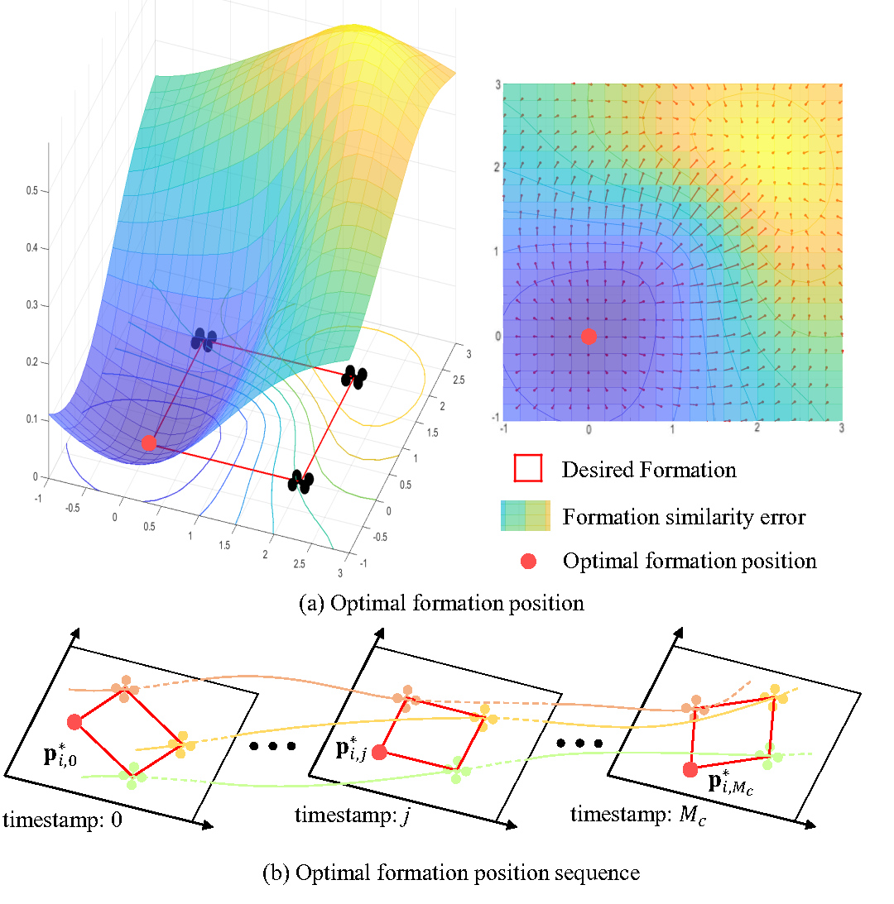

# Multi-Agent Planning
> Source:
>
> [1] L. Quan et al., ‘Robust and efficient trajectory planning for formation flight in dense environments’, *IEEE Trans. Robot.*, vol. 39, no. 6, pp. 4785–4804, Dec. 2023, doi: [10.1109/TRO.2023.3301295](https://doi.org/10.1109/TRO.2023.3301295).
>
> [2] L. Quan, L. Yin, C. Xu, and F. Gao, “Distributed swarm trajectory optimization for formation flight in dense environments,” in *Proc. Int. Conf. Robot. Autom.*, 2022, pp. 4979–4985.
>
> [3] Z. Wang, X. Zhou, C. Xu, and F. Gao, "Geometrically constrained trajectory optimization for multicopters", *IEEE Trans. Robot.*, vol. 38, no. 5, pp. 3259–3278, Oct. 2022, doi: [10.1109/TRO.2022.3160022](https://doi.org/10.1109/TRO.2022.3160022).


## Notation
|Sign|Meaning|
|------|---------|
|$\mathbf{A}$|Adjacency matrix of the formation graph|
|$a_m$|Maximum acceleration|
|$\mathbf{c}_i$|Coefficients of the $i^\text{th}$ piece|
|$\mathbf{D}$|Degree matrix of the formation graph|
|$d_o$|Safety threshold|
|$d_r$|Safe clearance between each robot|
|$\text{des}$|Sign for desired trajectory|
|$f_s(\cdot)$|Differentiable formation similarity error metric: [$(5)$](#eq-5)|
|$H(\cdot)$|Cost function|
|$\mathcal{H}(\cdot)$|Continuous-time constraint function: **similarity in group formation, dynamic feasibility, obstacle avoidance, and reciprocal avoidance of swarms**|
|$J(\cdot)$|2nd-order continuous cost function|
|$J_s$|Formation similarity error|
|$J_u$|Uniform distribution cost|
|$\mathbf{L}$|Laplacian matrix of the formation graph|
|$\hat{\mathbf{L}}$|Symmetric normalized Laplacian matrix|
|$M_c$|Number of sample points with corresponding time stamps|
|$\mathcal{M}(\cdot)$|Parameter mapping from $(\mathbf{q}, \mathbf{T})$ to $\mathbf{c}$|
|$m$|Dimension of the robot|
|$N$| Number of robots|
|$\mathcal{P}$|Cost: subscript $f$: swarm formation similarity; $e$: control effort; $t$: total time; $o$: obstacle avoidance; $r$: swarm reciprocal avoidance; $d$: dynamic feasibility|
|$\mathbf{p}_{i,j}$|The $j^\text{th}$ sample point of the $i^\text{th}$ robot trajectory|
|$\mathbf{p}_{i,j}^*$|The **optimal** $j^\text{th}$ sample point of the $i^\text{th}$ robot trajectory|
|$p(t)$|Trajectory, piecewise polynomial|
|$\mathbf{p}^{(s-1)}(t)$|The $(s-1)^\text{th}$ derivative of the trajectory, i.e., the control input|
|$\mathbf{p}^{[s-1]}(t)$|$(\mathbf{p}(t)^\top, \dot{\mathbf{p}}(t)^\top, \cdots, \mathbf{p}^{(s-1)}(t)^\top)^\top\in\mathbb{R}^{ms}$|
|$\mathbf{p}_i(t)$|The $i^\text{th}$ piece of the trajectory|
|$\bar{\mathbf{p}}_0$|Initial state|
|$\bar{\mathbf{p}}_f$|Final state|
|$\tilde{\mathbf{p}}_{i,j}$|The $j^\text{th}$ constraint point of the $i^\text{th}$ piece|
|$Q$|Degree of the polynomial, here $Q=2s-1=5$|
|$\boldsymbol{q}$|Intermediate waypoints|
|$s$|Integrator order, if controlling jerk, $s=3$|
|$\boldsymbol{T}$|Time allocation for each piece|
|$T_\Sigma$|Total time of the trajectory|
|$\mathfrak{T}_\text{MINCO}$|The class of trajectory parameterization based on piecewise polynomials aiming at minimizing control effort|
|$\mathbf{U}$|Squared distance vector: $(\|\hat{\mathbf{p}}_{i,1}^*-\hat{\mathbf{p}}_{i,0}^*\|_2^2,\cdots,\|\hat{\mathbf{p}}_{i,M_c}^*-\hat{\mathbf{p}}_{i,M_c-1}^*\|_2^2)\in\mathbb{R}^{M_c}$|
|$v_m$|Maximum velocity|
|$\boldsymbol{w}_i$|The weight vector of the robot $i$, $\mathbb{R}^N$, essentially the weights of its $N$ adjacent edges|
|$\boldsymbol{\beta}(t)$|Polynomial basis vector: $\boldsymbol{\beta}(t)=[1,t,\ldots,t^N]^\top$|
|$\delta$|Sampling time interval|
|$\lambda_s, \lambda_u$|Weights for the formation similarity and uniform distribution costs|
|$\kappa_i$|Number of constraint points for the $i^\text{th}$ piece|
|$\Phi$|All other robots in the swarm|
|$\phi$|Element in $\Phi$|
|$\rho$|Time regularization weight|

<!-- ## How to make it sparse & Outlier Rejection 
TBC -->

## 1 Adaptive description of swarm formation (Sec. IV in [1])
### 1.1 Graph-based Formation Definition
In this article, a swarm formation of $N$ robots is modeled by an undirected graph $\mathcal{G} = (\mathcal{V,E})$, where $\mathcal{V}:=\{1,2,...,N\}$ is the set of vertices, and $\mathcal{E} \subset \mathcal{V} \times \mathcal{V}$ is the set of edges. In graph $\mathcal{G}$, the vertex $i$ represents the $i^{th}$ robot with position vector $\mathbf{p}_i = [x_i,y_i,z_i] \in \mathbb{R}^3$ . An edge $e_{ij} \in \mathcal{E}$ that connects vertex $i\in \mathcal{V}$ and vertex $j\in \mathcal{V}$ means that robot $i$ and $j$ can measure the geometric distance between each other.

In our work, each robot can obtain the positions of all robots $\{\mathbf{p}_1,...,\mathbf{p}_i,...,\mathbf{p}_N\}$, thus the graph $\mathcal{G}$ is **complete**. Then we determine the adjacency matrix $\mathbf{A} \in \mathbb{R}^{N\times N}$ and degree matrix $\mathbf{D}\in \mathbb{R}^{N\times N}$ of the formation graph $\mathcal{G}$ by

<span id="eq-1"></span> <span id="eq-2"></span>

$$
\begin{align}
  &A_{ij}=w_{ij}= \parallel \mathbf{p}_i-\mathbf{p}_j\parallel^2, \tag{1} \\
  &D_{ij}=\begin{cases}
                  \sum\limits_{j = 1}^{N} A_{ij},  & \text{if}~~i=j, \\
                  0, & \text{otherwise},
              \end{cases} \tag{2}
\end{align}
$$

where the non-negative edge weight $w_{ij}$ is the **squared distance** between the $i^{th}$ and $j^{th}$ robots, and $\parallel\cdot\parallel$ denotes the Euclidean norm. Thus, the corresponding Laplacian matrix is

<span id="eq-3"></span>

$$
    \mathbf{L} = \mathbf{D} - \mathbf{A}. \tag{3}
$$

With the above matrices, the **symmetric normalized Laplacian matrix** of graph $\mathcal{G}$ is defined as

<span id="eq-4"></span>

$$
  \mathbf{\hat{L}} = \mathbf{D}^{-1/2}\mathbf{L}\mathbf{D}^{-1/2} = \mathbf{I} - \mathbf{D}^{-1/2}\mathbf{A}\mathbf{D}^{-1/2}, \tag{4}
$$

where $\mathbf{I} \in \mathbb{R}^{N\times N}$ is the identity matrix. $\mathbf{\hat{L}}$ contains the information that is **invariant to scale, translation, and rotation**.

> (Explained by ChatGPT 5.5)
> The distance measurement is invariant to translation and rotation. For uniform scaling:
> $$ \mathbf{p}_i' = s\mathbf{p}_i, \quad s > 0 \to w_{ij}' = s^2 w_{ij} \to \mathbf{A}' = s^2\mathbf{A}, \quad \mathbf{D}' = s^2\mathbf{D} \to \mathbf{L}' = s^2\mathbf{L} \to \mathbf{\hat{L}}' \text{ constant} $$
>
> A more precise statement is that $\mathbf{\hat{L}}$ is a **shape descriptor** invariant under **similarity transformations** (rotation + translation + uniform scaling). Since distances are also unchanged by **reflection**, it is actually invariant under the full Euclidean similarity group, including mirror reflections.
>
> Other properties:
> - Symmetric and positive semidefinite
> - Eigenvalues lie in a bounded interval: $0 = \lambda_1 \leq \lambda_2 \leq ... \leq \lambda_N \leq 2$
> - The multiplicity of the zero eigenvalue corresponds to the number of connected components in the graph. Since the grph is complete: $\operatorname{mult}(0)=1\to \lambda_1=0,\lambda_2>0$
> - The largest eigenvalue $\lambda_N$ is related to the maximum degree of the graph and can indicate the presence of highly connected nodes (hubs)
> - Known eigenvector for $\lambda=0$ is the constant vector $\mathbf{1}$, which reflects the uniform distribution of vertices in the graph 
> - The second smallest eigenvalue (normalized algebraic connectivity) indicates how well connected the graph is: larger values suggest stronger connectivity and robustness to node removal, while smaller values indicate a more fragile structure
> - The eigenvalues and eigenvectors of $\mathbf{\hat{L}}$ can be used for spectral clustering, community detection, and dimensionality reduction in graph-based machine learning tasks
> - The eigenvectors (Laplacian eigenmaps) can be used for clustering and dimensionality reduction
> - Spectral invariance: the spectrum of $\mathbf{\hat{L}}$ is a compact shape descriptor. Many formation-recognition methods use only the eigenvalues because eigenvalues are independent of robot numbering up to permutation.
> - Invariance to robot relabeling (permutation): $\mathbf{\hat{L}}$ is invariant under any permutation of the robot indices, which means that the formation similarity metric based on $\mathbf{\hat{L}}$ does not depend on how we label the robots.
> - The trace of $\mathbf{\hat{L}}$ is equal to the number of vertices $N$ (since the diagonal entries are all 1)
> - The Frobenius norm $\|\mathbf{\hat{L}}\|_F$ is related to the total edge weight and can be used as a measure of graph connectivity
> - The normalized Laplacian can be interpreted as a discrete analog of the continuous Laplace-Beltrami operator on a manifold, which is useful for analyzing the geometry of the formation 
> - The normalized Laplacian can be used to define a diffusion process on the graph, which can model how information or influence spreads through the swarm formation
> - the spectrum alone does not always uniquely determine the formation. Different formations can occasionally be cospectral. However, in practice, the spectrum of $\mathbf{\hat{L}}$ is often sufficient to distinguish between different formation shapes, especially when combined with other features or constraints.
> - The normalized Laplacian is particularly useful for comparing formations of different sizes, as it normalizes the influence of the number of robots and their connectivity, allowing for a more meaningful comparison of formation shapes.

Finally, we use graph theory to describe various desired formation shapes,  such as squares, hexagons, and pyramids.

By specifying the desired positions $\mathbf{p}_i^d= [x_i^d,\,\,y_i^d,\,\,z_i^d]\in \mathbb{R}^3,\,\,i = 1,...,N$, computing $\mathbf{\hat{L}}_\text{des}$ is simple.

It's important to note that the desired formation shape is independent of the coordinate system as long as the **relative positions** are provided.

### 1.2 Differentiable Formation Similarity Error Metric

To assess the deviation from the desired formation, we propose a differentiable formation similarity error metric as

<span id="eq-5"></span>

$$
  \begin{align*}
      f_s & = f_s(\mathbf{p}_1,...,\mathbf{p}_i,...,\mathbf{p}_N) = f_s (\mathbf{A},\mathbf{D}) = f_s(\mathbf{\hat{L}},\mathbf{\hat{L}}_\text{des}) \\   
      & = \parallel\mathbf{\hat{L}}-\mathbf{\hat{L}}_\text{des}\parallel^2_F = \operatorname{tr}\{(\mathbf{\hat{L}}-\mathbf{\hat{L}}_\text{des})^\top(\mathbf{\hat{L}}-\mathbf{\hat{L}}_\text{des})\}, \tag{5}
  \end{align*}
$$

where $\operatorname{tr}\{\cdot\}$ denotes the trace of a matrix, $\mathbf{\hat{L}}$ is the symmetric normalized Laplacian of the current swarm formation, $\mathbf{\hat{L}}_\text{des}$ is the counterpart of the desired formation. Frobenius norm $\parallel\cdot\parallel_F$ is used in our distance metric.

As a graph representation matrix, $\mathbf{\hat{L}}$ contains information about the graph structure. This allows $f_s$ to **consider only the geometric shape** of the formation, and not be influenced by scaling, translation, or rotation. Additionally, $f_s$ is a dimensionless value that **solely reflects the error in formation shape similarity**.

In particular, under the distributed framework, each robot can **only change its positions** to reduce the overall formation similarity error. 
Therefore, the only variable for robot $i$ in [$(5)$](#eq-5) is $\mathbf{p}_i$, and $f_s(\mathbf{p}_1,...,\mathbf{p}_i,...,\mathbf{p}_N)$ can be simplified as $f_s(\mathbf{p}_i)$.
    
Our metric is analytically differentiable with respect to the position of each robot. For robot $i$, we use the weights of its $N$ adjacent edges $\{e_{i1},\,e_{i2},\,...,\;,e_{iN}\}$ to form a weight vector $\boldsymbol{w}_{i} = [w_{i1},\,w_{i2},\,...,\;,w_{iN}]^\top$. By the chain rule, the gradient of $f_s$ with respect to $\mathbf{p}_i$ can be written as 

<span id="eq-6"></span>

$$
  \frac{\partial f_s}{\partial \mathbf{p}_i} = \frac{\partial f_s}{\partial \boldsymbol{w}_i^\top} \frac{\partial \boldsymbol{w}_i}{\partial \mathbf{p}_i}. \tag{6}
$$

According to our metric [$(5)$](#eq-5), the gradient of $f_s$ with respect to each weight $w_{ij}$ can be computed as follow

<span id="eq-7"></span>

$$
\begin{align*}
    \frac{\partial f_s}{\partial w_{ij}} &= \operatorname{tr}\left\{\left(\frac{\partial f_s}{\partial \hat{\mathbf{L}}}\right)^\top\left(\frac{\partial \hat{\mathbf{L}}}{\partial w_{ij}}\right)\right\}, \\
    \frac{\partial f_s}{\partial \mathbf{\hat{L}}} &= \frac{\partial ||\mathbf{\hat{L}}-\mathbf{\hat{L}}_\text{des}||_F^2}{\partial \mathbf{\hat{L}}} =
2(\mathbf{\hat{L}}-\mathbf{\hat{L}}_\text{des}), \\
    \frac{\partial \mathbf{\hat{L}}}{\partial w_{ij}} &=
    -\frac{\partial(\mathbf{D}^{-1/2}\mathbf{A}\mathbf{D}^{-1/2})}{\partial w_{ij}}. \tag{7}
\end{align*}
$$

Then the gradient $\partial f_s/\partial \boldsymbol{w}_i$ can be written as 

<span id="eq-8"></span>

$$
   \partial f_s/\partial \boldsymbol{w}_i = [\partial f_s/\partial w_{i1}, \partial f_s/\partial w_{i2}, ..., \partial f_s/\partial w_{iN}]^\top. \tag{8}
$$

As for $\partial \boldsymbol{w}_i/\partial \mathbf{p}_i$, the Jacobian can be easily derived since the weight function [$(1)$](#eq-1) is a differentiable quadratic form.

### 1.3 Optimal Formation Position Sequence
TODO: Previous work
Previous work [2] incorporated $f_s$ directly into the trajectory optimization, making formation flight a coupled trajectory optimization problem. While this method is **suitable for small-scale** formation flight, it becomes **computationally inefficient** as the number $N$ of robots increases.

Considering the simplified equation for coupled trajectory optimization

<span id="eq-9"></span>

$$
  \min_{\mathbf{p}_{i,0},...,\mathbf{p}_{i,M_c}} \sum_{j=0}^{M_c} f_s(\mathbf{p}_{i,j})+J_\text{other}, \tag{9}
$$

where $\mathbf{p}_{i,j}$ represent the $j^{th}$ sample point of $i^{th}$ robot trajectory in [$(19)$](#eq-19) for convenience. $J_\text{other}$ represents all other cost functions, and $M_c$ is the number of sample points with corresponding timestamps.

The primary purpose of calculating $f_s$ is to **supply gradient information for minimizing formation similarity error**. However, since the graph $\mathcal{G}$ is a complete graph, computing $f_s$ has a complexity of $O(N^2)$.

Consequently, the coupled trajectory optimization [$(9)$](#eq-9) also exhibits high complexity of $O(N^2)$ in each iteration, limiting its applicability to large-scale swarm operations.

To address this issue, we must identify an **equivalent approach** with reduced computational complexity to replace the function of $f_s$ in [$(9)$](#eq-9). We introduce the concept of **optimal formation position** $\mathbf{p}_{i,j}^*$ for robot $i$ at timestamp $j$, which is the position that minimizes the formation similarity error $f_s$. [Fig.1(a)](#fig-10-1) illustrates this concept using a 2D formation as an example. 

<figure>
   
   <div align="center"><figcaption> Figure 1[1]: Illustration of optimal formation position sequence using a 2D formation. (a) The surface shows the profile of the similarity metric when one UAV moves in the plane and the other three remain still. The minimum suggests the optimal formation position to form the desired shape. (b) The sequence of optimal formation positions corresponds to the timestamps.</figcaption></div>
</figure>

It is evident from the figure that there exists an optimal formation position $\mathbf{p}_{i,j}^*$ that results in a minimal formation similarity error, and the partial derivative is $\partial f_s/\partial \mathbf{p}_{i,j}^*=0$.

In the future period with a sequence of timestamps $\{0, ..., j, ..., M_c\}$, we represent the expected positions of robot $i$ with the **optimal formation position sequence** $\mathbf{p}_i^*=\{\mathbf{p}_{i,0}^*,\cdots,\mathbf{p}_{i,j}^*,\dots,\mathbf{p}_{i,M_c}^*\}$, as shown in [Fig. 1(b)](#fig-10-1).
By **precomputing** $\mathbf{p}_i^*$, we can utilize **its quadratic distance to replace the gradient information** offered by $f_s$ in [$(11)$](#eq-11), thus decreasing the computational requirements as follows

<span id="eq-10"></span>

$$
  f_s(\mathbf{p}_{i,j}) \Rightarrow \| \mathbf{p}_{i,j} - \mathbf{p}_{i,j}^* \|^2. \tag{10}
$$

Since the **optimal solutions of $f_s$ and quadratic distance cost are equivalent**, the trajectory approaches the positions with minimal formation similarity error, maintaining the desired formation.

Thus, we can effectively solve the coupled trajectory optimization with a **two-step procedure**

<span id="eq-11"></span>

$$
  \begin{align*}
        &\text{1.}~~\mathbf{p}_i^* = \arg\min \sum_{k=0}^{M_c}f_s(\mathbf{p}_{i,k}), \\
        \xRightarrow{\mathbf{p}_i^*}~~&\text{2.}~~\min_{\mathbf{p}_{i,0},...,\mathbf{p}_{i,M_c}} \| \mathbf{p}_{i,k}-\mathbf{p}_{i,k}^*\|^2+J_\text{other}. \tag{11}
  \end{align*}
$$

As a result, the previously required calculation of $f_s$ in each trajectory optimization process is replaced by the computation of the quadratic distance, simplifying the optimization problem. This significantly reduces computational demands and enables large-scale swarm formation.

Formula [$(11)$](#eq-11) indicates that trajectory optimization in the next section is performed on discretized points. **Non-uniform discretized points may lead to poor trajectories and sub-optimal performance**. Therefore it is crucial to ensure a uniform distribution of these points to maintain the effectiveness of the optimization process.

In engineering practice, since graphs $\mathcal{G}$ are constructed from a series of discretized timestamps as depicted in [Fig. 1(b)](#fig-10-1), each $\mathbf{p}_{i,j}^*$ is **independent**.

To ensure a smoother trajectory, we introduce the **uniform optimal formation position sequence** $\hat{\mathbf{p}}_i^*$, which is generated by considering the formation similarity error $J_s$ and the uniform distribution cost $J_u$

<span id="eq-12"></span> <span id="eq-13"></span>

$$
  \begin{align*}
    \hat{\mathbf{p}}_i^* &= \arg\min \lambda_s J_s + \lambda_u J_u, \tag{12} \\
    J_s &= \sum_{j=0}^{M_c} 
    f_s(\hat{\mathbf{p}}_{i,j}^*), \\
    J_u &= \mathbb{E}(\mathbf{U}^2) - \mathbb{E}(\mathbf{U})^2 = \frac{\| \mathbf{U}\|_2^2}{M_c}  - \frac{\| \mathbf{U}\|_1^2}{(M_c)^2}, \tag{13}
  \end{align*}
$$

where $\lambda_s$ and $\lambda_u$ are the relative weights. $\mathbb{E}(\cdot)$ is mathematic expectation and the squared distance vector $\mathbf{U} \in \mathbb{R}^{M_c}$ is 

<span id="eq-14"></span>

$$
  \mathbf{U}=(\|\hat{\mathbf{p}}_{i,1}^*-\hat{\mathbf{p}}_{i,0}^*\|_2^2,\cdots,\|\hat{\mathbf{p}}_{i,M_c}^*-\hat{\mathbf{p}}_{i,M_c-1}^*\|_2^2). \tag{14}
$$

We use the **quasi-Newton method** to solve this unconstrained optimization problem [$(12)$](#eq-12) and generate uniform $\hat{\mathbf{p}}_i^*$ for the later trajectory optimization [$(18)$](#eq-18).

By doing so, the trajectory resulting from these discretized points in the next section can be **smoother and avoid sudden spatial changes**.

## 2 Spatial-temporal trajectory optimization for formation flight
### 2.1 Trajectory Representation

The differential flatness of multicopters benefits trajectory generation without integrating differential equations. Moreover, the motion planning of multicopters can be performed on low-dimensional smooth trajectories.

Here we adopt a state-of-the-art trajectory representation named [MINCO](./9MINCO.md) to achieve **minimum control effort spatial-temporal trajectory planning** for swarm aerial robots in three-dimensional environments. `MINCO` conducts spatial-temporal deformation of the flat-output $M$-piece trajectory $p(t)$ by decoupling the space and time parameters with a linear-complexity mapping $\mathcal{M}$

<span id="eq-15"></span>

$$
  p(t)=\mathcal{M}_{\mathbf{q},\mathbf{T}}(t),~~\forall{t}\in[t_0,t_M], \tag{15}
$$

where $\mathbf{q}=(\mathbf{q}_1,\cdots,\mathbf{q}_{M-1})^\top\in \mathbb{R}^{3\times(M-1)}$ are the adjacent intermediate points between each pair of connected pieces and $\mathbf{T}=(T_1,\cdots,T_M)^\top\in \mathbb{R}^M_{>0}$ the time duration of each piece.

A $m$-dimensional $M$-piece trajectory $p(t)$ is represented by piecewise polynomials. And $i^{th}$ piece $p_i(t)$ is defined as a multi-degree polynomial ($Q=5$ in this paper)

<span id="eq-16"></span>

$$
	p_i(t)=\mathbf{c}_i^\top \boldsymbol{\beta}(t),~~\forall{t}\in[0,T_i], \tag{16}
$$

where $\mathbf{c}_i\in \mathbb{R}^{(Q+1)\times m}$ is the coefficient matrix and $\boldsymbol{\beta}(t)=[t^0,t^1,\cdots,t^Q]^\top$ is the natural basis.

For an $s$-integrator ($s=3$ here) chain dynamics system, a $M$-piece $2s-1$ degree trajectory $p(t)$ is defined by constant boundaries and minimum control effort $\{\mathbf{q},\mathbf{T}\}$.

Furthermore, `MINCO` is advanced in convert $\{\mathbf{q},\mathbf{T}\}$ to $\{\mathbf{c},\mathbf{T}\}$ using a linear-time and space parameter mapping $\mathbf{c}=\mathcal{M}(\mathbf{q},\mathbf{T})$, where $\mathbf{c}=(\mathbf{c}_1^\top,\cdots,\mathbf{c}_M^\top)^\top$ is polynomial coefficients.

### 2.2 Problem Formulation
After determining the desired formation shape in the last section, we expect a cluster of trajectories for swarm robots, which are **smooth, collision-free, and formation maintained**.

In practice, navigating swarm robots in an unknown dense environment with FOV-limited sensors and onboard computer requires an efficient real-time planner focusing on local information. Besides, centralized optimization is limited by the scale of the swarm.

Therefore, we choose a **distributed local trajectory optimization for formation flight** as follows

<span id="eq-17"></span>

$$
  \begin{align*}
      \min_{\mathbf{q},\mathbf{T}} ~~
      & \int_{t_0}^{t_M} \| p^{(s)}(t) \|^2 dt + \rho \cdot T_\Sigma , \tag{17a}\\
  \text{s.t.}~~~~& p(t) = \mathcal{M}_{\mathbf{q},\mathbf{T}}(t), \forall t \in [t_0,t_M], \tag{17b}\\
      & \mathbf{p}^{[s-1]}(0)=\bar{\mathbf{p}}_{0}, \tag{17c}\\
      & \mathbf{p}^{[s-1]}(t_M)=\bar{\mathbf{p}}_{f}, \tag{17d}\\
      & \mathcal{H}(p(t),...,p^{(s)}(t))\preceq \mathbf{0}, \forall t \in [t_0,t_M].\tag{17e}
  \end{align*}
$$

We define costs [$(17a)$](#eq-17) for smoothness and aggressiveness to achieve smooth and efficient flight. $\rho$ is time regularization parameter, $T_\Sigma=\sum\limits_{i=1}^M T_i$. The state of robot $p(t)$ [$(17b)$](#eq-17) is parameterized by the optimization variables $\{\mathbf{q},\mathbf{T}\}$. $\mathbf{p}^{[s-1]}(t)=(p(t)^\top,\dot{p}(t)^\top,...,p^{(s-1)}(t)^\top)^\top\in\mathbb{R}^{ms}$ represents the higher-order derivatives of a chain dynamic system with $s$-integrator. Boundary conditions involve initial state $\bar{\mathbf{p}}_0\in\mathbb{R}^{ms}$ [$(17c)$](#eq-17) and terminal state $\bar{\mathbf{p}}_f\in\mathbb{R}^{ms}$ [$(17d)$](#eq-17). Continuous-time constraints $\mathcal{H}$ [$(17e)$](#eq-17) include **swarm formation similarity, dynamic feasibility, obstacle avoidance, and swarm reciprocal avoidance**. 

### 2.3 Constraints Transcription
To solve the continuous constrained optimization problem [$(17)$](#eq-17) in real-time, we use the optimization variable of MINCO [$(15)$](#eq-15) to eliminate all kinds of equality constraints [$(17b)$](#eq-17)-[$(17d)$](#eq-17) (See [MINCO](./9MINCO.md#3-geometrically-constrained-flight-trajectory-optimization) for details). And penalty function method TODO is used to deal with the inequality constraints [$(17e)$](#eq-17). Then, every integral is evaluated by a finite sum of sample points.

Finally, the continuous constrained optimization problem is converted to a discrete unconstrained optimization problem

<span id="eq-18"></span>

$$
  \min_{\mathbf{q},\mathbf{T}}  
      \sum_{\star} \lambda_\star \widetilde{J}_\star(\mathbf{q},\mathbf{T},\delta), \tag{18}
$$

where $\widetilde{J}_\star$ are various terms of cost function or penalties, and $\lambda_\star$ are relative weights. Subscripts $\star=\{f,e,t,o,r,d\}$:
- ($f$) swarm formation similarity;
- ($e$) denote control effort;
- ($t$) total time;
- ($o$) obstacle avoidance;
- ($r$) swarm reciprocal avoidance;
- ($d$) dynamic feasibility.

$\delta$ is the sampling time interval.

In the previous work[2], we used the **fixed number** sampling points $\hat{\mathbf{p}}_{i,j}=p_i((j/\kappa_i)\cdot T_i)$ to transform the optimization problem, where $p_i(t)$ is the $i^{th}$ piece trajectory and $\kappa_i$ is the fixed sample number on this piece.

However, considering that the total time $T_\Sigma$ changes during the optimization process, the fixed number sampling points $\hat{\mathbf{p}}_{i,j}$ are difficult to space on the whole trajectory equally.

Therefore, we take **fixed-time-interval sampling points** for the whole trajectory to ensure the accuracy of the penalty function sampling transformation

<span id="eq-19"></span>

$$
  \begin{align*}
      & \tilde{\mathbf{p}}_{j}(t)=p_i\left(j\delta-\sum^{i-1}_{l=1}T_l\right), \\
      & j\in\{0,\cdots,\kappa\}, \kappa=\left\lfloor \frac{T_\Sigma}{\delta} \right\rfloor, \tag{19}
  \end{align*}
$$

where $\kappa$ is the sample number and $T_l$ is the preceding time for any $1 \leqslant l<i$.

For the trajectory planning of swarm robots, the fixed time interval sampling points $\tilde{\mathbf{p}}_{j}(t)$ can simplify the optimization problem. Compared with $\hat{\mathbf{p}}_{i,j}$, the timestamp corresponding to $\tilde{\mathbf{p}}_{j}(t)$ is **fixed**, so the states of other robots at this timestamp are also **constant** during the optimization process.

Therefore, it is feasible to calculate the states of other robots w.r.t $\tilde{\mathbf{p}}_{j}(t)$ according to the broadcast trajectories before optimization.

Then we can solve the **uniform formation position sequence optimization** [$(12)$](#eq-12) **in advance** and use $\hat{\mathbf{p}}_i^*$ to replace the formation similarity metric $f_s$ in trajectory optimization [$(17a)$](#eq-17) of $i^{th}$ robot. This decoupled formation trajectory optimization results in higher computational efficiency, making our method suitable for large-scale swarm robots.

Despite the optimization problem is **not differentiable** when sampling number $\kappa$ changes, the cost function remains continuous w.r.t. time duration $\mathbf{T}$. We use the **quasi-Newton method** to solve the non-smooth discrete unconstrained optimization problem [$(18)$](#eq-18).

### 2.4 Cost Functions and Gradients
Given the fixed sampling time interval $\delta$, we can evaluate the cost functions and gradients of the whole trajectory by a finite sum of sampling points $\tilde{\mathbf{p}}_{j}(t)$.

The cost of various general purpose penalties at $j^{th}$ sampling points is

<span id="eq-20"></span>

$$
    \mathcal{P}_\star(\mathbf{c},\mathbf{T},j\delta) = \mathcal{P}_\star(\tilde{\mathbf{p}}_{j}(t)), \tag{20}
$$

then the cost function $\widetilde{J}_\star$ in [$(18)$](#eq-18) is calculated as follows

<span id="eq-21"></span>

$$
\begin{align*}
    \nonumber \widetilde{J}_\star(\mathbf{q}, \mathbf{T},\delta) =&  J_\star(\mathbf{c},\mathbf{T},\delta) \\
    =& \delta \sum_{j=0}^\kappa \bar{\omega}_j \mathcal{P}_\star(\mathbf{c},\mathbf{T},j\delta) + \\
    &+ \frac{1}{2} (T_\Sigma -\kappa\delta)\left[\mathcal{P}_\star(\mathbf{c},\mathbf{T},\kappa\delta) + \mathcal{P}_\star(\mathbf{c},\mathbf{T},T_\Sigma)\right], \tag{21}
\end{align*}
$$

where $(\bar{\omega}_0,\bar{\omega}_1,\cdots,\bar{\omega}_{\kappa-1},\bar{\omega}_{\kappa})=(1/2,1,\cdots,1,1/2)$ are the orthogonal coefficients following the trapezoidal rule.

And `MINCO` allows any second-order continuous cost function $\widetilde{J}_\star(\mathbf{q},\mathbf{T})$ to be represented by $J_\star(\mathbf{c},\mathbf{T})$. Hence, $\partial\widetilde{J}_\star/\partial\mathbf{q}$ and $\partial\widetilde{J}_\star/\partial\mathbf{T}$ can be efficiently obtained from $\partial{J}_\star/\partial\mathbf{c}$ and $\partial{J}_\star/\partial\mathbf{T}$ respectively, which is benefit to the construction and solution of the optimization problem.

In [$(19)$](#eq-19), the sampling time $t=j\delta-\sum\limits^{i-1}_{l=1}T_l$ is related to the preceding time $T_l$, so the gradient of $J_\star$ w.r.t $\mathbf{c}_i$ and $T_l$ are computed as

<span id="eq-22"></span> <span id="eq-23"></span> <span id="eq-24"></span>

$$
  \begin{align*}
    \frac{\partial{J}_\star}{\partial \mathbf{c}_i} &= \frac{\partial{J}_\star}{\partial \mathcal{P}_\star}                           \frac{\partial \mathcal{P}_\star}{\partial \tilde{\mathbf{p}}_{j}(t)} \frac{\partial \tilde{\mathbf{p}}_{j}(t)}{\partial \mathbf{c}_i}, \tag{22} \\
    \frac{\partial{J}_\star}{\partial T_l} &= \frac{\partial{J}_\star}{\partial \mathcal{P}_\star}                           \frac{\partial \mathcal{P}_\star}{\partial \tilde{\mathbf{p}}_{j}(t)} \frac{\partial \tilde{\mathbf{p}}_{j}(t)}{\partial t} \frac{\partial t}{\partial T_l}, \tag{23} \\
    \frac{\partial \tilde{\mathbf{p}}_{j}(t)}{\partial \mathbf{c}_i} &= \boldsymbol{\beta}(t), \frac{\partial \tilde{\mathbf{p}}_{j}(t)}{\partial t}=\dot{\tilde{\mathbf{p}}}_{j}(t), \frac{\partial t}{\partial T_l} = 
      \begin{cases}
      0,  &l=i, \\
      -1, &l<i,
      \end{cases} \tag{24}
  \end{align*}
$$
where the calculation of $\partial{J}_\star/\partial \mathcal{P}_\star$ is simple and the details of $\mathcal{P}_\star(\tilde{\mathbf{p}}_{j}(t))$ for various general purpose are given as follow.

- **Cost of Swarm Formation Similarity** $\mathcal{P}_f$
In [Sec. 1.3](#13-optimal-formation-position-sequence), we decouple the formation similarity error metric from trajectory optimization by constructing an unconstrained optimization problem to calculate the uniform optimal formation position sequence $\hat{\mathbf{p}}_i^*$ for each sampling point. This improvement avoids multiple calculations of formation similarity metric $f_s$.
Then, we use the quadratic form to calculate the cost of swarm formation similarity

<span id="eq-25"></span>

$$
  \mathcal{P}_f(\tilde{\mathbf{p}}_{j}(t))=\max \{ \parallel \tilde{\mathbf{p}}_{j}(t) - \hat{\mathbf{p}}_{i,j}^* \parallel^2,0 \}^3. \tag{25}
$$

- **Control Effort** $J_e$
The $s^{th}$ ($s=3$ here) control input for the trajectory and its gradients are written as 
	
<span id="eq-26"></span> <span id="eq-27"></span> <span id="eq-28"></span>

$$
  \begin{align*}
    J_e&=\sum_{i=1}^{M}\int_{0}^{T_i}\parallel p_i^{(s)}(t)\parallel^2\mathrm{~d}t, \tag{26}\\
  	\frac{\partial J_e}{\partial \mathbf{c}_i}&=2\left( \int_0^{T_i}\boldsymbol{\beta}^{(s)}(t)\boldsymbol{\beta}^{(s)}(t)^\top \mathrm{~d}t \right)\mathbf{c}_i, \tag{27}\\
  	\frac{\partial J_e}{\partial T_i}&=\mathbf{c}_i^\top\boldsymbol{\beta}^{(s)}(T_i)\boldsymbol{\beta}^{(s)}(T_i)^\top\mathbf{c}_i.\tag{28}
  \end{align*}  
$$

- **Total Time** $J_t$
In order to ensure the aggressiveness of the trajectory, we minimize the total time $J_t=\sum\limits_{i=1}^MT_i$. The gradients are given by $\partial J_t/\partial \mathbf{c}=\mathbf{0}$ and $\partial J_t/\partial \mathbf{T}=\mathbf{1}$.

- **Cost of Obstacle Avoidance** $\mathcal{P_o}$
Obstacle avoidance penalty $J_o$ is computed using Euclidean Signed Distance Field (ESDF). 
We penalize the sampling points which are too close to the obstacles
<span id="eq-29"></span><span id="eq-30"></span>
$$
  \begin{align*}
    \mathcal{P}_o(\tilde{\mathbf{p}}_{j}(t)) &= \max\{\psi_o(\tilde{\mathbf{p}}_{j}(t)), 0\}^3, \tag{29}\\
    \psi_o(\tilde{\mathbf{p}}_{j}(t)) &= d_o - d_o(\tilde{\mathbf{p}}_{j}(t)), \tag{30}
  \end{align*}
$$
where $d_o$ is the safety threshold set according to the actual situation and $d_o(\tilde{\mathbf{p}}_{j}(t))$ is the distance between $\tilde{\mathbf{p}}_{j}(t)$ and the closest obstacle around it. The gradient of $\mathcal{P}_o$ w.r.t $\tilde{\mathbf{p}}_{j}(t)$ is
<span id="eq-31"></span>
$$
  \frac{\partial \mathcal{P}_o}{\partial \tilde{\mathbf{p}}_{j}(t)} = - \nabla d^\top, \tag{31}
$$
where the $\nabla d$ is the gradient of ESDF in $\tilde{\mathbf{p}}_{j}(t)$.

- **Cost of Swarm Reciprocal Avoidance** $\mathcal{P_r}$
We penalize $\tilde{\mathbf{p}}_{j}(t)$ when it is too close to the trajectories $p_\phi(t),\phi\in\Phi$ at the fixed timestamp $t=j\delta$, where $\Phi$ represents the all other robots in the swarm. Compared to previous work[2], the state of other robots with fixed timestamp $p_\phi(j\delta)$ are constant during the optimization process and do not produce a gradient w.r.t $\mathbf{T}$ for the cost function $J_r$. So the optimization problem and the gradients are simplified.
The cost of swarm reciprocal avoidance is defined as
<span id="eq-32"></span><span id="eq-33"></span>
$$
  \begin{align*}
    \mathcal{P}_r(\tilde{\mathbf{p}}_{j}(t))= \sum_{\Phi} \max \{\psi_r(\tilde{\mathbf{p}}_{j}(t),p_\phi(j\delta)),0\}^3,  \tag{32}\\
	  \psi_r(\tilde{\mathbf{p}}_{j}(t),p_\phi(j\delta))=d_r^2-\parallel \tilde{\mathbf{p}}_{j}(t)-p_\phi(j\delta) \parallel^2, \tag{33}
  \end{align*}
$$
where $d_r$ is the safe clearance between each robot. 
And the gradient of $\mathcal{P}_r$ w.r.t $\tilde{\mathbf{p}}_{j}(t)$ is
<span id="eq-34"></span>
$$
  \frac{\partial \mathcal{P}_r}{\partial \tilde{\mathbf{p}}_{j}(t)} = -2(\tilde{\mathbf{p}}_{j}(t)-p_\phi(j\delta))^\top. \tag{34}
$$

- Cost of Dynamic feasibility $\mathcal{P_d}$
We limit the maximum value of velocity and acceleration to guarantee that the robots can execute the trajectory.
<span id="eq-35"></span>
$$
  \begin{align*}
        \mathcal{P}_d(\tilde{\mathbf{p}}_{j}(t))&=\mathcal{P}_{d,v}(\tilde{\mathbf{p}}_{j}(t))+\mathcal{P}_{d,a}(\tilde{\mathbf{p}}_{j}(t)), \\
        \mathcal{P}_{d,v}(\tilde{\mathbf{p}}_{j}(t)) &= \max \{ \parallel \dot{\tilde{\mathbf{p}}}_{j}(t)\parallel^2 - v_m^2, 0\}^3, \\
        \mathcal{P}_{d,a}(\tilde{\mathbf{p}}_{j}(t)) &= \max \{ \parallel \ddot{\tilde{\mathbf{p}}}_{j}(t)\parallel^2 - a_m^2, 0\}^3, \tag{35}
    \end{align*}
$$
where $v_m$ and $a_m$ are the maximum velocity and acceleration.

### 2.5 Discussion on solution quality of trajectory optimization
The proposed trajectory optimization process [$(17)$](#eq-17) aims to solve a challenging multi-stage Linear Quadratic Minimum Time (LQMT) problem, which is inherently non-convex and non-linear. Additionally, incorporating ESDF for obstacle avoidance introduces further non-convex constraints. As a result, guaranteeing the global optimal solution with the quasi-Newton method is **not always possible**.

To address concerns regarding local minima and infeasible solutions, we have implemented measures that prioritize safety and dynamic feasibility while maintaining high-performance formation flight.

- Firstly, we utilize **hybrid-A* searching algorithm** to **generate initial trajectories** that are collision-free and dynamically feasible, ensuring a valid final solution trajectory.
- During optimization, we give **greater weight to obstacle avoidance and dynamic constraints to prioritize safety and feasibility**. 
- Additionally, we conduct **collision checks** on trajectories to enhance safety.
- Moreover, our distributed swarm optimization framework effectively mitigates the impact of local minima on overall formation performance.

Implementing these measures, our method reliably achieves robust formation flight while maintaining computational efficiency.

## 9 Conclusion

### Procedure (two-step decoupled formation trajectory optimization)

**Inputs:**
- Desired formation (relative positions) $\{\mathbf{p}_i^d\}_{i=1}^N$;
- Initial/terminal states $(\bar{\mathbf{p}}_0,\bar{\mathbf{p}}_f)$;
- Obstacle ESDF $d_o(\cdot)$;
- Safety clearances $(d_o,d_r)$;
- Dynamic limits $(v_m,a_m)$;
- Weights $\lambda_\star$;
- Sampling interval $\delta$.

1. **Describe the desired formation with a graph.**
  - Build the (complete) formation graph $\mathcal{G}$, compute $\mathbf{A}$, $\mathbf{D}$, and normalized Laplacian $\hat{\mathbf{L}}$ via [$(1)$](#eq-1)–[$(4)$](#eq-4).
  - From $\{\mathbf{p}_i^d\}$ compute $\hat{\mathbf{L}}_{\text{des}}$ ([codes](https://github.com/ZJU-FAST-Lab/Swarm-Formation/tree/967a4bdfae949e994691f8ffc87dbb0147cbebb7/src/planner/swarm_graph/src/swarm_graph.cpp#L40:L82)).
  ```cpp
  bool SwarmGraph::setDesiredForm()
  ```

2. **Define formation similarity and its gradients.**
  - Use the differentiable similarity metric $f_s(\hat{\mathbf{L}},\hat{\mathbf{L}}_{\text{des}})$ in [$(5)$](#eq-5) and its gradients [$(6)$](#eq-6)–[$(8)$](#eq-8) to measure formation-shape error ([codes](https://github.com/ZJU-FAST-Lab/Swarm-Formation/tree/967a4bdfae949e994691f8ffc87dbb0147cbebb7/src/planner/traj_opt/src/poly_traj_optimizer.cpp#L376:L460)).
  ```cpp
  bool PolyTrajOptimizer::swarmGraphGradCostP()
  ```

3. **Precompute the (uniform) optimal formation position sequence.**
  - For each robot $i$ and each discrete timestamp $j\in\{0,\dots,M_c\}$, solve the formation-only optimization to obtain the optimal formation positions $\mathbf{p}^*_{i,j}$ ([Sec. 1.3](#13-optimal-formation-position-sequence)).
  - Replace the $O(N^2)$ formation similarity term by a quadratic distance surrogate [$(10)$](#eq-10), yielding the decoupled two-step pipeline [$(11)$](#eq-11).
  - Add the uniformity regularizer and solve [$(12)$](#eq-12)–[$(14)$](#eq-14) to obtain the *uniform* sequence $\hat{\mathbf{p}}^*_{i,j}$.

4. **Initialize a feasible trajectory for each robot.**
  - Generate an initial collision-free, dynamically feasible trajectory (e.g., hybrid-A*) to warm start the optimizer ([Sec. 2.5](#25-discussion-on-solution-quality-of-trajectory-optimization)). Codes: [computeInitReferenceState](https://github.com/ZJU-FAST-Lab/Swarm-Formation/tree/967a4bdfae949e994691f8ffc87dbb0147cbebb7/src/planner/plan_manage/src/planner_manager.cpp#L41:L136) $\to$ [astarWithMinTraj](https://github.com/ZJU-FAST-Lab/Swarm-Formation/tree/967a4bdfae949e994691f8ffc87dbb0147cbebb7/src/planner/traj_opt/src/poly_traj_optimizer.cpp#L623:L675) $\to$ [astarSearchAndGetSimplePath](https://github.com/ZJU-FAST-Lab/Swarm-Formation/tree/967a4bdfae949e994691f8ffc87dbb0147cbebb7/src/planner/path_searching/src/dyn_a_star.cpp#L265:L276) $\to$ [AstarSearch](https://github.com/ZJU-FAST-Lab/Swarm-Formation/tree/967a4bdfae949e994691f8ffc87dbb0147cbebb7/src/planner/path_searching/src/dyn_a_star.cpp#L121:L252)

5. **Parameterize each trajectory using MINCO.**
  - Represent the piecewise polynomial trajectory with variables $(\mathbf{q},\mathbf{T})$ using [$(15)$](#eq-15)–[$(16)$](#eq-16): (Codes: [Variables](https://github.com/ZJU-FAST-Lab/Swarm-Formation/tree/967a4bdfae949e994691f8ffc87dbb0147cbebb7/src/planner/traj_opt/include/optimizer/poly_traj_utils.hpp#L1143:L1250) & [Grad](https://github.com/ZJU-FAST-Lab/Swarm-Formation/tree/967a4bdfae949e994691f8ffc87dbb0147cbebb7/src/planner/traj_opt/include/optimizer/poly_traj_utils.hpp#L1342:L1348) in [costFunctionCallback](https://github.com/ZJU-FAST-Lab/Swarm-Formation/tree/967a4bdfae949e994691f8ffc87dbb0147cbebb7/src/planner/traj_opt/src/poly_traj_optimizer.cpp#L130:L162)).
  - Formulate the distributed local optimization objective and constraints as [$(17)$](#eq-17).

6. **Transcribe continuous constraints with fixed-interval sampling.**
  - Sample the full trajectory using the fixed time interval $\delta$ to obtain $\tilde{\mathbf{p}}_j(t)$ as in [$(19)$](#eq-19), so timestamps remain constant while $\mathbf{T}$ changes.
  - For reciprocal avoidance, query other robots’ broadcast trajectories at the fixed timestamps $t=j\delta$.

7. **Assemble the discrete unconstrained optimization objective.**
  - Convert [$(17)$](#eq-17) into the sampled objective [$(18)$](#eq-18) using trapezoidal integration [$(21)$](#eq-21).
  - Use the following penalty/cost terms at samples:
    - Formation similarity via distance to $\hat{\mathbf{p}}^*_{i,j}$ [$(25)$](#eq-25).
    - Control effort and time terms [$(26)$](#eq-26)–[$(28)$](#eq-28).
    - Obstacle avoidance using ESDF [$(29)$](#eq-29)–[$(31)$](#eq-31).
    - Reciprocal avoidance [$(32)$](#eq-32)–[$(34)$](#eq-34).
    - Dynamic feasibility [$(35)$](#eq-35).

8. **Optimize per robot with quasi-Newton and analytic gradients.**
  - Compute gradients w.r.t. coefficients and durations using the MINCO mapping and chain rules [$(22)$](#eq-22)–[$(24)$](#eq-24).
  - Solve [$(18)$](#eq-18) with a quasi-Newton method until convergence; run collision checks and keep high weights on obstacle/dynamic penalties for safety ([Sec. 2.5](#25-discussion-on-solution-quality-of-trajectory-optimization)).

9. **Execute and iterate.**
  - Broadcast the optimized trajectory to neighbors and execute; repeat the above steps in a distributed replanning loop as new environment/neighbor information arrives.
