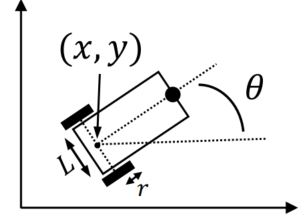
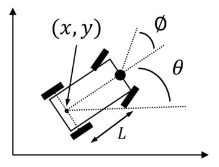
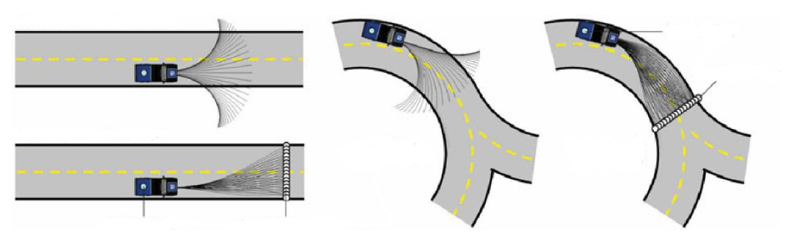

# 4. Kinodynamic Path Finding
## Introduction
Kinodynamic : Kinematic + Dynamic:
> The **kinodynamic planning** problem is to synthesize a robot motion subject to simultaneous **kinematic** constraints, such as **avoiding obstacles**, and **dynamics** constraints, such as modulus **bounds on velocity, acceleration, and force**. A kinodynamic solution is a mapping from time to generalized forces or accelerations. (From *Kinodynamic Motion Planning*)

- Differentially constrained
- Up to force (acceleration)

Reason: Straight-line connections between pairs of states are typically **not valid trajectories** due to the system’s differential constraints.

- Coarse-to-fine process
- Trajectory only optimizes locally
- Infeasible path means nothing to nonholonomic system

Examples:
- **Unicycle** model:
$$
\left(\begin{array}{c}\dot{x} \\ \dot{y} \\ \dot{\theta}\end{array}\right)=\left(\begin{array}{c}\cos \theta \\ \sin \theta \\ 0\end{array}\right) \cdot v+\left(\begin{array}{l}0 \\ 0 \\ 1\end{array}\right) \cdot \omega
$$
Constraints:
$$
\begin{aligned}
  &|v|\leqslant v_{\max} \\
  &|\omega|\leqslant \omega_{\max} \\
\end{aligned}
$$

- **Differential drive** model:
$$
\left(\begin{array}{c}\dot{x} \\ \dot{y} \\ \dot{\theta}\end{array}\right)=\left(\begin{array}{c}\frac{r}{2}\left(u_l+u_r\right) \cos \theta \\ \frac{r}{2}\left(u_l+u_r\right) \sin \theta \\ \frac{r}{L}\left(u_r-u_l\right)\end{array}\right)
$$
Constraints:
$$
\begin{aligned}
  &|u_l|\leqslant u_{l,\max} \\
  &|u_r|\leqslant u_{r,\max} \\
  &v = \frac{r}{2}(u_l + u_r) \\
  &\omega = \frac{r}{L}(u_r - u_l)
\end{aligned}
$$

<figure>
   
   
<figcaption> Figure 1: Differential drive model.</figcaption>

</figure>

- Simplified car model:
$$
\left(\begin{array}{c}\dot{x} \\ \dot{y} \\ \dot{\theta}\end{array}\right)=\left(\begin{array}{c}v\cos \theta \\ v\sin \theta \\ \frac{r}{L}\tan\phi\end{array}\right)
$$
Constraints:
$$
\begin{align*}
  &|v|\leqslant v_{\max}, \quad |\phi|\leqslant \phi_{\max}<\frac{\pi}{2} \quad &\text{Simple car model}\\
  &|v|\in \{-v_{\max}, v_{\max}\}, \quad |\phi|\leqslant \phi_{\max}<\frac{\pi}{2} \quad &\text{Reeds \& Shepp's car}\\
  &|v|= v_{\max}, \quad |\phi|\leqslant \phi_{\max}<\frac{\pi}{2} \quad &\text{Dubin's car}
\end{align*}
$$

<figure>
   
   
<figcaption> Figure 2: Simplified car model.</figcaption>

</figure>

## State Lattice Planning
### Basic idea
TODO: chap 2
- Recall the **search-based** path finding method in Chapter 2
- For planning, how to build a **graph**?
- Is this graph doable for our real robot?

Assume the robot, a mass point, is not satisfactory any more. We now require a graph with **feasible motion connections**. We manually create (build) a graph with all edges executable by the robot.
- **Forward direction**: discrete (sample) in **control** space
- **Reverse direction**: discrete (sample) in **state** space

This is the basic motivation for all kinodyanmic planning. **State lattice planning** is the most straight-forward one.

TODO: chap 2, 3
- In chapter 2, we discretize the control space (**4 connections** for 4-neighbor, **8 connections** for 8-neighbor). We assume the robot can move in 4 / 8 directions.
- In chapter 3, we discretize the state space (position) and assume the robot can move in any direction.

For a robot model: $\dot{s}=f(s,u)$
The robot is differentially driven. We have an **initial state** $s_0$ of the robot. Generate **feasible local motions** by:
- Sample in **control** space: select a $u$, fix a time duration $T$, forward simulate the system (numerical integration).
  - Forward simulation
  - Fixed $u,T$
  - No mission guidance,
  - East to implement
  - Low planning efficiency
- Sample in **state** space: select a $s_f$, find the connection (a trajectory) between $s_0$ and $s_f$
  - Backward calculation
  - Need calculate $u, T$
  - Good mission guidance
  - Hard to implement
  - High planning efficiency

### Sampling in control space
- State:
$$
\boldsymbol{s}=\left(\begin{array}{c}x \\ y \\ z \\ \dot{x} \\ \dot{y} \\ \dot{z}\end{array}\right)
$$

- Input:
$$
\boldsymbol{u}=\left(\begin{array}{c}\ddot{x} \\ \ddot{y} \\ \ddot{z}\end{array}\right)
$$

- System equation:
$$
\dot{\boldsymbol{s}}=\mathbf{A}\boldsymbol{s}+\mathbf{B}\boldsymbol{u}, \quad \boldsymbol{s}(0)=\boldsymbol{s}_0.
$$
where
$$
\mathbf{A}=\left[\begin{array}{cc}\mathbf{0} & \mathbf{I}_3 \\ \mathbf{0} & \mathbf{0}\end{array}\right], \quad \mathbf{B}=\left[\begin{array}{c}\mathbf{0} \\ \mathbf{I}_3\end{array}\right].
$$

Specially, $\mathbf{A},\mathbf{B}$ can be expanded to more general cases, such as:
$$
\mathbf{A}=\left[\begin{array}{ccccc}\mathbf{0} & \mathbf{I}_3 & \mathbf{0} & \cdots & \mathbf{0} \\ \mathbf{0} &  \mathbf{0} & \mathbf{I}_3 & \cdots & \mathbf{0}\\ \vdots & \vdots & \vdots & \ddots & \vdots \\ \mathbf{0} & \cdots & \cdots & \mathbf{0} & \mathbf{I}_3\\ \mathbf{0} & \cdots & \cdots & \mathbf{0} & \mathbf{0}\end{array}\right], \quad \mathbf{B}=\left[\begin{array}{c}\mathbf{0} \\ \mathbf{0} \\ \vdots \\ \mathbf{0} \\ \mathbf{I}_3\end{array}\right].
$$

- Several-order integrator
- $\mathbf{A}$ nilpotent

The solution is:

$$
\begin{aligned}
  \boldsymbol{s}(t)&=e^{\mathbf{A}t}\boldsymbol{s}_0+\left[\int_0^t e^{\mathbf{A}(t-\tau)}\mathbf{B} \mathrm{~d} \tau\right]\boldsymbol{u}_m. \\
  &\triangleq F(t)\boldsymbol{s}_0+G(t)\boldsymbol{u}_m
\end{aligned}
$$

where $F(t)=e^{\mathbf{A}t}$ is the state transition matrix, critical to the integration.

> If matrix $\mathbf{A}\in\mathbb{R}^{n\times n}$ is nilpotent, i.e., $\mathbf{A}^n = \mathbf{0}$, then $e^{\mathbf{A}t}$ has a closed-form expression in the form of an $(n-1)$ degree matrix polynomial in $t$. 

Note:
- During searching, the graph can be built when necessary.
- Create nodes (state) and edges (motion primitive) when nodes are newly discovered.
- Save computational time/space.

For every $s\in \mathcal{S}$ from the search tree:
- Pick a control vector $u$
- Integrate the equation over short duration
- Add collision-free motions to the search tree

For simplified car model with state $s=(x,y,\theta)^\top$ and control $u=(v,\phi)^\top$:
- Select a $s\in\mathcal{S}$
- Pick $v,\phi,\tau$
- Integrate motion from $s$
- Add result if collision-free

### Sampling in state space
Build a lattice graph:
- Given an origin.
- for 8 neighbor nodes around the origin, feasible paths are found.
- extend outward to 24(=25-1) neighbors.
- complete lattice.

### Comparison
<figure>
   
   
<figcaption> Figure 3: Comparison of sampling methods.</figcaption>

</figure>

## Boundary Value Problem (BVP)
- `BVP` is the basis of state sampled lattice planning.
- **No general solution**. Case by case design.
- Often evolve complicated numerical optimization.

BVP: design a trajectory $x(t)$ such that:
$$
x(0) = a, \quad x(T) = b
$$

With $5^\text{th}$ order polynomial trajectory:
$$
x(t) = c_5t^5 + c_4t^4 + c_3t^3 + c_2t^2 + c_1t + c_0.
$$

Boundary conditions:
||Position|Velocity|Acceleration|
|:---:|:---:|:---:|:---:|
| $t=0$ | $a$ | $0$ | $0$ |
| $t=T$ | $b$ | $0$ | $0$ |

Solve:
$$
\left[\begin{array}{c}a\\ b\\ 0\\ 0 \\0\\0\end{array}\right]=\left[\begin{array}{cccccc}0 & 0 & 0 & 0 & 0 & 1 \\ T^5 & T^4 & T^3 & T^2 & T & 1 \\ 0 & 0 & 0 & 0 & 1 & 0 \\ 5T^4 & 4T^3 & 3T^2 & 2T & 1 & 0 \\ 0 & 0 & 0 & 2 & 0 & 0 \\ 20T^3 & 12T^2 & 6T & 2 & 0 & 0\end{array}\right]\left[\begin{array}{c}c_5 \\ c_4 \\ c_3 \\ c_2 \\ c_1 \\ c_0\end{array}\right].
$$

### Optimal BVP (OBVP)[^1]
#### Fix final state
Modelling:
- Objective: minimize the integral of squared jerk:
$$
J_\Sigma = \sum_{k=1}^3 J_k, \quad J_k=\frac{1}{T} \int_0^T j_k^2(t) \mathrm{~d} t.
$$

- State: $\boldsymbol{s}_k=(p_k, v_k, a_k)$. Input: $u_k = j_k$
- System model: $\dot{\boldsymbol{s}}_k = \boldsymbol{f}_s(\boldsymbol{s}_k, u_k) = (v_k, a_k, j_k)$ / $\dot{\boldsymbol{s}} = \boldsymbol{f}_s(\boldsymbol{s}, u) = (v, a, j)$

Solving:
- By Pontryagin's Minimum Principle, we first introduce the costate: $\boldsymbol{\lambda} = (\lambda_1, \lambda_2, \lambda_3)$
- Define the Hamiltonian function:
$$
\begin{aligned}
  H(\boldsymbol{s}, u, \boldsymbol{\lambda}) &= \frac{1}{T}j^2 + \boldsymbol{\lambda}^\top \boldsymbol{f}_s(\boldsymbol{s}, u) \\
  &= \frac{1}{T}j^2 + \lambda_1 v + \lambda_2 a + \lambda_3 j
\end{aligned}
$$

> Generally:
> $$J=h(s(T))+\int_0^T g(\boldsymbol{s}(t), u(t)) \mathrm{~d} t$$
> 
> where $s(T)$ is the final state and $g(\boldsymbol{s}(t), u(t))$ is the transition cost.
>
> Write the Hamiltonian and costate:
> $$\begin{aligned}&H(\boldsymbol{s}, u, \boldsymbol{\lambda})=g(\boldsymbol{s}, u)+\boldsymbol{\lambda}^\top \boldsymbol{f}_s(\boldsymbol{s}, u) \\ &\boldsymbol{\lambda} = \left(\lambda_1, \lambda_2, \cdots, \lambda_n\right)^\top\end{aligned}$$
>
> Suppose the optimal input is $u^*$ and the optimal state is $s^*$, then the necessary conditions for optimality are:
> $$\dot{\boldsymbol{\lambda}}=-\nabla H_{\boldsymbol{s}}(\boldsymbol{s}^*, u^*, \boldsymbol{\lambda})$$
>
> with the boundary condition of:
> $$\boldsymbol{\lambda}(T)=-\nabla h(\boldsymbol{s}^*(T))$$
>
> and the optimal input $u^*$ satisfies:
> $$u^*=\arg\min_u H(\boldsymbol{s}^*, u, \boldsymbol{\lambda})$$

$$
\dot{\boldsymbol{\lambda}} = -\nabla_{\boldsymbol{s}} H(\boldsymbol{s}^*, u^*, \boldsymbol{\lambda}) = \left(\begin{array}{c}0 & -\lambda_1 & -\lambda_2\end{array}\right)^\top
$$

The costate is solved as:
$$
\boldsymbol{\lambda} = \frac{1}{T}
\begin{bmatrix}
  -2\alpha \\
  2\alpha t + 2\beta \\
  -\alpha t^2 - 2\beta t - 2\gamma
\end{bmatrix}
$$

(For later convenience)

> $$\begin{aligned} &\dot{\boldsymbol{\lambda}} = \begin{bmatrix} 0 \\ -\lambda_1 \\ -\lambda_2 \end{bmatrix} = \begin{bmatrix} 0  & 0 & 0\\ -1 & 0 & 0 \\ 0 & -1 & 0 \end{bmatrix}\boldsymbol{\lambda} \triangleq \mathbf{C}\boldsymbol{\lambda} \\ \Rightarrow& \boldsymbol{\lambda} = e^{\mathbf{C}t}\boldsymbol{\lambda}(0), \quad \boldsymbol{\lambda}(0) \triangleq 2/T\begin{bmatrix} -\alpha & \beta & -\gamma \end{bmatrix} \\ & \mathbf{C}^2 = \begin{bmatrix} 0 & 0 & 0 \\ 0 & 0 & 0 \\ 1 & 0 & 0 \end{bmatrix}, \quad \mathbf{C}^3 = \mathbf{0}, \cdots \\ \Rightarrow& \boldsymbol{\lambda} = \begin{bmatrix} 1 & 0 & 0\\ -t & 1 & 0 \\ t^2/2 & -t & 1 \end{bmatrix}\boldsymbol{\lambda}(0)\end{aligned}$$

The optimal input is solved as:

$$
\begin{aligned}
  u^*(t) &= j^*(t) = \arg\min_{j(t)} H(\boldsymbol{s}^*(t), j(t), \boldsymbol{\lambda}(t)) \\
  &= \frac12\alpha t^2 + \beta t + \gamma.
\end{aligned}
$$

The optimal state trajectory is solved as:
$$
\begin{aligned}
  \boldsymbol{s}^*(t) &= \left[\begin{array}{c}p^*(t) \\ v^*(t) \\ a^*(t)\end{array}\right] \\
  &= \left[\begin{array}{c}\frac{1}{120} \alpha t^5 + \frac{1}{24} \beta t^4 + \frac{1}{6} \gamma t^3 + \frac{1}{2} a_0 t^2 + v_0 t + p_0 \\ \frac{1}{24} \alpha t^4 + \frac{1}{6} \beta t^3 + \frac{1}{2} \gamma t^2 + a_0 t + v_0 \\ \frac{1}{6} \alpha t^3 + \frac{1}{2} \beta t^2 + \gamma t + a_0\end{array}\right]
\end{aligned}
$$

with initial state: $\boldsymbol{s}(0) = (p_0, v_0, a_0)$. This is obtained by jerk-acceleration-velocity-position integration.

The remaining unknowns $\alpha, \beta, \gamma$ are solved for as a function of the desired end state variable components $s_k$. Let $s(T)=\left(p_f, v_f, a_f\right)^\top$, then the unknowns $\alpha, \beta, \gamma$ are isolated by reordering the above equation as:

$$
\left[\begin{array}{c}p_f \\ v_f \\ a_f\end{array}\right]=\left[\begin{array}{ccc}\frac{1}{120} T^5 & \frac{1}{24} T^4 & \frac{1}{6} T^3 \\ \frac{1}{24} T^4 & \frac{1}{6} T^3 & \frac{1}{2} T^2 \\ \frac{1}{6} T^3 & \frac{1}{2} T^2 & T\end{array}\right]\left[\begin{array}{c}\alpha \\ \beta \\ \gamma\end{array}\right]+\left[\begin{array}{c}\frac{1}{2} a_0 T^2 + v_0 T + p_0 \\ a_0 T + v_0 \\ a_0\end{array}\right].
$$

Solving for the unknown coefficients yields

$$
\begin{aligned}
  \left[\begin{array}{c}\alpha \\ \beta \\ \gamma\end{array}\right]&=\left[\begin{array}{ccc}\frac{1}{120} T^5 & \frac{1}{24} T^4 & \frac{1}{6} T^3 \\ \frac{1}{24} T^4 & \frac{1}{6} T^3 & \frac{1}{2} T^2 \\ \frac{1}{6} T^3 & \frac{1}{2} T^2 & T\end{array}\right]^{-1}\left[\begin{array}{c}\Delta p \\ \Delta v \\ \Delta a\end{array}\right] \\
  &= \frac{1}{T^5}\left[\begin{array}{ccc}720 & -360T & 60T^2 \\ -360T & 168T^2 & -24T^3 \\ 60T^2 & -24T^3 & 3T^4\end{array}\right]\left[\begin{array}{c}\Delta p \\ \Delta v \\ \Delta a\end{array}\right]
\end{aligned}
$$

where

$$
\left[\begin{array}{c}\Delta p \\ \Delta v \\ \Delta a\end{array}\right] = \left[\begin{array}{c}p_f \\ v_f \\ a_f\end{array}\right]-\left[\begin{array}{c}\frac{1}{2} a_0 T^2 + v_0 T + p_0 \\ a_0 T + v_0 \\ a_0\end{array}\right].
$$

And the cost is:
$$
\begin{aligned}
  J_\Sigma &= \frac{1}{T}\int_0^T j^{*2}(t) \mathrm{~d} t = \frac{1}{T}\int_0^T \left(\frac{1}{2}\alpha t^2 + \beta t + \gamma\right)^2 \mathrm{~d} t. \\
  &=\frac{1}{T}\int_0^T \left(\frac{1}{4}\alpha^2 t^4 + \alpha \beta t^3 + \left(\frac{1}{2}\alpha \gamma + \beta^2\right) t^2 + 2\beta \gamma t + \gamma^2\right) \mathrm{~d} t \\
  &=\frac{1}{20}\alpha^2 T^4 + \frac{1}{4}\alpha \beta T^3 + \left(\frac{1}{6}\alpha \gamma + \frac{1}{3}\beta^2\right) T^2 + \beta \gamma T + \gamma^2
\end{aligned}
$$

- Similar solution can also be found when $s(T)$ is partially defined
- Same solving process holds for $J_k = \int_0^T j^{*2}(t) \mathrm{~d} t + T$

The boundary condition: $\boldsymbol{\lambda}(t)=-\nabla h(\boldsymbol{s}^*(t))$.

- For fixed final state problem:
$$
h(s(T)) = \begin{cases}0, & s = s(T) \\ +\infty, & \text{otherwise}\end{cases}
$$
Not differentiable. So we discard this condition, and use given $s(T)$ to directly solve for unknown variables
- For (partially)-free final state problem:
$$
\text{Given } s_i(T), i\in I
$$
We have boundary condition for other costate: 
$$
\lambda_j(T) = \frac{\partial }{\partial \boldsymbol{s}_j} h(s^*(T)), j\neq i.
$$

#### Free v & a (Homework)
The Hamiltonian function is shown in the last section:

$$
H(\boldsymbol{s}, u, \boldsymbol{\lambda}) = \frac{1}{T}j^2 + \lambda_1 v + \lambda_2 a + \lambda_3 j
$$

By utilizing Pontryagin's Minimum Principle, we have (Also shown in the last section):

$$
\dot{\boldsymbol{\lambda}} = -\nabla_{\boldsymbol{s}} H(\boldsymbol{s}^*, u^*, \boldsymbol{\lambda}) \Rightarrow \boldsymbol{\lambda}(t)= \frac{1}{T}\left[\begin{array}{c}-2\alpha \\ -2\alpha t - 2\beta \\ \alpha t^2 + 2\beta t + 2\gamma\end{array}\right]
$$

With boundary condition for $\boldsymbol{\lambda}(T)$ with free $v(T), a(T)$, thus $h$ doesn't relate to $v(T), a(T)$, we have:

$$
\lambda_2(T) = \lambda_3(T) = 0
$$

Thus, we have:

$$
\left\{
\begin{aligned}
  \beta = -\alpha T \\
  \gamma = \frac{1}{2}\alpha T^2
\end{aligned}
\right.
$$

and

$$
\boldsymbol{\lambda}(t) = \frac{1}{T}\left[\begin{array}{c}-2\alpha \\ -2\alpha t - 2\beta \\ \alpha t^2 + 2\beta t + 2\gamma\end{array}\right] = \frac{1}{T}\left[\begin{array}{c}-2\alpha \\ 2\alpha(t-T) \\ -\alpha(t^2 - 2Tt + T^2)\end{array}\right].
$$

The optimal input is solved as:

$$
\begin{aligned}
  u^*(t) &= j^*(t) = \arg\min_{j(t)} H(\boldsymbol{s}^*(t), j(t), \boldsymbol{\lambda}(t)) \\
  &= -\frac{\lambda_3 T}{2} = \frac{1}{2}\alpha t^2 - \alpha T t + \frac{1}{2}\alpha T^2.
\end{aligned}
$$

By integrating the optimal input, we have the optimal state trajectory as:

$$
\begin{aligned}
  \boldsymbol{s}^*(t) &= \left[\begin{array}{c}p^*(t) \\ v^*(t) \\ a^*(t)\end{array}\right] \\
  &= \left[\begin{array}{c}\frac{1}{120} \alpha t^5 - \frac{1}{24} \alpha T t^4 + \frac{1}{12} \alpha T^2 t^3 + \frac{1}{2} a_0 t^2 + v_0 t + p_0 \\ \frac{1}{24} \alpha t^4 - \frac{1}{6} \alpha T t^3 + \frac{1}{4} \alpha T^2 t^2 + a_0 t + v_0 \\ \frac{1}{6} \alpha t^3 - \frac{1}{2} \alpha T t^2 + \frac{1}{2} \alpha T^2 t + a_0\end{array}\right].
\end{aligned}
$$

With known $p(T)=p_f$, we can solve for $\alpha$ as:

$$
\begin{aligned}
  &p_f = \frac{1}{120} \alpha T^5 - \frac{1}{24} \alpha T^5 + \frac{1}{12} \alpha T^5 + \frac{1}{2} a_0 T^2 + v_0 T + p_0 \\
  \Rightarrow& \alpha = \frac{20}{T^5}\left(p_f - p_0 - v_0 T - \frac{1}{2} a_0 T^2 \right).
\end{aligned}
$$

Thus:

$$
J_\Sigma = \frac{1}{T}\int_0^T j^{*2}(t) \mathrm{~d} t = \frac{20}{T^6}\left(p_f - p_0 - v_0 T - \frac{1}{2} a_0 T^2 \right)^2.
$$

It shows that $J$ is a function of $T$. By optimizing $T$, we can further reduce the cost. With differentiating $J$ with respect to $T$, and setting $\frac{\mathrm{d} J}{\mathrm{d} T} = 0$, we have:

$$
\left(p_f - p_0 - v_0 T - \frac{1}{2} a_0 T^2 \right)\left(a_0 T^2 + 4v_0T-6p_f+6p_0\right) = 0
$$

Thus, the optimal $T$ is:

$$
T^* = \frac{-v_0 + \sqrt{v_0^2 + 2a_0(p_f - p_0)}}{a_0}\text{ or }T^* = \frac{-2v_0 + \sqrt{4v_0^2 + 6a_0(p_f - p_0)}}{a_0}.
$$

And $T^*\in\mathbb{R}_{\geqslant 0}$ and pick the one with smaller cost.

TBC

[^1]: Mueller M W, Hehn M, D'Andrea R. A computationally efficient motion primitive for quadrocopter trajectory generation[J]. *IEEE transactions on robotics*, 2015, 31(6): 1294-1310.